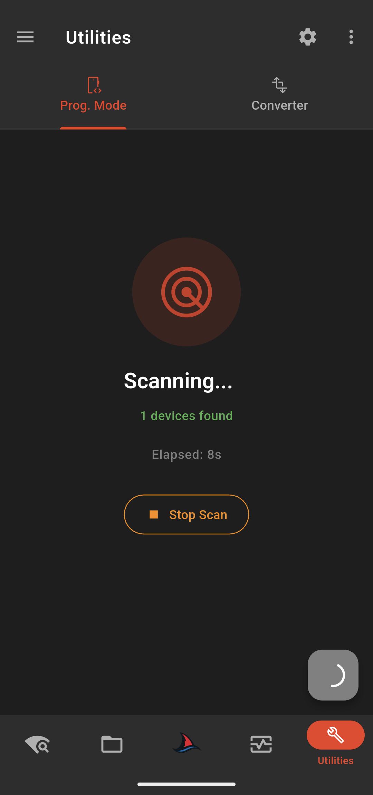

  
  
  # SharKNX
  
  
  
  
  Bring professional KNX monitoring and diagnostics to your phone or tablet. SharKNX gives installers and integrators ETS-like capabilities on mobile - monitor bus traffic, send telegrams, and view project data anywhere on-site.
  

## About

SharKNX is a mobile app for KNX installers and System Integrators. Carry your ETS projects in your pocket, discover and connect to KNX IP gateways/routers and monitor your KNX installation. 

##  Platforms

**SharKNX is available for:** 

  <table>
    <tr>
      <td align="center" valign="middle">
        
      </td>
      <td align="center" valign="middle">
        
      </td>
      <td align="center" valign="middle">
        
      </td>
    </tr>
  </table>

## Features

- **Bus Traffic Monitor** - Real-time group value telegram capture with automatic DPT decoding for 30+ data types
- **ETS Project Viewer** - Import and browse `.knxproj` files on mobile. View Group Addresses, Topology, Buildings, Devices and their connected Communication Objects
- **Send Group Telegrams** - GroupValueWrite/Read commands with full DPT support (switching, dimming, temperature, RGB, scenes)
- **Gateway Discovery** - Discover and connect to KNX IP Gateways/Routers on your network
- **Diagnostic Funtionality** - Scan for devices in programming mode
- **KNX IP Secure support** - Load credentials from `.knxkeys` file or `.knxproj` file directly
- **Shark Hunt Pages** - Allows creation of pages with quick send actions for KNX commnads and complex Monitor Filters for diagnostics

##  Screenshots

  
  | Connection | Project Viewer |
  |---|---|
  |  |  |
  | **Bus Monitor** | **Device Scanner** |
  |  |  |
  

## Documentation

### Getting Started
- **[Quick Start Guide](docs/getting-started.md)**

### Feature Guides
- **[Connection & Gateway Discovery](docs/connection-and-discovery.md)**
- **[ETS Project Viewer](docs/ets-project-viewer.md)**
- **[Bus Monitor & Send Telegrams](docs/monitor-and-send.md)**
- **[Shark Hunt Pages](docs/shark-hunt.md)**
- **[Utilities](docs/utilities-page.md)**

### Misc
- **[Changelog](docs/changelog.md)**
- **[Privacy & Data](docs/privacy-and-data.md)**

##  Issues & Feature Requests

Please see guided on how to report a bug/issue or request additional functionality that might be missing.

- **Found a bug?** - Please read our **[How to Report an Issue Guide](guides/how-to-report-an-issue.md)** for detailed instructions
- **Have a feature idea?** - Check out our **[How to Request a Feature Guide](guides/how-to-request-a-feature.md)**

##  Roadmap

Our next steps include:

1. **Localization** - Support for Greek, German, and Spanish languages
2. **More Shark Hunt Actions** - Expand diagnostic capabilities with additional hunting actions
3. **Enhanced Diagnostics** - New diagnostic functions including device reset functionality

## License & Intellectual Property

© 2026 OWL AUTOMATA. All rights reserved.

This app is developed and maintained by OWL AUTOMATA. All rights reserved.

For licensing inquiries or questions, please contact us at info@owl-automata.com.

## Contact & Support

- **Email**: info@owl-automata.com
- **Website**: [www.owl-automata.com](https://www.owl-automata.com)
- **LinkedIn**: [OWL AUTOMATA](https://www.linkedin.com/company/owl-automata)
- **YouTube**: [@OWLAUTOMATA](https://www.youtube.com/@OWLAUTOMATA)

---

## Legal Notice & Trademarks

This repository contains documentation and materials related to SharKNX.

KNX® and ETS® are registered trademarks of KNX Association.
This project is not affiliated with, endorsed by, or sponsored by KNX Association,
unless explicitly stated otherwise.

All product names, logos, and brands are property of their respective owners.
