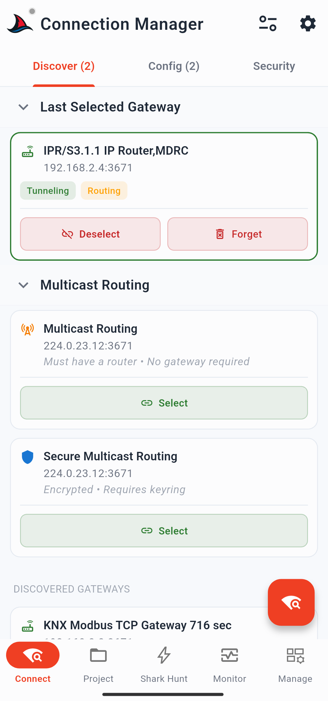
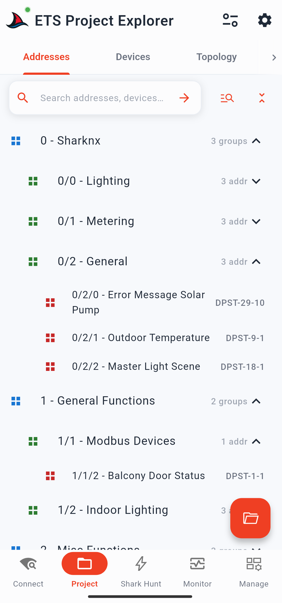
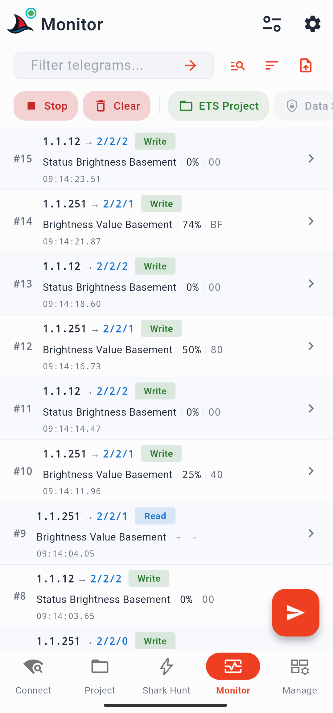
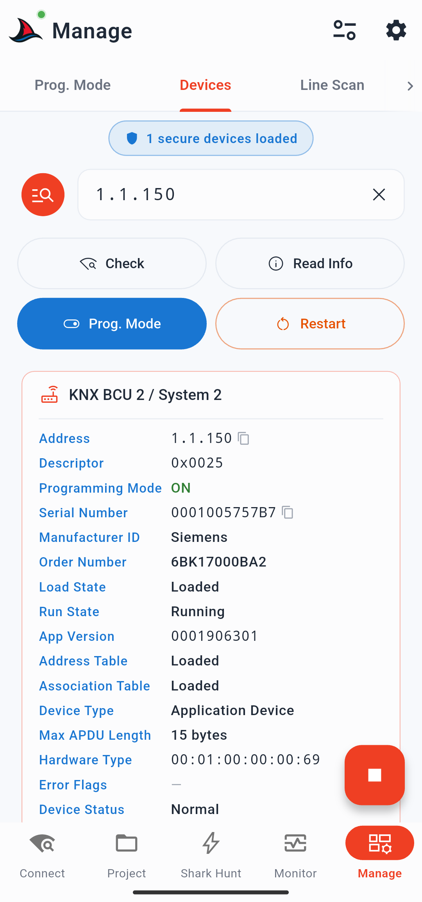

  
  
  # SharKNX
  
  
  
  
  Bring professional KNX monitoring and diagnostics to your phone or tablet. SharKNX gives installers and integrators ETS-like capabilities on mobile - monitor bus traffic, manage devices, send telegrams, and view project data anywhere on-site.
  

## About

SharKNX is a mobile app for KNX installers and System Integrators. Carry your ETS projects in your pocket, discover and connect to KNX IP gateways/routers and monitor your KNX installation. 

## Supported Languages

SharKNX is available in:

- 🇬🇧 English
- 🇩🇪 German
- 🇫🇷 French
- 🇪🇸 Spanish
- 🇮🇹 Italian
- CN Chinese (simplified)

##  Platforms

**SharKNX is available for:** 

  <table>
    <tr>
      <td align="center" valign="middle">
        
      </td>
      <td align="center" valign="middle">
        
      </td>
      <td align="center" valign="middle">
        
      </td>
    </tr>
  </table>

## Features

- **Bus Traffic Monitor** - Real-time group value telegram capture with automatic DPT decoding for 30+ data types
- **ETS Project Viewer** - Import and browse `.knxproj` files on mobile. View Group Addresses, Topology, Buildings, Devices and their connected Communication Objects
- **Send Group Telegrams** - GroupValueWrite/Read commands with full DPT support (switching, dimming, temperature, RGB, scenes)
- **Gateway Discovery** - Discover and connect to KNX IP Gateways/Routers on your network
- **Device Management** - Check device existence on the bus, read information, reset device and control programming mode
- **Commissioning** - Program individual addresses of devices, either by pressing their programming button or by using their serial number
- **Diagnostic Functionality** - Scan for devices in programming mode and scan KNX bus lines
- **KNX IP Secure support** - Load credentials from `.knxkeys` file or `.knxproj` file directly
- **KNX Data Secure support** - View and send KNX data secure telegrams and manage KNX data secure devices
- **Shark Hunt Pages** - Allows creation of pages with quick send actions for KNX commands and complex Monitor Filters for diagnostics
- **Chat Assistant** - Control your installation, send commands, discover and connect to gateways, perform device diagnostics, with simple intuitive chat interface
- **Scripts** - Create your own chain of commands for connecting, device diagnostics or KNX bus control, with simple text inputs. Import scripts though YAML files

##  Screenshots

  
  | Connection | Project Explorer |
  |---|---|
  |  |  |
  | **Bus Monitor** | **Device Management** |
  |  |  |
  

## Community

  <a href="https://www.youtube.com/watch?v=ktrKcycl_Eg">
    
     
    <strong>▶ Watch on YouTube - SharKNX Review by Poseidwn Tech</strong>
  </a>

## Documentation

### Getting Started
- **[Getting Started](docs/guides/en/getting-started.md)**

### Page Guides
- **[Discovery](docs/guides/en/pages/discovery.md)**
- **[Project](docs/guides/en/pages/project.md)**
- **[Monitor](docs/guides/en/pages/monitor.md)**
- **[Shark Hunts](docs/guides/en/pages/shark-hunts.md)**
- **[Management](docs/guides/en/pages/management.md)**
- **[Settings](docs/guides/en/pages/settings.md)**

### How-To Guides
- **[Connect to a KNX Gateway](docs/guides/en/how-to/connect-to-gateway.md)**
- **[Load an ETS Project](docs/guides/en/how-to/load-ets-project.md)**
- **[Set Up KNX IP Secure](docs/guides/en/how-to/setup-knx-ip-secure.md)**
- **[Set Up KNX Data Secure](docs/guides/en/how-to/setup-knx-data-secure.md)**
- **[Send KNX Commands](docs/guides/en/how-to/send-commands.md)**
- **[Program a Device Individual Address](docs/guides/en/how-to/program-device-address.md)**
- **[Scan a KNX Bus Line](docs/guides/en/how-to/scan-bus-line.md)**
- **[Inspect a Device's Communication Objects](docs/guides/en/how-to/inspect-device.md)**
- **[Create a Shark Hunt](docs/guides/en/how-to/create-shark-hunt.md)**
- **[Export Telegrams](docs/guides/en/how-to/export-telegrams.md)**

### Concepts
- **[KNX IP Secure](docs/guides/en/concepts/knx-ip-secure.md)**
- **[KNX Data Secure](docs/guides/en/concepts/knx-data-secure.md)**
- **[ETS Projects in SharKNX](docs/guides/en/concepts/ets-project-in-sharknx.md)**
- **[The Shark Hunt Concept](docs/guides/en/concepts/shark-hunts.md)**

### Reference
- **[Supported DPTs](docs/guides/en/reference/supported-dpts.md)**
- **[Settings Reference](docs/guides/en/reference/settings.md)**
- **[Export Format](docs/guides/en/reference/export-format.md)**
- **[Subscription Plans](docs/guides/en/reference/subscription-plans.md)**

### Misc
- **[Changelog](CHANGELOG.md)**
- **[Privacy Policy](docs/privacy/privacy-en.md)**
- **[Terms of Service](docs/terms/terms-en.md)**

##  Issues & Feature Requests

Please see our guides on how to report a bug/issue or request additional functionality that might be missing.

- **Found a bug?** - Please read our **[How to Report an Issue Guide](docs/support/how-to-report-an-issue.md)** for detailed instructions
- **Have a feature idea?** - Check out our **[How to Request a Feature Guide](docs/support/how-to-request-a-feature.md)**

##  Roadmap

Our next steps include:

1. **More Shark Hunt Actions** - Expand diagnostic capabilities with additional hunting actions
2. Auto create automation tasks based on project and reconstruction

## License & Intellectual Property

© 2026 OWL AUTOMATA. All rights reserved.

This app is developed and maintained by OWL AUTOMATA. All rights reserved.

For licensing inquiries or questions, please contact us at info@owl-automata.com.

## Contact & Support

- **Email**: info@owl-automata.com
- **Website**: [www.owl-automata.com](https://www.owl-automata.com)
- **LinkedIn**: [OWL AUTOMATA](https://www.linkedin.com/company/owl-automata)
- **YouTube**: [@OWLAUTOMATA](https://www.youtube.com/@OWLAUTOMATA)

---

## Legal Notice & Trademarks

This repository contains documentation and materials related to SharKNX.

KNX® and ETS® are registered trademarks of KNX Association.
This project is not affiliated with, endorsed by, or sponsored by KNX Association,
unless explicitly stated otherwise.

All product names, logos, and brands are property of their respective owners.
