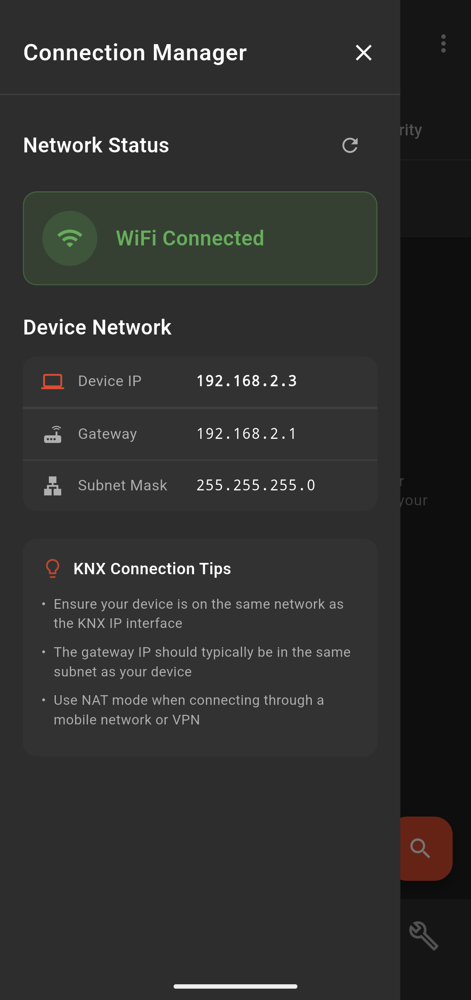
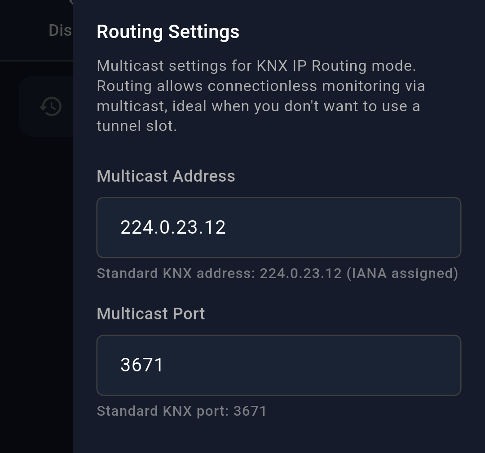
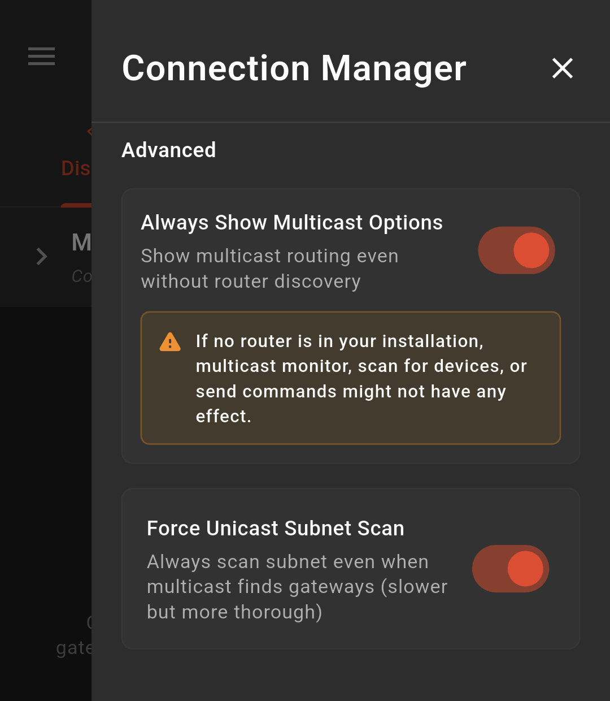
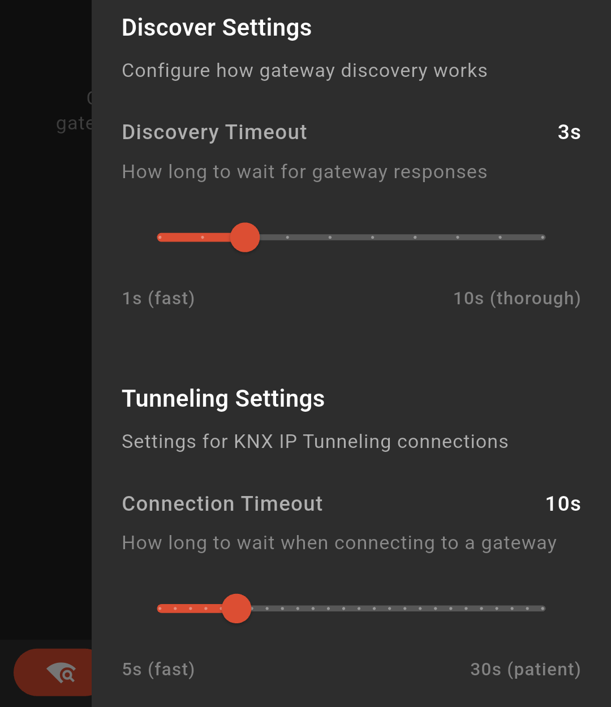
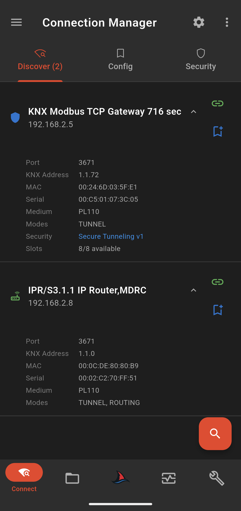
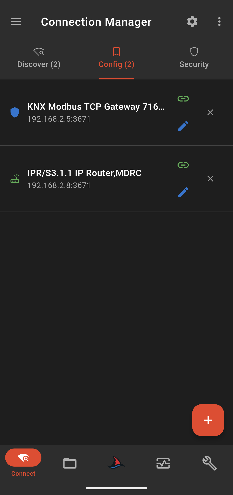
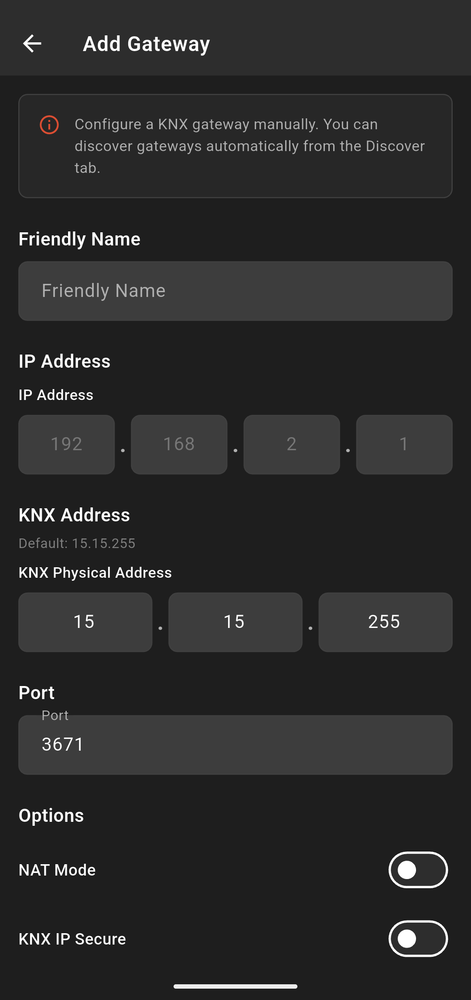
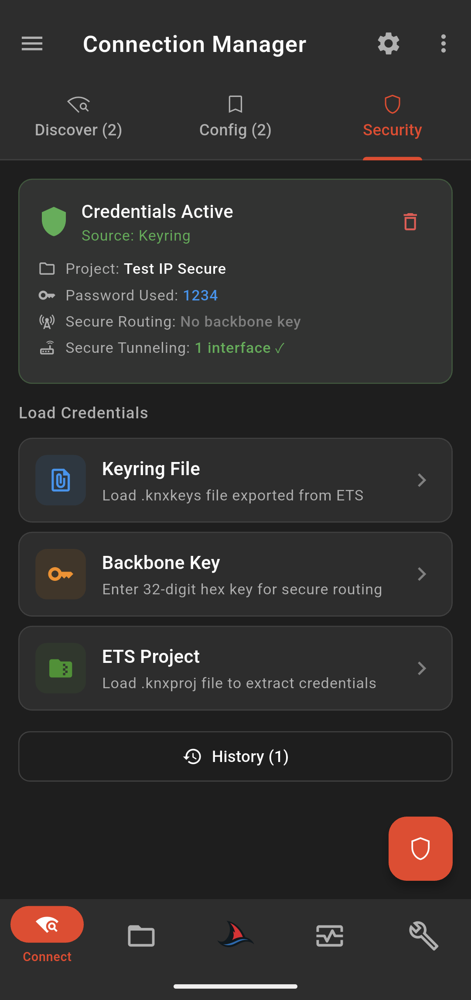
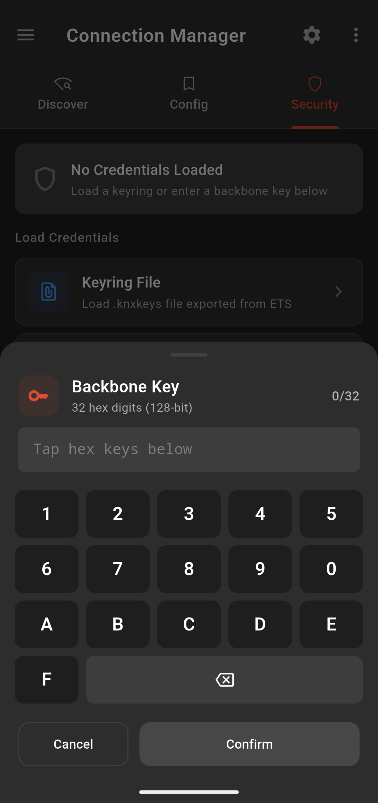
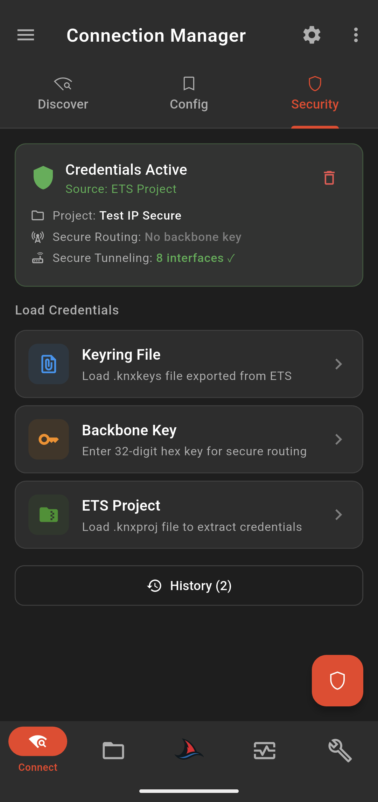

# Connection & Gateway Discovery

This guide explains how to use the connection page of the app. It explains the varioys options available, how to configure new gateways and how to use load secure credentials page.

## Menu & Settings

Almost all pages in **SharKNX** have a **"hamburger"** menu button on the top left and a **"gear"** settings icon on the right. Clicking on them opens the respective left or right drawer panel to view additional information and edit certain settings.

The **Connection Manager** page left pane **Menu** shows information about the current network that your mobile phone is connected to. It helps as a quick diagnostic in case you cannot discover any **Gateways** on your network, allowing you to verify you are searching in the right spot.

  
   
  <em>Connection Manager Menu</em>

The Settings panel allows you to change **routing settings**, **routing view options**, **default scan behavior** and **timeout settings**.

> [!NOTE]
> All settings are persistent between app restarts. So any change you make will be applied every time you open the app unless you change it again.

#### Routing Settings

The default **Multicast Address** and **Port** defined by KNX is **224.0.23.12** and **3671**. However, if you would like to change the default address and port you can enter your preference in the settings panel option:

  
   
  <em>Connection Manager - Routing Settings</em>

#### Advanced Settings

**Always Show Multicast Options**
	In order to be able to use the **Multicast/Routing** option as a way to communicate with the KNX bus, you would normally need to have a **KNX IP Router** in your installation, otherwise no one would route/send your telegrams to or from the KNX bus. This is the reason Multicast/Routing options **are only visible if a KNX IP device with routing capabilities is discovered**. However you can change this behavior in **Advanced Settings**.

**Force Unicast Subnet Scan**
	The procedure of **discovering KNX IP Gateway** devices by **KNX** is **to send Multicast Discovery Requests through the network**. However, multicast packets are unreliable on wireless communication like in Wi-Fi networks, especially if the network is overloaded, and might not reach their destination, resulting in **"No Gateways Discovered"**. This is a common problem in mobile phones or laptops and can even happen in ETS tool. 
	For this reason, **SharKNX** always tries a **Unicast Scan** if no Gateways are discovered after a common Multicast Scan. You can always **force this Unicast Scan**, even when gateways are discovered, to make sure any active gateway in your network will respond.

  
   
  <em>Connection Manager - Advanced Settings</em>

#### Timeout Settings

These sliders allow you to control the behavior of **SharKNX**, when searching or connecting to a gateway. The default options are usually robust but in case you would like to **make the scan faster** or **make it listen to responses for a longer time**, you can change it here. Likewise, default connection timeout is fine for most cases. However, if your network is unstable, you can **increase the timeout setting** when connecting to gateway to allow **SharKNX** for more time to listen to device responses.

  
   
  <em>Connection Manager - Timeout Settings</em>

## Discover Tab

The **Discover Tab** of Connection Manager page allows you to scan for KNX IP Gateways in your network. Initiate a scan by pressing the **Magnifying Glass button** on the bottom left.

Discovered Gateways/Interfaces/Router will be shown as expandable cards on the page. Additionally, if a discovered device has **Routing capabilities**, the section **Multicast Routing** will be available and, upon expansion, will show the options of **Multicast Routing** or **Secure Multicast Routing**.

  
   
  <em>Connection Manager - Discover Tab</em>

Expanding a discovered gateway allows you to view some extra details about it, like:

- Communication Port
	
- KNX Physical Address
	
- MAC Address
	
- Serial Address
	
- Medium Type
	
- Supported Modes (Tunnel and/or Routing)
	
- Security (Supports KNX IP secure or not)
	
- Slots available (only for Secure devices)

  
   
  <em>Connection Manager - Gateway Info</em>

You can select a gateway by clicking the **green link icon**. This gateway will later be used to connect to KNX bus.

You can save a discovered gateway by clicking on the **blue bookmark icon** (so you can use it another time without scanning again). The saved gateways will appear on the **Configured Gateways Tab**.

> [!important]
> Selecting a gateway **will not automatically connect to it**, until you actually need to connect for some operation. This helps preserve mobile battery.

## Configured Gateways Tab

In this tab you can view, edit, select or remove your saved gateways. This allows you to skip the scanning process if you already know the address of your interface. You can create a list of all your project gateways here so you can quickly connect to them each time you are on site!

You can select a gateway by clicking the **green link icon**. This gateway will later be used to connect to KNX bus.

  
   
  <em>Connection Manager - Config. Tab</em>

To configure a new gateway, click on the "+" icon on the bottom right. This open the configuration page.

  
   
  <em>Connection Manager - Add/Edit Gateway Page</em>

The following fields are available:

- **Friendly Name:** This is the display name for your configured gateway. Using project names allows you to quickly identify which one to use, e.g. "Seaside Villa"
	
- **IP Address:** The IP address of the gateway to connect to
	
- **KNX Physical Address:** The physical address of the gateway in the KNX bus
	
- **Port:** The port to use. In most cases 3671 should not be changed
	
- **NAT Mode:** Whether to use Network Address Translation or not
	
- **KNX IP Secure:** Whether this is a secure gateway or not

#### NAT

Network Address Translation (NAT) mode ensures that communication remains stable when your phone and the KNX gateway are not on the exact same local network.

**Possible scenarios to enable NAT mode:**

- **Multiple Subnets:** Use this if your phone is on one VLAN (e.g., "Staff WiFi") and the KNX hardware is on a different VLAN (e.g., "Technical/IoT Network").
	
- **VPN Connections:** If you are connecting to the site via a VPN, NAT mode is often required to ensure the gateway knows how to route response packets back through the VPN tunnel to your phone.
    
- **Remote Access:** If you have configured port forwarding on a router to access a site from the internet (using a Public IP), NAT mode must be **ON**.

#### KNX IP Secure & KNX Physical Address

The KNX Physical Address field can be left as default for most plain KNX IP communication use cases. However, if you have selected that your gateway is **Secure KNX IP enabled, YOU HAVE to give it the correct KNX physical address, otherwise the connection will fail.** 

KNX IP Secure requires the KNX physical address of the tunnel to connect to.

## Security Tab

You can set the secure credentials that will be used for your Secure KNX IP connection in **Security tab**. 

Selection of a **KNX Secure Gateway** or **Secure Multicast Routing** without credentials loaded, will pop up a dialog that prompts you to navigate in **Security Tab** and load them. 

There are 3 options available to load/set secure credentials:

#### Keyring File (.knxkeys file)

A `.knxkeys` file, along with the password you used when exporting it, contains all the required information to connect to a KNX IP Secure device.

You can select this option to load your `.knxkeys` file that you have exported from your ETS project. A dialog pop up will prompt you for the password. SharKNX will automatically detect and use the passwords and auth codes included. 

  
   
  <em>Connection Manager - knxkeys file loaded</em>

> [!warning] Ensure Correct Password Input
> **SharKNX does not verify that the password** you provided for your `.knxkeys` file is correct, since that would be impossible! There is no way to know, before connecting to gateway if this password is correct. That is why the password you provide for `.knxkeys` file is visible in **credential details card**. Ensure you have entered it correctly, otherwise connection will fail.

> [!info] Where do I get the `.knxkeys` file? (ETS6)
> To get a `.knxkeys` file of a device, do the following steps:
> 1. Open ETS tool
> 2. Open your ETS project that contains your secure device (must be open)
> 3. Navigate back to ETS home page (where all your projects are)
> 4. Select **"Details"** for your open project that contains the secure device
> 5. Go to **"Security"**
> 6. Select your device from the list and press **"Back up keyring"**
> 7. Input your password and save it (also save the password somewhere to remember it)

#### Backbone Key

The Backbone key is a 32 digit, hex number used for Secure Routing. There is an option to set it manually if you want but can also be set through `.knxkeys` and `.knxproj` files (if it exists).

  
   
  <em>Connection Manager - Input backbone key</em>

#### ETS Project

SharKNX allows the option to load your ETS `.knxproj` file that contains the secure device you would like to connect. The app automatically discovers the secure credentials and loads them so it can use them for secure connection.

An ETS project that contains secure enabled devices must also have a password. In order to load the file you have to provide the correct project password, otherwise loading will fail.

  
   
  <em>Connection Manager - knxproj file loaded</em>

#### History List

Loaded credentials are saved in local storage, to help quick loading of previous credentials.