## Getting Started

A quick guide for helping you get started with SharKNX app!
## Permissions

> [!warning] 
> SharKNX requires network and file access permissions. This is solely for the purpose of communicating with KNX IP devices in your network, as well as allowing you to import ETS project and `.knxkeys` files for viewing and secure credentials loading.

> [!note] 
> SharKNX does not collect and share user data. Any data saved is solely for the purposes of app functionality and stays on your phone.

## Discover and Select Gateway

Opening the app directs you at **Connection Page**. This is where you can discover, configure and select **KNX IP Gateways**, so that you can later connect, monitor and send commands to KNX bus. Press the **Scan** button on the bottom right to start scanning your network.

  
   
  <em>SharKNX Gateway Discovery Page</em>

After Scan finishes, the discovered gateways will be shown on screen. If KNX IP devices with Router capabilities are discovered, the option to select **Multicast Routing** (either plain or secure) will appear.

You can select a gateway by clicking the **green link icon**. This gateway will later be used to connect to KNX bus.

You can save a discovered gateway by clicking on the **blue bookmark icon** (so you can use it another time without scanning again).

> [!important]
> Selecting a gateway **will not automatically connect to it**, until you actually need to connect for some operation. This helps preserve mobile battery.

> [!note]
> If no gateways are discovered, please make sure your phone is connected to **the network that your KNX IP devices are**. The **Hamburger** menu on the top left can show your current network your mobile phone is connected to.

#### Secure Credentials

If your **Gateway(s)** are configured for **secure KNX IP communication**, you will have to provide the credentials so that the app can establish a secure connection. 

You can load either a `.knxkeys` file or a `.knxproj` file that you have exported for ETS tool. The app will find the passwords and keys and will use them to connect to your selected gateway.

> [!important]
> Please make sure that you import the right `.knxkeys` or `.knxproj` file otherwise the secure connection will fail. In the case of `.knxkeys` file, please make sure you enter its password correctly.

## ETS Project Load & Viewing

> [!note]
> This step is optional and is not actually needed to monitor KNX bus or send commands. Feel free to skip and jump to Monitor & Send Commands section. However, loading an ETS project will enable some extra search, filter and autofill functionalities of the monitor page.

The second page of the app (from the left) is the **ETS Project Explorer**. This is where you can load a `.knxproj` file and view:

- Group Addresses
- Devices (physical address, name, connected Group Addresses)
- Topology
- Buildings

  
  | Addresses | Devices |
  |---|---|
  | 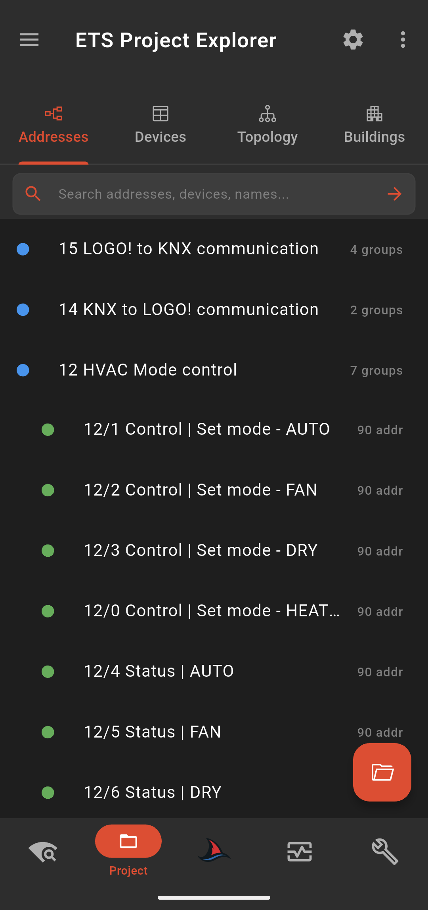 | 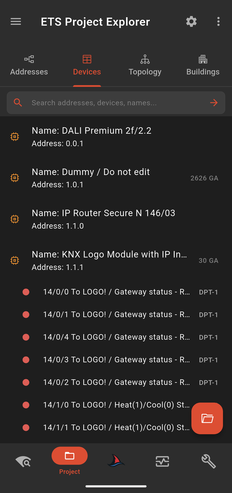 |
  | **Topology** | **Buildings** |
  | 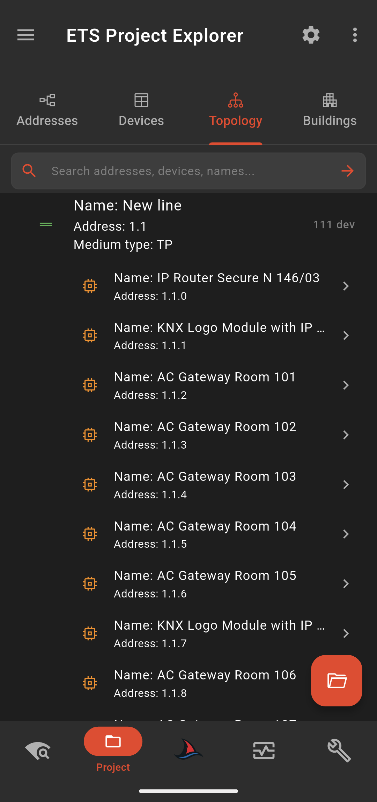 | 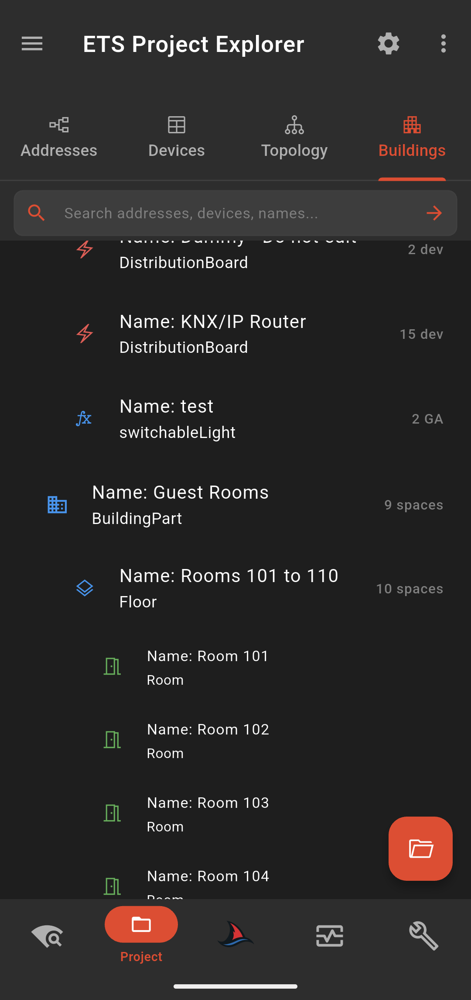 |
  

If selected in the **Settings** menu (**gear icon on the top right**), the **Communication Objects** that are connected with Group Address(es) of each device, can also be available under: 

- Topology -> Device X (press the device to open page).

  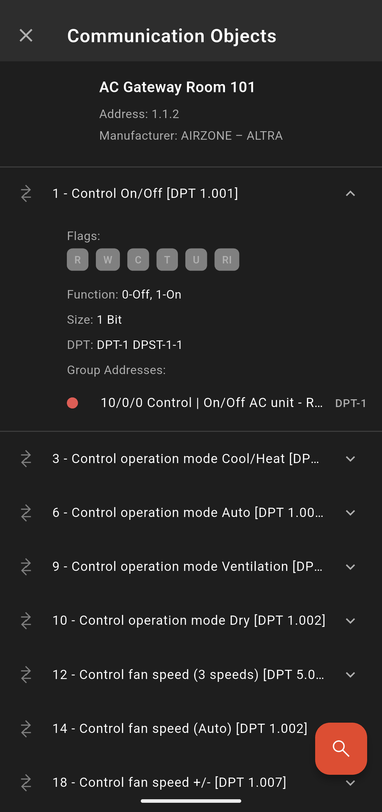
   
  <em>SharKNX ETS Project Page - Com. Objects</em>

**Group Addresses** are clickable under the **Addresses** Tab, in **Devices** Tab and inside the **Communication Objects** page, if you opted to load them. Clicking a Group Address opens a bottom drawer that shows additional information, as well as allowing you to directly **send a Read or Write command**.

  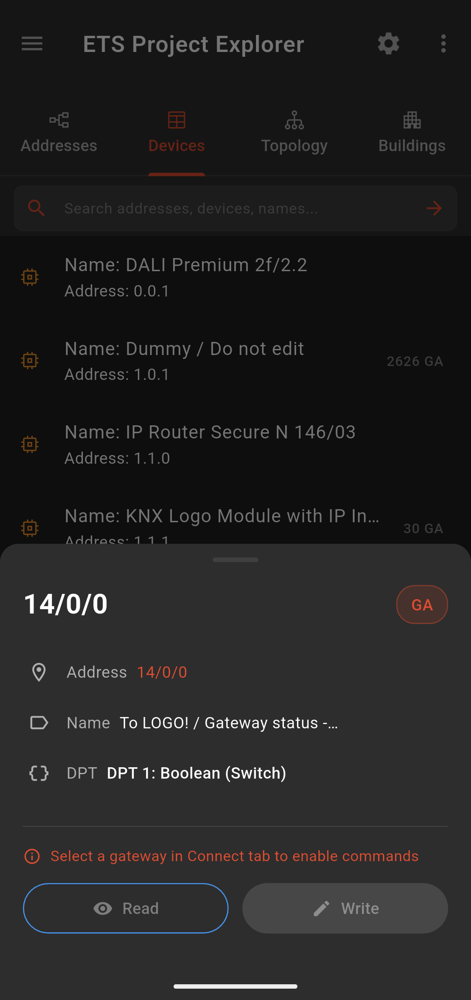
   
  <em>SharKNX ETS Project Page - GA Bottom Sheet</em>

*To be able to send a command, you have to have a Gateway selected from previous step.*
## Monitor & Send Commands

After Selecting a Gateway, you can simply navigate to **Monitor page** and start listening to incoming telegrams or sending commands to KNX bus!

Press the **Play** button on the bottom right or in the row above the filter input and the app will connect to the selected gateway and start monitoring.

  
   
  <em>SharKNX Monitor Page</em>

> [!note]
> If you have an **ETS Project** loaded, **SharKNX** will automatically decode telegram values and additional telegram information, based on your project data, like ETS does. If no project is loaded, only raw data will be available.

The input on the top row allows you to filter telegrams based on text. The **Magnifying Glass** icon allows you to quickly search your loaded project for **Group Addresses** or **Devices** you would like to filter for. Of course, if no ETS project is loaded, this list will be empty.

  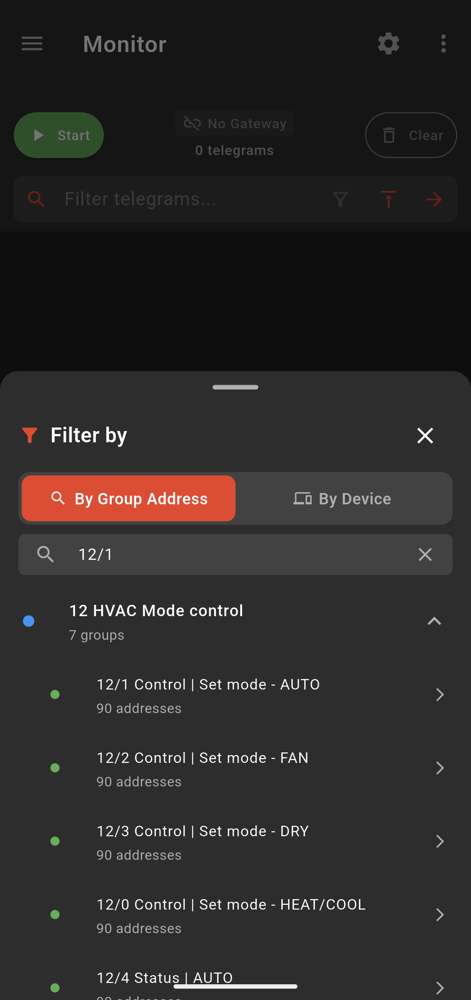
   
  <em>SharKNX Monitor Page - Filter Search</em>

When **monitoring** is active, the button on the bottom right will have a **Send** icon. Clicking on it allows you to create a new command to send to KNX bus. The **"+ New Command"** button navigates you to **Command Composer** page.

  
  | Send Temperature | Send Dimming |
  |---|---|
  | 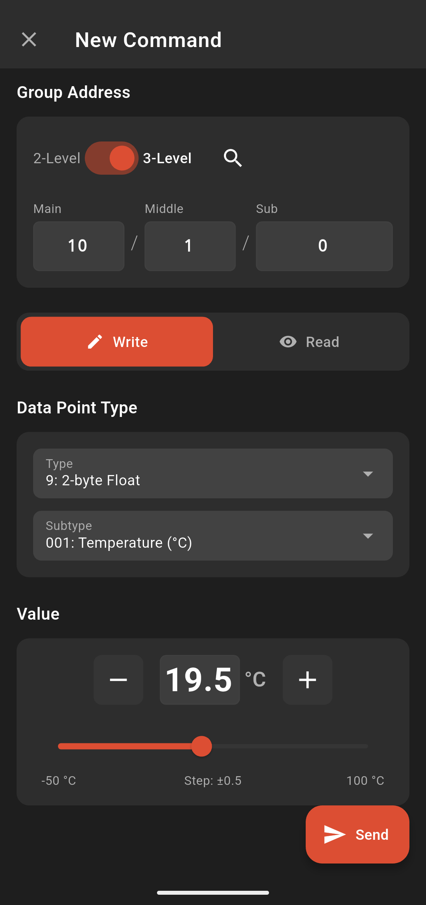 | 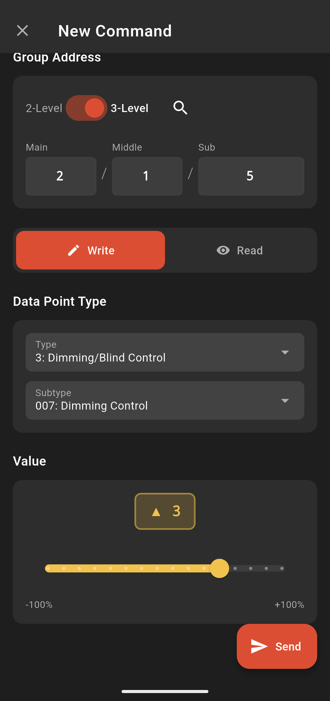 |
  | **Send RGB** | **Send Read** |
  | 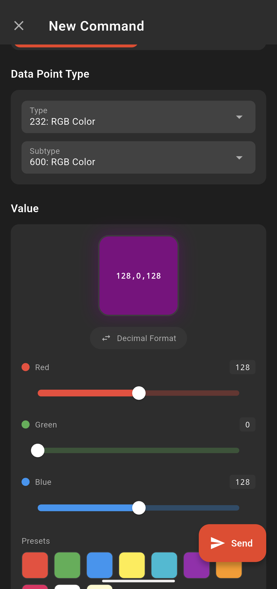 | 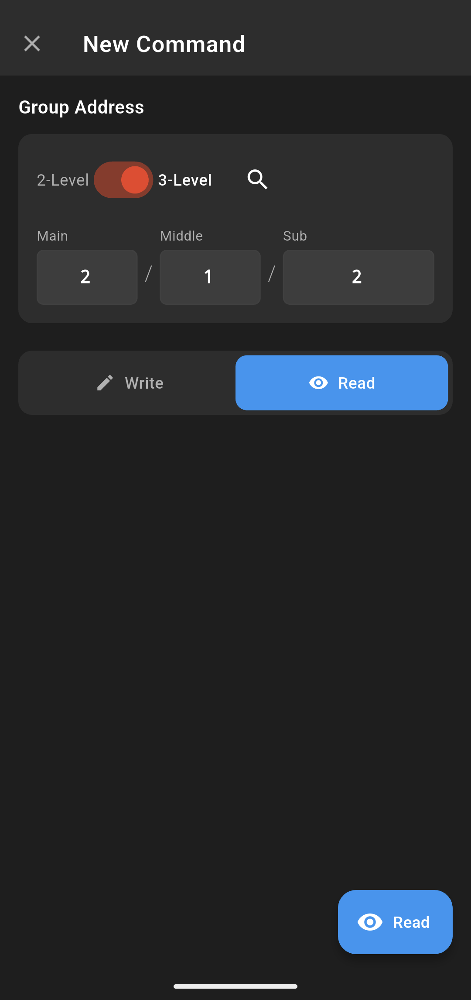 |
  

The flow for creating a new command is simple:

1. Enter manually or search you loaded ETS project for the **Group Address to send**. Selecting a Group Address from your ETS project, **automatically** fills **Datapoint Type and Subtype** if available and supported
2. Decide if this will be a **Write** or **Read** command
3. Enter **Datapoint Type and Subtype** (if not automatically detected)
4. Use the dedicated forms to select **value**
5. Press **Send**

That's it! Your command is sent to KNX bus!

## Summary

This guide covered the most basic and common functionality of SharKNX app. To discover more or or find more details, please look at the dedicated guides:
1. [Connection & Discovery](connection-and-discovery.md)
2. [ETS Project Explorer](ets-project-viewer.md)
3. [Monitor & Send](monitor-and-send.md)
4. [Utilities](utilities-page.md)
5. [Shark Hunts](shark-hunt.md)