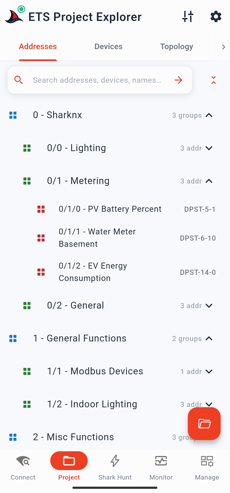
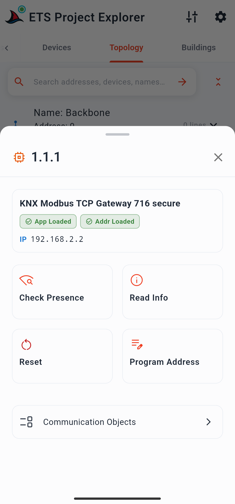
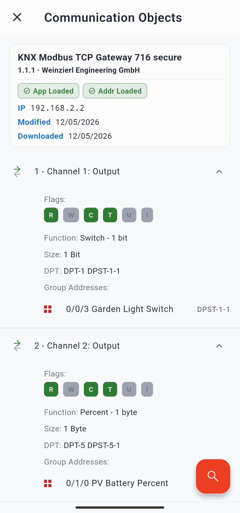

# Die Projektseite

Die Projektseite ist die zweite Seite in der unteren Navigationsleiste. Hier laden Sie eine ETS-Projektdatei und durchsuchen deren Inhalte in vier strukturierten Ansichten: **Gruppenadressen**, **Geräte**, **Topologie** und **Gebäude**.

---

## Ein Projekt laden

Tippen Sie auf den **Ordner-FAB**, um die Dateiauswahl zu öffnen und eine `.knxproj`-Datei auszuwählen. Wenn Sie bereits zuvor Projekte geladen haben, erscheint zuerst ein Verlaufsmenü – wählen Sie einen kürzlich verwendeten Eintrag aus oder tippen Sie auf **Durchsuchen**, um eine neue Datei zu suchen. Passwortgeschützte Projekte werden voll unterstützt; die App fragt das Passwort während des Imports automatisch ab.

Das Laden eines neuen Projekts ersetzt das aktuell geladene Projekt. Die Daten des vorherigen Projekts werden vollständig aus dem Speicher gelöscht.

> Hintergrundinformationen darüber, was das Laden eines Projekts bewirkt und was nicht, finden Sie unter [ETS-Projekte in SharKNX](../concepts/ets-project-in-sharknx.md).

---

## Such- und Filterleiste

Sobald ein Projekt geladen ist, erscheint eine Such- und Filterleiste unterhalb der Reiter-Leiste. Geben Sie einen beliebigen Text ein, um projektweit nach Namen zu suchen – dies umfasst Gruppenadressen, Geräte, Gebäude, Linien und Funktionen. Die Ergebnisse werden bereits während der Eingabe im jeweils aktiven Reiter aktualisiert.

Neben der Suchleiste befindet sich eine Schaltfläche zum **Alles aufklappen / Alles zuklappen**, mit der Sie alle Abschnitte der Baumstruktur im aktuellen Reiter gleichzeitig erweitern oder minimieren können.

---

## KNX Data Secure-Banner

Wenn das geladene Projekt KNX Data Secure-Gruppenadressen enthält, erscheint unterhalb der Reiter-Leiste ein Banner, das Sie zur Konfiguration der Data Secure-Absender auffordert. Ein Tippen auf das Banner leitet Sie zur Konfigurationsseite für Data Secure-Absender weiter. Dort legen Sie fest, welche Physikalische Adresse SharKNX als Absender für die jeweilige geschützte Gruppenadresse verwenden soll. Dies ist zwingend erforderlich, um Data Secure-Befehle zu senden; die reine Busüberwachung (Monitoring) funktioniert auch ohne diesen Schritt. Details finden Sie unter [KNX Data Secure](../concepts/knx-data-secure.md).

  

---

## Reiter "Gruppenadressen"

Dieser Reiter zeigt die Gruppenadresshierarchie exakt so an, wie Sie sie in der ETS angelegt haben: Hauptgruppen auf der obersten Ebene, die sich zu Mittelgruppen und schließlich zu den einzelnen Gruppenadressen aufklappen lassen.

Tippen Sie auf eine Haupt- oder Mittelgruppe, um diese auf- oder zuzuklappen. Tippen Sie auf eine **Gruppenadresse**, um deren Schnellzugriffsmenü (Quick Action Sheet) zu öffnen. Dieses zeigt:
- Gruppenadressname
- Datenpunkttyp und Untertyp (DPT)
- **Lesen (Read)**-Button — Sendet eine Leseanforderung an den Bus und zeigt die Antwort innerhalb von einer Sekunde direkt live im Menü an, sofern eine Rückmeldung eintrifft.
- **Schreiben (Write)**-Button — Öffnet den Befehls-Editor mit bereits vorausgefüllter Gruppenadresse und DPT; geben Sie einfach den gewünschten Wert ein und senden Sie ihn ab.

  

> Ein Gateway muss ausgewählt sein, um Lese- oder Schreibbefehle zu senden. Falls keines ausgewählt ist, fordert die App Sie auf, eines festzulegen.

---

## Reiter "Geräte"

Dieser Reiter listet alle Geräte des Projekts auf, sortiert nach ihrer Physikalischen Adresse. Geräte, die mit Gruppenadressen verknüpft sind, können aufgeklappt werden, um diese Adressen anzuzeigen – ein Tippen auf eine davon öffnet dasselbe Schnellzugriffsmenü wie im Reiter *Gruppenadressen*.

**Tippen** Sie auf ein Gerät ohne verknüpfte Gruppenadressen oder **halten Sie ein Gerät gedrückt**, das Gruppenadressen besitzt, um das **Geräte-Detailblatt** zu öffnen. Dieses Blatt enthält:

### Geräte-Info-Karte
Eine kompakte Karte, die anzeigt, ob die Physikalische Adresse und das Applikationsprogramm des Geräts im ETS-Projekt geladen sind.

### Schnelle Diagnoseaktionen

| Aktion | Was sie bewirkt |
|---|---|
| **Prüfen (Check)** | Überprüft, ob das Gerät am Bus physikalisch vorhanden ist und antwortet. |
| **Info auslesen (Read Info)** | Liest detaillierte Geräteinformationen direkt aus dem Gerät aus (siehe unten). |
| **Programmiermodus umschalten** | Schaltet den Programmiermodus des Geräts aus der Ferne ein oder aus. |
| **Adresse programmieren** | Sucht nach einem Gerät im Programmiermodus und schreibt eine neue Physikalische Adresse darauf. |

**Info auslesen** ruft die folgenden Daten vom Gerät ab:
- Gerätedeskriptor (Device Descriptor, z. B. System B)
- Status des Programmiermodus
- Hersteller und Bestellnummer
- Firmware-Version
- Ladestatus und Betriebsstatus (Run State)
- Applikationsversion
- Status von Adresstabelle und Zuordnungstabelle (Assoziationstabelle)
- Maximale APDU-Länge
- Hardware-Typ
- Fehler-Flags und Gerätestatus

### Schaltfläche "Kommunikationsobjekte"

Öffnet die dedizierte **Seite der Kommunikationsobjekte** für dieses Gerät (siehe unten).

  

---

## Seite der Kommunikationsobjekte

Erreichbar über die Schaltfläche "Kommunikationsobjekte" im Geräte-Detailblatt. Diese Seite zeigt alle Kommunikationsobjekte (KO) des Geräts an, die mit mindestens einer Gruppenadresse verknüpft sind.

Am oberen Rand der Seite werden die Daten für **Zuletzt geändert** und **Zuletzt aus ETS übertragen** (heruntergeladen) angezeigt.

Jeder Eintrag eines Kommunikationsobjekts zeigt:
- Objektnummer (KO-Nummer)
- Flags: K (Kommunikation), L (Lesen), S (Schreiben), Ü (Übertragen), A (Aktualisieren), I (Initiallesen)
- Funktionsname (sofern in der Geräteapplikation definiert)
- Objektgröße (z. B. 1 Bit, 1 Byte, 2 Bytes)
- Verknüpfte Gruppenadressen — Jede Adresse ist antippbar, um das Schnellzugriffsmenü für Lese-/Schreibbefehle zu öffnen.

  

> Die Einstellung **Kommunikationsobjekte laden** in den Projekt-Einstellungen steuert, ob diese Daten beim Einlesen des Projekts analysiert werden. Sie ist standardmäßig aktiviert. Das Deaktivieren reduziert den Speicherbedarf bei sehr großen Projekten, entfernt jedoch den Zugriff auf diese Seite.

---

## Reiter "Topologie"

Dieser Reiter zeigt die physikalische Topologie des Projekts: Bereiche auf der obersten Ebene, die sich zu Linien oder Segmenten und schließlich zu den einzelnen Geräten aufklappen lassen. Ein Tippen auf ein Gerät öffnet das oben beschriebene Geräte-Detailblatt.

---

## Reiter "Gebäude"

Dieser Reiter zeigt die in der ETS konfigurierte Gebäudestruktur: Gebäude und Etagen, die sich zu Räumen und Funktionen aufklappen lassen, unter denen sich wiederum die Gruppenadressen und Geräte befinden. Ein Tippen auf eine Gruppenadresse oder ein Gerät öffnet das jeweilige Schnellzugriffsmenü.

---

## Optionen-Menü (Tuning-Symbol)

Das Tuning-Symbol in der oberen Statusleiste opens ein Menü am unteren Bildschirmrand mit einer Aktion:

**Projekt entladen** — Entfernt das aktuell geladene Projekt vollständig aus dem Speicher. Alle vier Reiter kehren in ihren leeren Ausgangszustand zurück. Aufgezeichnete Telegramme auf der Monitor-Seite bleiben erhalten, verlieren jedoch ihre zugewiesenen Namen und dekodierten Werte.
