## Getting Started

ShaeKNX is a mobile application for Android and iOS, that brings ETS diagnostics and KNX control on your phone or tablet. This guide covers the basic functionality to help you get started immediately.

---

## Permissions

SharKNX does not collect or share user data. Any stored data remains on your device and is used only for app functionality

> [!important]
> SharKNX requires network and file access permissions to communicate with KNX IP devices and to import ETS project or `.knxkeys` files.

---

## Discover and Select Gateway

Opening the app takes you to the **Connection Page**. In this page you can:
- Discover KNX IP Gateways or Routers
- Configure new Gateways or save discovered ones so you can connect to them without scanning
- Upload secure credentials for KNX IP Secure communication

Press the **Scan** button on the bottom right to start scanning your network.

  
  | SharKNX Gateway Discovery Page |
  |--------------------------------|
  | 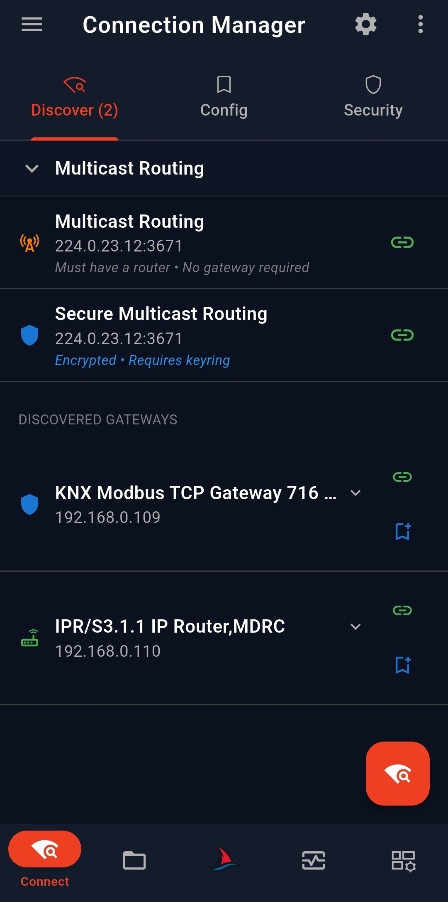 |
  

When scan completes:
- Discovered KNX Gateways will appear in a list
- If KNX IP devices with Router capabilities are discovered, the option to select **Multicast Routing** (either plain or secure) will appear

Actions:
- Click the **green link icon** → select gateway  
- Click the **blue bookmark icon** → save gateway 

> [!important]
> Selecting a gateway **will not automatically connect to it**, until you actually need to connect for some operation. This helps preserve mobile battery.

> [!note]
> If no gateways are discovered, please make sure your phone is connected to **the network that your KNX IP devices are**. The **Hamburger** menu on the top left can show your current network your mobile phone is connected to.

---

### Secure Credentials

If your **Gateway(s)** are configured for **secure KNX IP communication**, you will have to provide the credentials so that the app can establish a secure connection. 

You can import:
- `.knxkeys` file  
- `.knxproj` file 

The app will automatically:
- Extract credentials  
- Match them to the gateway  
- Use them for secure communication  

> [!important]
> Please make sure that you import the right `.knxkeys` or `.knxproj` file otherwise the secure connection will fail. In the case of `.knxkeys` file, please make sure you enter its password correctly.

---

## ETS Project Load & Viewing

> [!note]
> This step is optional and is not actually needed to monitor KNX bus or send commands. Feel free to skip and jump to Monitor & Send Commands section. However, loading an ETS project will enable some extra search, filter and autofill functionalities of the monitor page.

The second page of the app (from the left) is the **ETS Project Explorer**. This is where you can load a `.knxproj` file and view:

- Group Addresses
- Devices (physical address, name, connected Group Addresses, Communication Objects)
- Topology
- Buildings

  
  | Addresses | Devices |
  |---|---|
  | 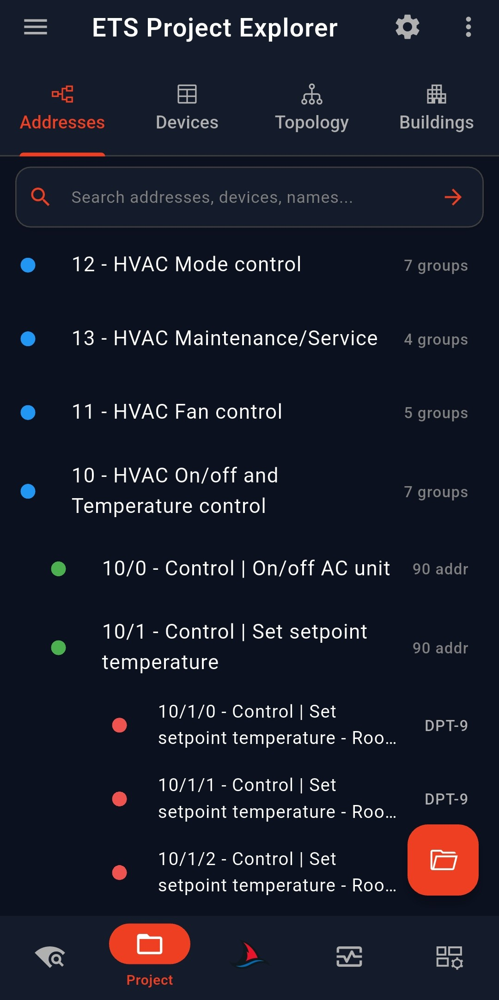 | 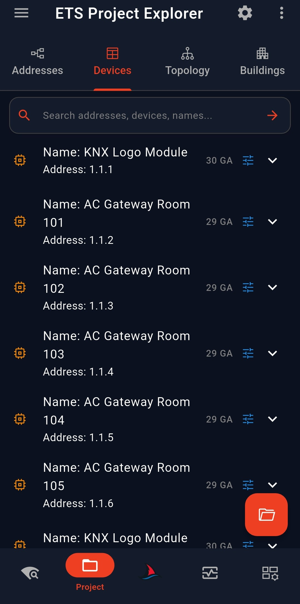 |
  | **Topology** | **Buildings** |
  | 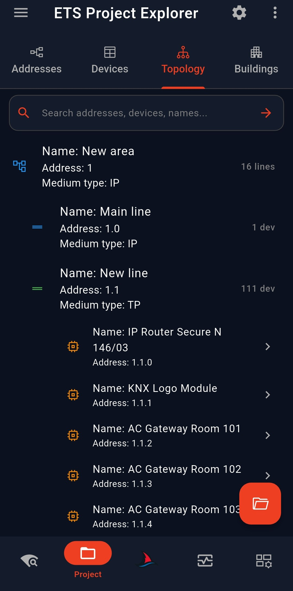 | 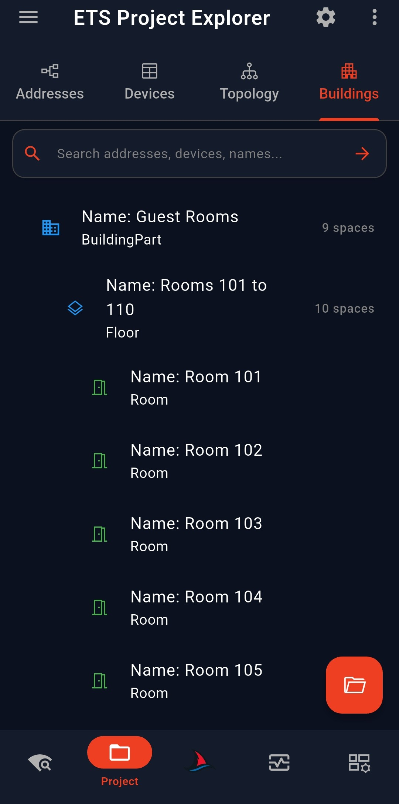 |
  

---

### Communication Objects

If selected in the **Settings** menu (**gear icon on the top right**), the **Communication Objects** that are connected with Group Address(es), can also be viewed for each device, by tapping on a device or the **tune** icon at **Devices** tab: 

  
  | SharKNX ETS Project Page - Com. Objects |
  |-----------------------------------------|
  | 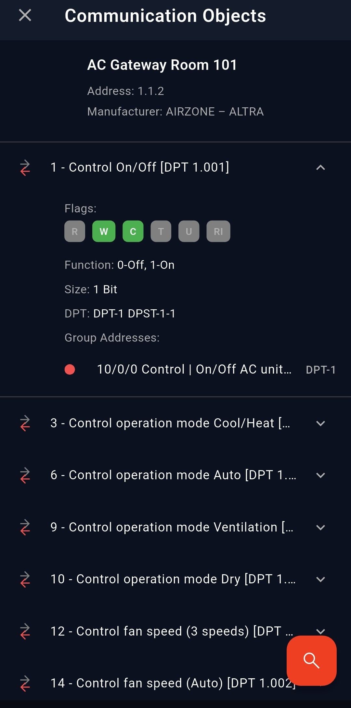 |
  

---

### Interacting with Group Addresses

Group Addresses are clickable:
- In **Addresses tab**  
- Inside **Devices**  
- In **Communication Objects**  

Clicking one opens a panel where you can:
- View details  
- Send **Read** or **Write** commands  

  
  | SharKNX ETS Project Page - GA Bottom Sheet |
  |--------------------------------------------|
  | 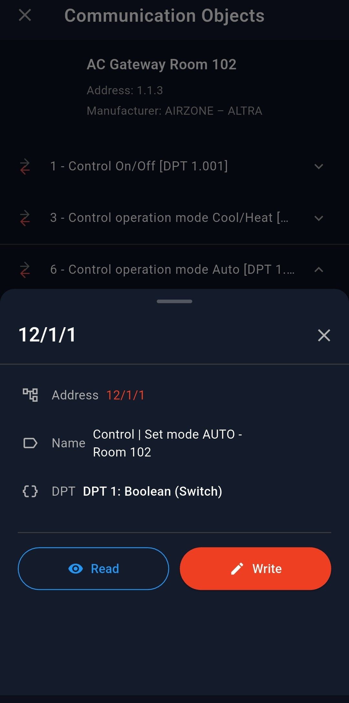 |
  

*To be able to send a command, you have to have a Gateway selected from previous step.*

---

## Monitor & Send Commands

After Selecting a Gateway, you can simply navigate to **Monitor page** and start listening to incoming telegrams or sending commands to KNX bus!

Press the **Play** button on the bottom right or in the row above the filter input and the app will connect to the selected gateway and start monitoring.

  
  | SharKNX Monitor Page |
  |----------------------|
  | 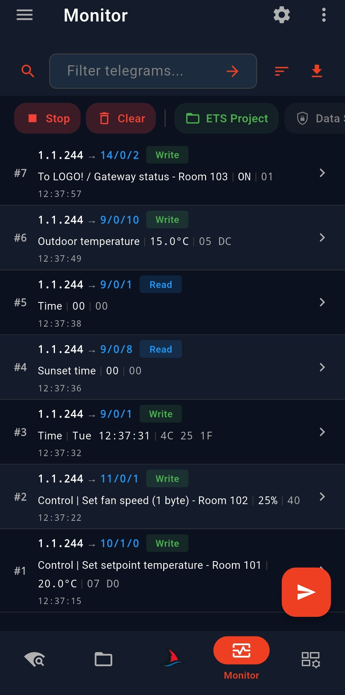 |
  

> [!note]
> If you have an **ETS Project** loaded, **SharKNX** will automatically decode telegram values and additional telegram information, based on your project data, like ETS does. If no project is loaded, only raw data will be available.

---

### Filtering Telegrams

The input on the top row allows you to filter telegrams based on text. The **Magnifying Glass** icon allows you to quickly search your loaded project for **Group Addresses** or **Devices** you would like to filter for. Of course, if no ETS project is loaded, this list will be empty.

  
  | SharKNX Monitor Page - Filter Search |
  |--------------------------------------|
  | 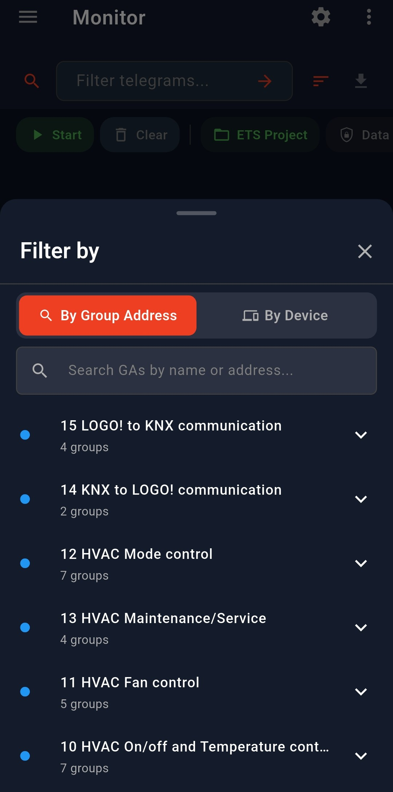 |
  

---

### Sending Commands

When **monitoring** is active, the button on the bottom right will have a **Send** icon. Clicking on it allows you to create a new command to send to KNX bus. The **"+ New Command"** button navigates you to **Command Composer** page.

  
  | Send Temperature | Send Dimming |
  |---|---|
  | 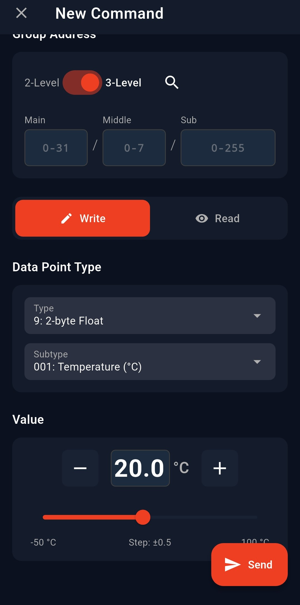 | 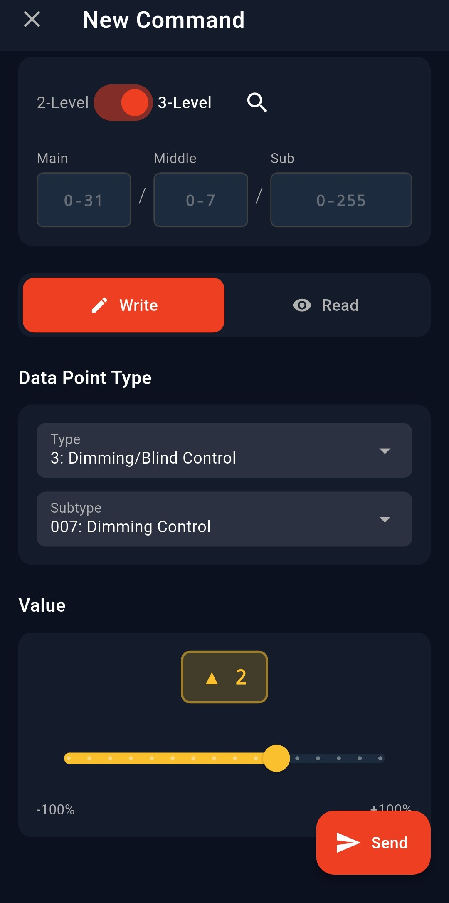 |
  | **Send RGB** | **Send Scene** |
  | 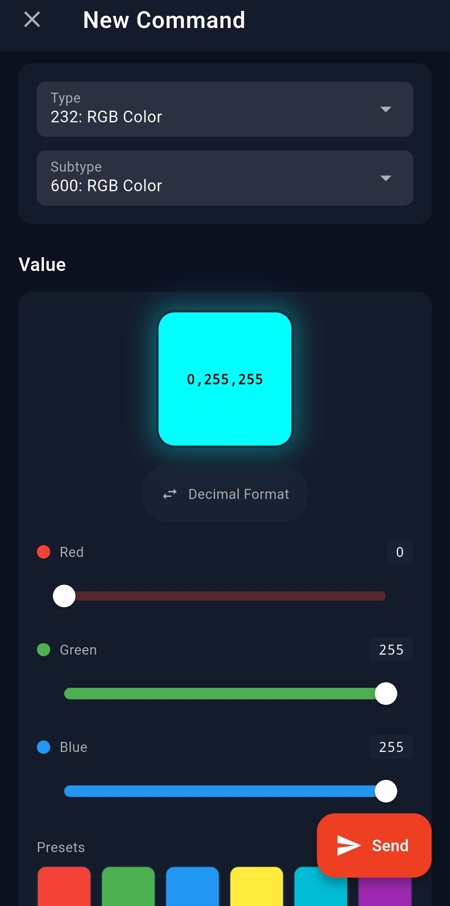 | 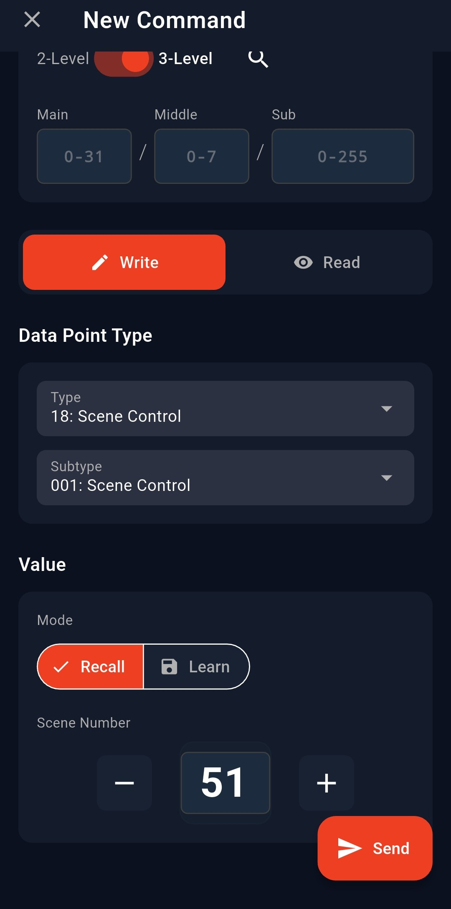 |
  

The flow for creating a new command is simple:

1. Enter manually or search you loaded ETS project for the **Group Address to send**. Selecting a Group Address from your ETS project, **automatically** fills **Datapoint Type and Subtype** if available and supported
2. Decide if this will be a **Write** or **Read** command
3. Enter **Datapoint Type and Subtype** (if not automatically detected)
4. Use the dedicated forms to select **value**
5. Press **Send**

That's it! Your command is sent to KNX bus!

---

## Summary

This guide covered the most basic and common functionality of SharKNX app. To discover more or or find more details, please look at the dedicated guides:
1. [Connection & Discovery](02-connection-and-discovery.md)
2. [ETS Project Explorer](03-ets-project-explorer.md)
3. [Shark Hunts](04-shark-hunt.md)
3. [Monitor & Send](05-monitor-and-send.md)
4. [Manage Devices](06-manage-page.md)
