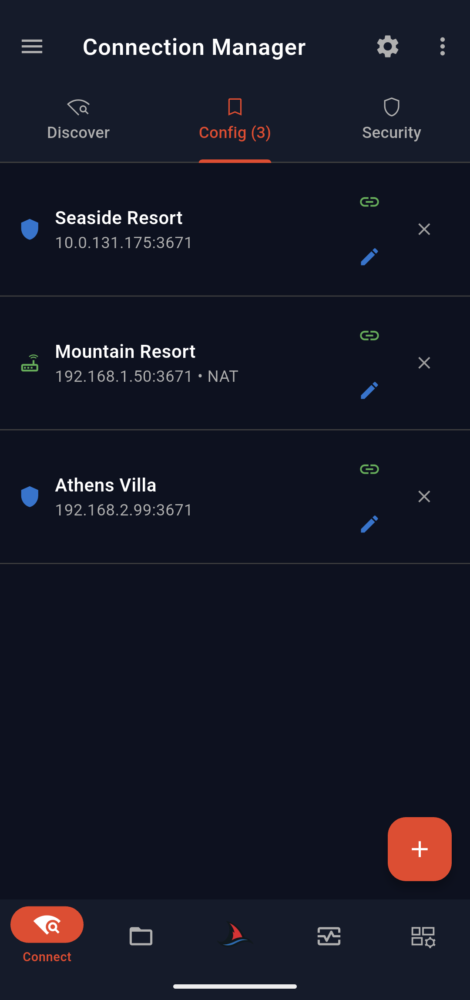
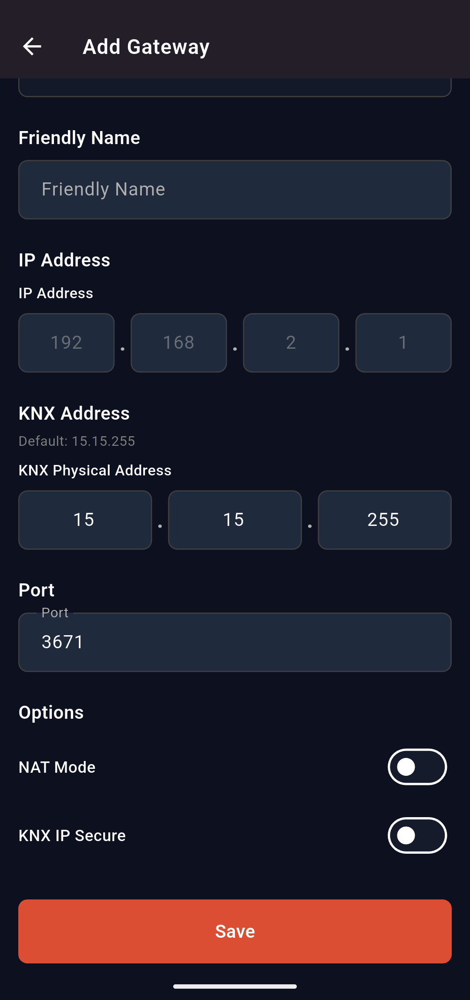
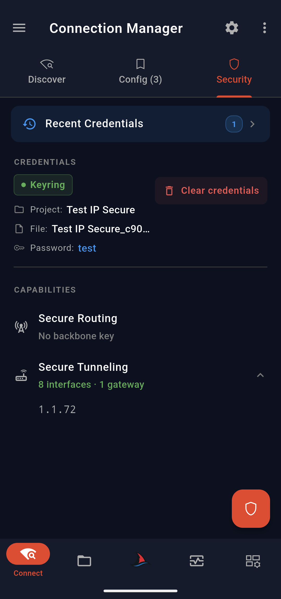
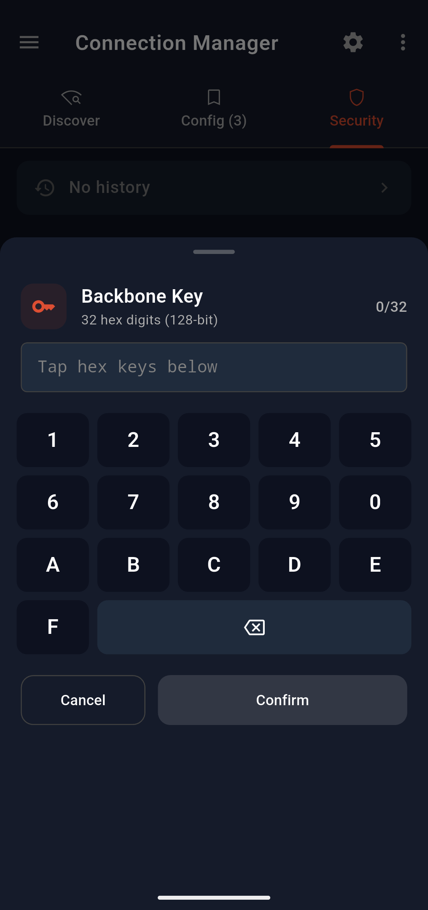
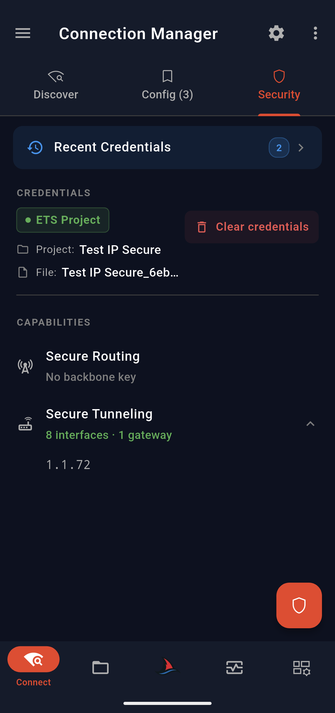
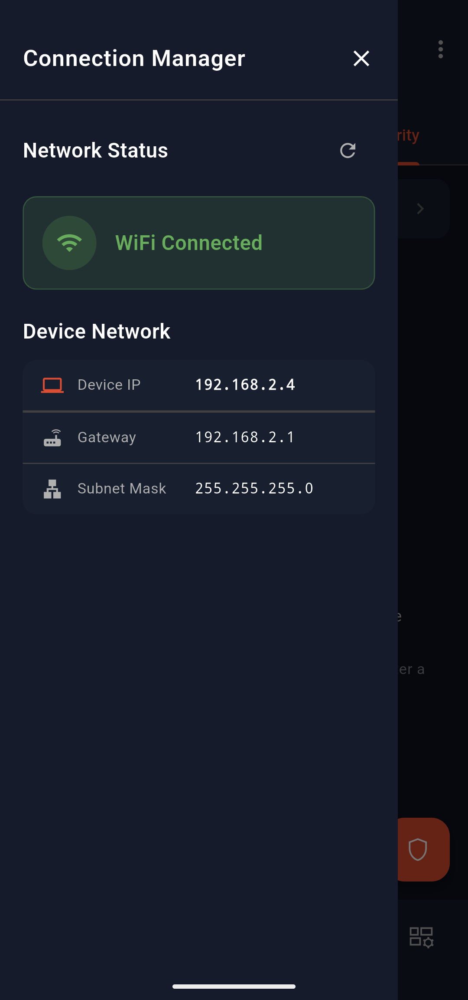
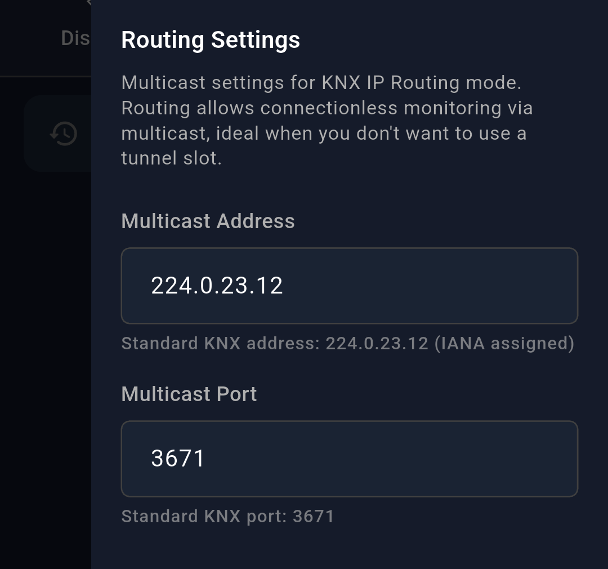
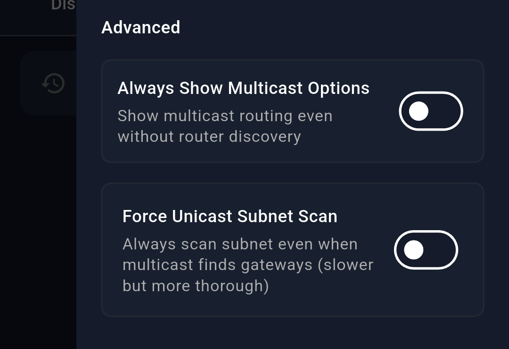
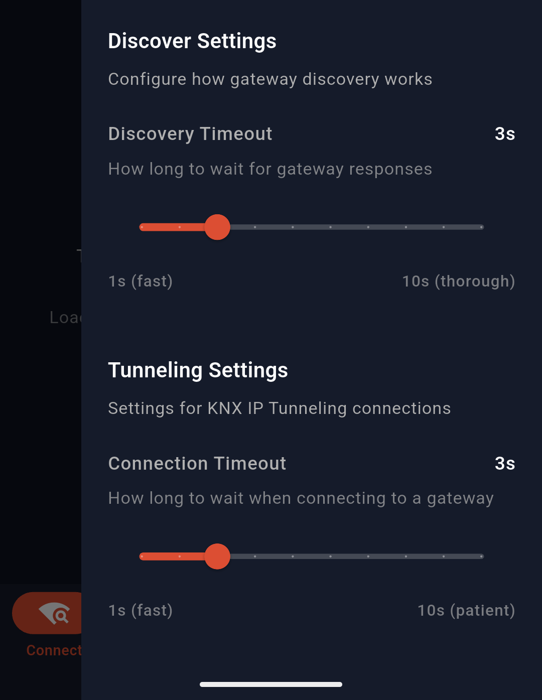

# Connection & Gateway Discovery

The **Connection Manager** is the first page you see when opening SharKNX. It is organized into three tabs: 
- **Discover**, for scanning and selecting KNX IP gateways on your network
- **Configured Gateways**, for saving and managing known gateways
- **Security**, for managing credentials required for KNX IP Secure communication

This guide covers all options and settings available on this page in detail.

---

## Contents

- [Discover Tab](#discover-tab)
  - [Gateway Details](#gateway-details)
- [Configured Gateways Tab](#configured-gateways-tab)
  - [Adding a new Gateway](#adding-a-new-gateway)
- [Security Tab](#security-tab)
  - [Keyring File (.knxkeys file)](#keyring-file-knxkeys-file)
  - [Backbone Key](#backbone-key)
  - [ETS Project](#ets-project)
- [Menu & Settings](#menu--settings)
  - [Menu - Network Information](#menu---network-information)
  - [Settings](#settings)
    - [1. Routing Settings](#1-routing-settings)
    - [2. Advanced Settings](#2-advanced-settings)
    - [3. Timeout Settings](#3-timeout-settings)

---

## Discover Tab

The **Discover Tab** of Connection Manager page allows you to scan for KNX IP Gateways in your network. Initiate a scan by pressing the **Scan Network button** on the bottom right.

Discovered devices appear as expandable cards.

If a discovered device supports routing, additional connection options appear:
- Multicast Routing  
- Secure Multicast Routing  

  
  | Connection Manager - Discover Tab |
  |-----------------------------------|
  |  |
  

You can select a gateway by clicking the **green link icon**. This gateway will later be used to connect to KNX bus.

You can save a discovered gateway by clicking on the **blue bookmark icon** (so you can use it another time without scanning again). The saved gateways will appear on the **Configured Gateways Tab**.

> [!important]
> Selecting a gateway **will not automatically connect to it**, until you actually need to connect for some operation. This helps preserve mobile battery.

---

### Gateway Details

| Property | Description |
|----------|------------|
| Communication Port | KNX communication port |
| KNX Address | Device physical address |
| MAC Address | Hardware identifier |
| Serial Number | Device serial |
| Medium | KNX medium type |
| Modes | Tunnel / Routing |
| Security | KNX Secure support |
| Slots | Available secure connections |

---

## Configured Gateways Tab

In this tab you can: 
- View
- Edit
- Select
- Delete

your saved gateways.

> [!TIP]
> This allows you to skip the scanning process if you already know the address of your interface. You can create a list of all your project gateways here so you can quickly connect to them each time you are on site!

  
  | Connection Manager - Config. Tab |
  |----------------------------------|
  |  |
  

---

### Adding a new Gateway

To configure a new gateway, click on the "+" icon on the bottom right. This open the configuration page.

  
  | Connection Manager - Add/Edit Gateway Page |
  |--------------------------------------------|
  |  |
  

### Available Fields

| Field | Description |
|------|------------|
| **Friendly Name** | Custom label (e.g. *Seaside Villa*) |
| **IP Address** | The IP address of the gateway to connect to |
| **KNX Physical Address** | The physical address of the gateway in the KNX bus |
| **Port** | The port to use. In most cases `3671` should not be changed |
| **NAT Mode** | Enable for routed networks |
| **KNX IP Secure** | Enable for secure gateways |

#### NAT

Network Address Translation (NAT) mode ensures that communication remains stable when your phone and the KNX gateway are not on the exact same local network.

Enable NAT in these cases:

- Different subnets / VLANs  
- VPN connections  
- Remote access via public IP  

#### KNX IP Secure & KNX Physical Address

The KNX Physical Address field can be left as default for most plain KNX IP communication use cases. However, if you have selected that your gateway is **Secure KNX IP enabled, YOU HAVE to give it the correct KNX physical address, otherwise the connection will fail.** 

KNX IP Secure requires the KNX physical address of the tunnel to connect to.

---

## Security Tab

You can set the secure credentials that will be used for your Secure KNX IP connection in **Security tab**. 

Selection of a **KNX Secure Gateway** or **Secure Multicast Routing** without credentials loaded, will pop up a dialog that prompts you to navigate in **Security Tab** and load them. 

There are 3 options available to load/set secure credentials:
- Load a `.knxkeys` file
- Load a `.knxproj` file
- Enter backbone key manually 

> [!NOTE]
> Previously loaded credentials are saved in local storage so you can quickly reload them without importing the file again.

---

### Keyring File (.knxkeys file)

A `.knxkeys` file, along with the password you used when exporting it, contains all the required information to connect to a KNX IP Secure device.

You can select this option to load your `.knxkeys` file that you have exported from your ETS project. A dialog pop up will prompt you for the password. SharKNX will automatically detect and use the passwords and auth codes included. 

  
  | Connection Manager - knxkeys file loaded |
  |------------------------------------------|
  |  |
  

> [!WARNING]
> **SharKNX does not verify that the password** you provided for your `.knxkeys` file is correct, since that would be impossible! There is no way to know, before connecting to gateway if this password is correct. That is why the password you provide for `.knxkeys` file is visible in **credential details card**. Ensure you have entered it correctly, otherwise connection will fail.

> [!TIP]
> To get a `.knxkeys` file of a device, do the following steps:
> 1. Open ETS tool
> 2. Open your ETS project that contains your secure device (must be open)
> 3. Navigate back to ETS home page (where all your projects are)
> 4. Select **"Details"** for your open project that contains the secure device
> 5. Go to **"Security"**
> 6. Select your device from the list and press **"Back up keyring"**
> 7. Input your password and save it (also save the password somewhere to remember it)

### Backbone Key

The Backbone key is a 32 digit, hex number used for Secure Routing. There is an option to set it manually if you want but can also be set through `.knxkeys` and `.knxproj` files (if it exists).

  
  | Connection Manager - Input backbone key |
  |-----------------------------------------|
  |  |
  

### ETS Project

SharKNX allows the option to load your ETS `.knxproj` file that contains the secure device you would like to connect. The app automatically discovers the secure credentials and loads them so it can use them for secure connection.

An ETS project that contains secure enabled devices must also have a password. In order to load the file you have to provide the correct project password, otherwise loading will fail.

  
  | Connection Manager - knxproj file loaded |
  |------------------------------------------|
  |  |
  

---

## Menu & Settings

Almost all pages in **SharKNX** include:
- **3-line Icon** Menu (top-left)  
- **Gear Icon** Settings (top-right) 

These open side panels for additional information and configuration.

---

### Menu - Network Information

The left **Menu** panel shows information about the current network that your mobile phone is connected to. This is useful for diagnosing discovery issues.

  
  | Connection Manager Menu |
  |-------------------------|
  |  |
  

### Settings

The right **Settings** panel allows you to configure:
- Routing settings
- Discovery scan behavior  
- Timeout settings  

> [!NOTE]
> All settings are persistent between app restarts. So any change you make will be applied every time you open the app unless you change it again.

---

#### 1. Routing Settings

| Parameter | Default | Description |
|----------|--------|------------|
| **Multicast Address** | `224.0.23.12` | Standard KNX multicast address |
| **Port** | `3671` | Default KNX communication port |

  
  | Connection Manager - Routing Settings |
  |---------------------------------------|
  |  |
  

#### 2. Advanced Settings

| Option | Description |
|--------|------------|
| **Always Show Multicast Options** | Shows routing options even if no KNX IP Router is detected |
| **Force Unicast Subnet Scan** | Forces discovery via unicast instead of multicast |

> [!NOTE]
> In order to be able to use the **Multicast/Routing** option as a way to communicate with the KNX bus, you would normally need to have a **KNX IP Router** in your installation, otherwise no one would route/send your telegrams to or from the KNX bus. This is the reason Multicast/Routing options **are only visible if a KNX IP device with routing capabilities is discovered**. However you can change this behavior in **Advanced Settings**.

  
  | Connection Manager - Advanced Settings |
  |----------------------------------------|
  |  |
  

> [!NOTE]
> The procedure of **discovering KNX IP Gateway** devices by **KNX** is **to send Multicast Discovery Requests through the network**. However, multicast packets are unreliable on wireless communication like in Wi-Fi networks, especially if the network is overloaded, and might not reach their destination, resulting in **"No Gateways Discovered"**. This is a common problem in mobile phones or laptops and can even happen in ETS tool. 

Multicast discovery may fail in:
- Wi-Fi networks  
- Congested networks  
- VLAN-separated environments  

SharKNX automatically retries using **Unicast Scan** if needed.

> [!TIP]
> Enable **Force Unicast Scan** when working on unstable or complex networks.

#### 3. Timeout Settings

These sliders allow you to control the behavior of **SharKNX**, when searching or connecting to a gateway. The default options are usually robust but in case you would like to **make the scan faster** or **make it listen to responses for a longer time**, you can change it here. Likewise, default connection timeout is fine for most cases. However, if your network is unstable, you can **increase the timeout setting** when connecting to gateway to allow **SharKNX** for more time to listen to device responses.

  
  | Connection Manager - Timeout Settings |
  |----------------------------------------|
  |  |
  

