# ETS Project Explorer

The **ETS Project Explorer** is the second page of SharKNX (from the left). It allows you to load and inspect KNX projects directly from `.knxproj` files - plain or password-protected. Once loaded, you can:

- Browse **Group Addresses**, **Devices**, **Topology**, and **Buildings** through four tree-view tabs
- Interact with individual group addresses (read, write)
- Perform device management: check presence, read device info, program individual addresses
- View the **Communication Objects** connected to group addresses for each device
- Monitor and send **KNX Data Secure** telegrams - SharKNX automatically identifies secure group addresses and their encryption keys

This guide covers all options and features available on this page in detail.

---

## Contents

- [Loading a Project](#loading-a-project)
- [View Tabs](#view-tabs)
  - [Group Addresses](#group-addresses)
  - [Devices](#devices)
  - [Topology](#topology)
  - [Buildings](#buildings)
- [Interacting with Group Addresses](#interacting-with-group-addresses)
- [Interacting with Devices](#interacting-with-devices)
  - [Communication Objects](#communication-objects)
- [Search](#search)
- [KNX Data Secure](#knx-data-secure)
  - [Secure Sender Configuration](#secure-sender-configuration)
- [Menu & Settings](#menu--settings)
  - [Menu](#menu)
  - [Settings](#settings)

---

## Loading a Project

Tap the **folder icon button** on the bottom right to load a project. This opens a bottom sheet with:
- A list of **previously loaded projects** - tap any entry to reload it directly
- A **Load New** option to pick a new `.knxproj` file from your device
- A **Clear History** option to remove the saved project list

If the selected project is password-protected, a dialog will prompt you for the password.

  | ETS Project Explorer - Load Project |
  |-------------------------------------|
  | 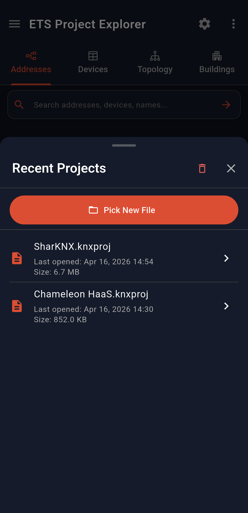 |

> [!NOTE]
> Loading a project is optional for monitoring and sending commands. See the [Getting Started](01-getting-started.md) guide for more context.

---

## View Tabs

After a project is loaded, four tabs become available to explore your project data.

> [!NOTE]
> In any tab that shows devices, a device whose individual address has been confirmed as loaded is shown with a **bold green address** and a **green tick** next to it. This status is read from your ETS project data and is not affected by programming an individual address from within SharKNX.

  | Group Addresses | Devices |
  |---|---|
  | 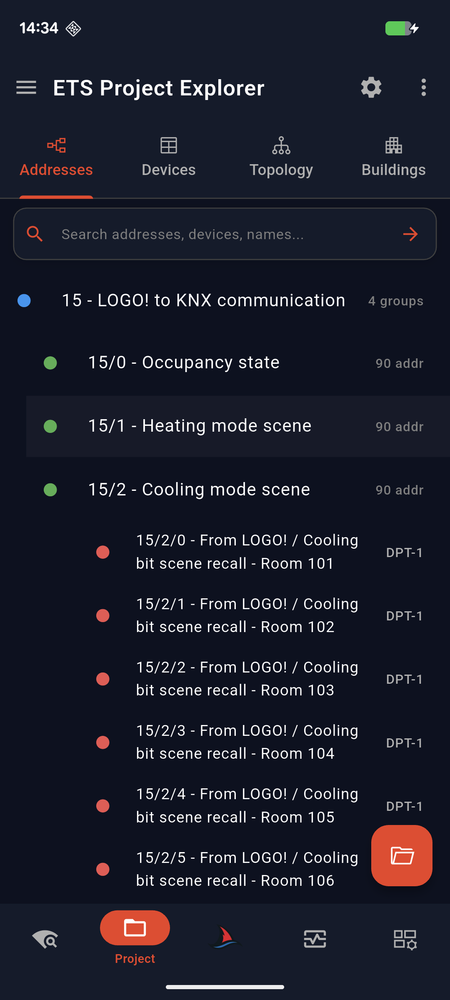 | 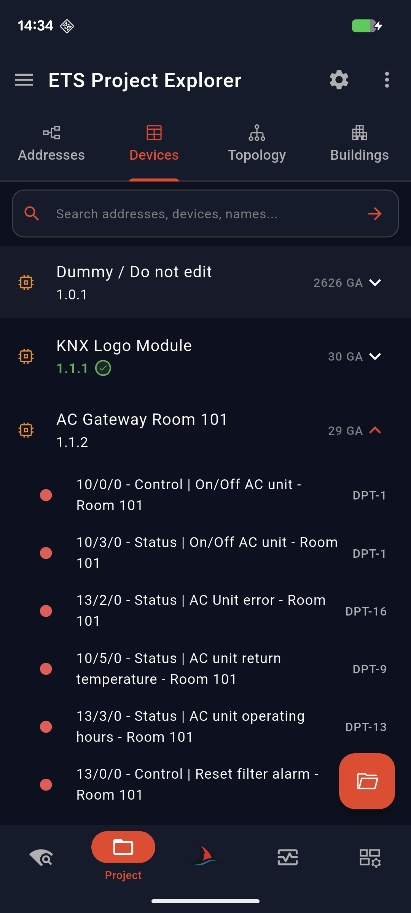 |
  | **Topology** | **Buildings** |
  | 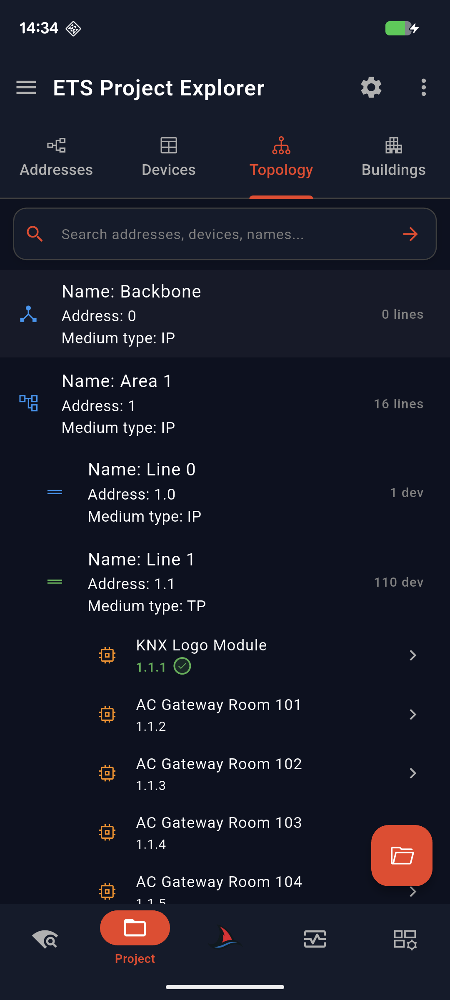 | 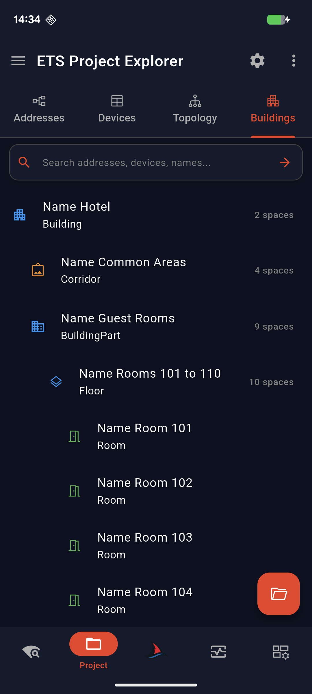 |

---

### Group Addresses

Displays all group addresses in a collapsible tree. The tree structure follows the group address format defined in your project:

| Format | Tree structure |
|--------|----------------|
| **3-level** | Main group → Middle group → Sub group |
| **2-level** | Main group → Sub group |

---

### Devices

Lists all devices in the project. Each device is expandable and shows the group addresses connected to it.

> [!TIP]
> Long-tap a device in the **Devices** tab to open its action panel directly, even when its group addresses are collapsed.

---

### Topology

A classic **Area → Line → Device** tree view, reflecting the physical KNX topology of your project.

---

### Buildings

Shows the buildings structure of your project - buildings, floors, rooms - along with any functions defined within them.

---

## Interacting with Group Addresses

Group addresses are tappable in all tabs: **Addresses**, **Devices**, **Topology**, **Buildings**, and the **Communication Objects** page.

Tapping a group address opens a bottom sheet with:
- **Address**, **Name**, and **DPT**
- Quick **Read** and **Write** action buttons

  | ETS Project Explorer - Group Address Bottom Sheet |
  |----------------------------------------------------|
  | 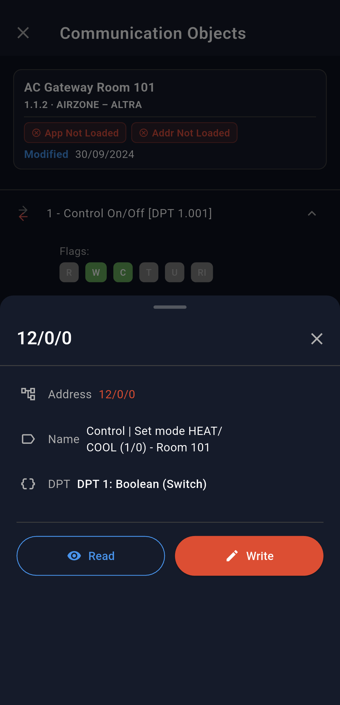 |

> [!NOTE]
> To send a Read or Write command, you must have a gateway selected. See [Connection & Gateway Discovery](02-connection-and-discovery.md).

---

## Interacting with Devices

Tapping a device (or long-tapping in the **Devices** tab) opens a bottom sheet with information and action buttons for that device.

  | ETS Project Explorer - Device Bottom Sheet |
  |--------------------------------------------|
  | 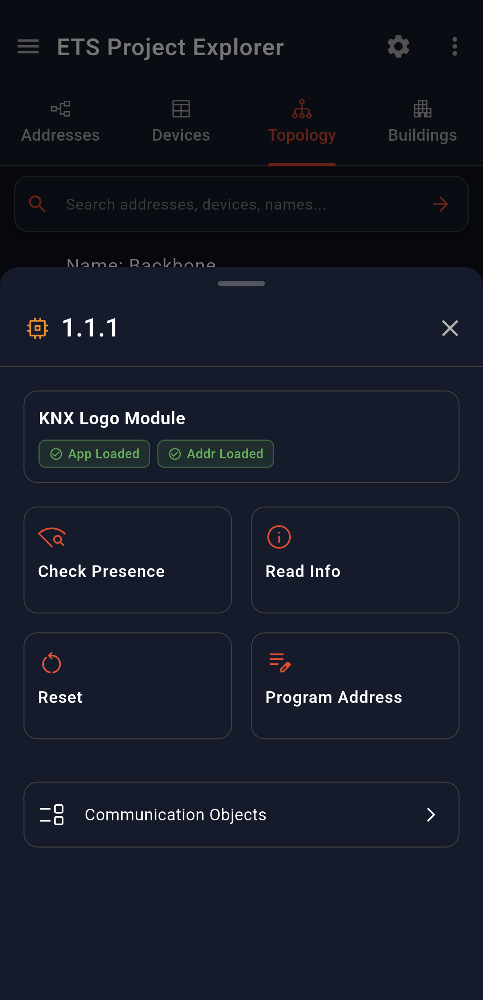 |

### Device Info

| Field | Description |
|-------|-------------|
| **Individual Address** | Whether the app has the device individual address loaded |
| **Application Address** | Whether the app has the device application address loaded |

### Device Actions

| Action | Description |
|--------|-------------|
| **Check Presence** | Quickly checks if the device is reachable on the KNX bus |
| **Read Info** | Reads device details: mask version, manufacturer, serial number, programming mode status, load state, run state, and app version |
| **Program Individual Address** | Waits up to 30 seconds for you to press the device's programming button, then programs the individual address |
| **Communication Objects** | Opens the Communication Objects page for this device |

  | ETS Project Explorer - Read Device Info |
  |------------------------------------------|
  | 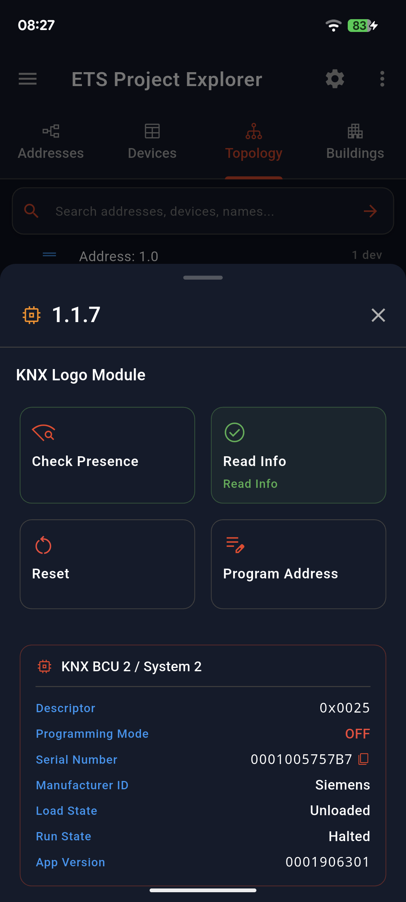 |

---

### Communication Objects

The **Communication Objects** page shows the communication objects of a device that are connected to group addresses. Objects with no group address connection are not shown.

  | ETS Project Explorer - Communication Objects |
  |----------------------------------------------|
  | 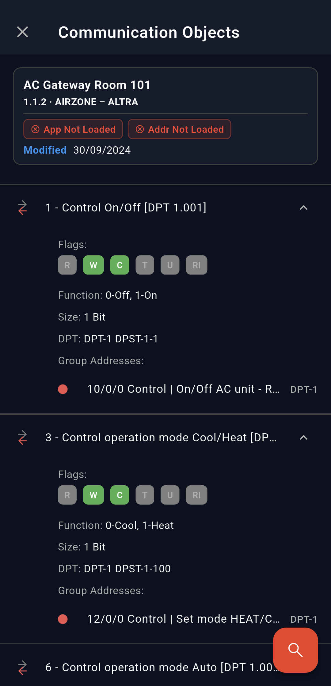 |

At the top of the page, an info card shows:
- **Last Modified** timestamp of the device in the project
- **Last Downloaded** timestamp (last time the application was downloaded to the device)

Each communication object displays:

| Field | Description |
|-------|-------------|
| **Name** | Name as defined in ETS |
| **Type** | Data type / DPT |
| **Flags** | Indicates whether the object sends, receives, or both |

Tapping a group address listed under a communication object opens the same [Group Address bottom sheet](#interacting-with-group-addresses) with quick Read/Write actions.

> [!NOTE]
> Communication Object loading can be toggled in **Settings**. Disabling it speeds up project loading and reduces memory usage. See [Settings](#settings).

---

## Search

When a project is loaded, a **search bar** is available at the top of the page. You can search by:
- Group address number or name
- Device name or individual address
- Any other text visible in the tree views

The view automatically filters to show only matching items across the active tab.

---

## KNX Data Secure

When a project containing **KNX Data Secure** group addresses is loaded, SharKNX automatically identifies those addresses and extracts their encryption keys. This enables the app to monitor and send secure KNX telegrams without any additional manual configuration.

> [!IMPORTANT]
> KNX Data Secure devices only accept telegrams from **trusted senders**. Before sending secure telegrams, you must configure the **Secure Sender** list. See [Secure Sender Configuration](#secure-sender-configuration) below.

---

### Secure Sender Configuration

A **banner** appears at the top of all tabs when secure group addresses are present in the loaded project. Tapping it opens the **Secure Sender Configuration** page.

  | ETS Project Explorer - Secure Sender Banner |
  |----------------------------------------------|
  |  |

On this page you can either:
- Set a **global sender** - the app will use this individual address as the sender for all secure group addresses
- Define a **per-address sender** - assign a specific sender to each group address individually
- Use **Auto-generate** to automatically assign senders based on the project data

**Sender resolution order:**

1. Per-address sender (if defined). If an address has multiple senders, the one with the **lowest individual address** is used
2. Global sender (if no per-address sender is defined)
3. The **connected gateway's address** (if no sender is configured at all)

  | ETS Project Explorer - Secure Sender Configuration |
  |------------------------------------------------------|
  |  |

---

## Menu & Settings

Almost all pages in **SharKNX** include:
- **3-line Icon** Menu (top-left)
- **Gear Icon** Settings (top-right)

These open side panels for additional information and configuration.

---

### Menu

The **Menu** panel shows information about the currently loaded project:

| Info | Description |
|------|-------------|
| **Name** | Project name |
| **Created On** | Project creation date |
| **Last Updated** | Date of the last modification |
| **Group Address Format** | 2-level or 3-level |
| **Created By** | Tool used (e.g. ETS6) |
| **Contact** | Author contact information |

It also displays basic **project statistics**: number of areas, lines, devices, and group addresses.

At the bottom of the menu, the **Unload Project** button clears the currently loaded project.

  | ETS Project Explorer - Menu |
  |------------------------------|
  | 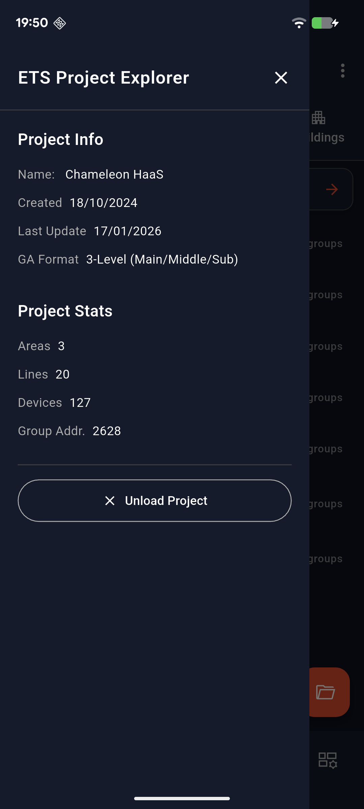 |

---

### Settings

The **Settings** panel allows you to adjust loading behavior and view performance.

  | ETS Project Explorer - Settings |
  |----------------------------------|
  | 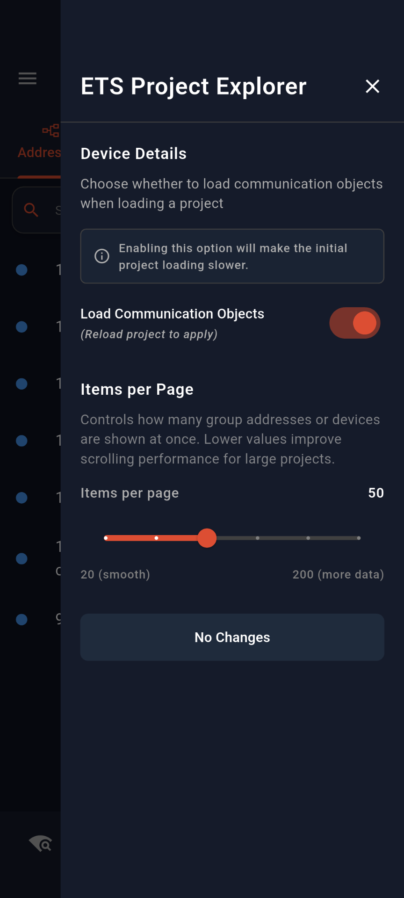 |

#### Device Details

A toggle that controls whether **Communication Objects** are loaded for each device when the project is imported.

| State | Effect |
|-------|--------|
| **Enabled** | Communication objects are loaded per device (default) |
| **Disabled** | Faster project loading and lower memory usage; Communication Objects page will not be available |

#### Items Per Page

A slider that sets the maximum number of items shown per tree node in any view tab. If a node has more items than the configured limit, a **Load More** button appears at the bottom.

> [!TIP]
> Lowering the **Items Per Page** value improves UI performance for projects with a large number of group addresses or devices under a single node.
