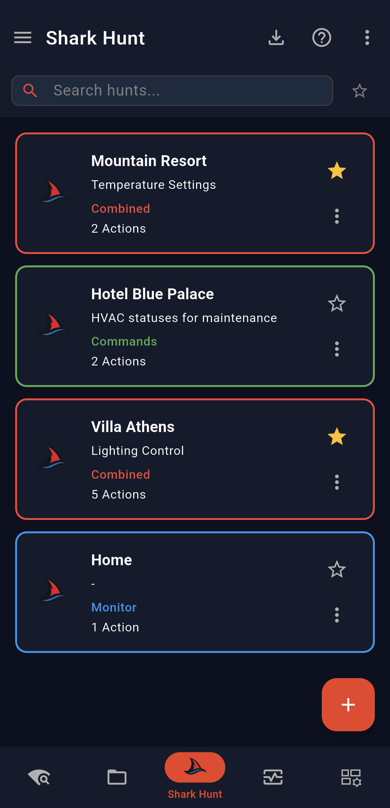
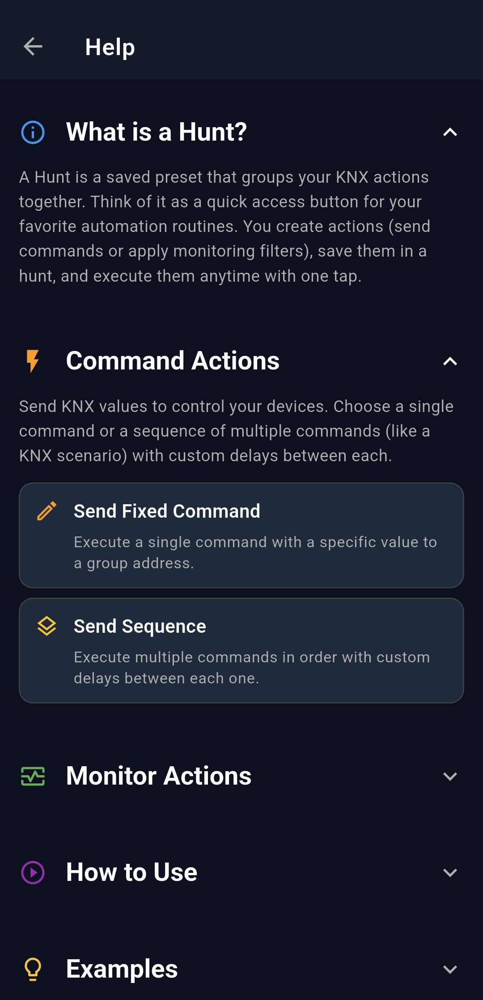
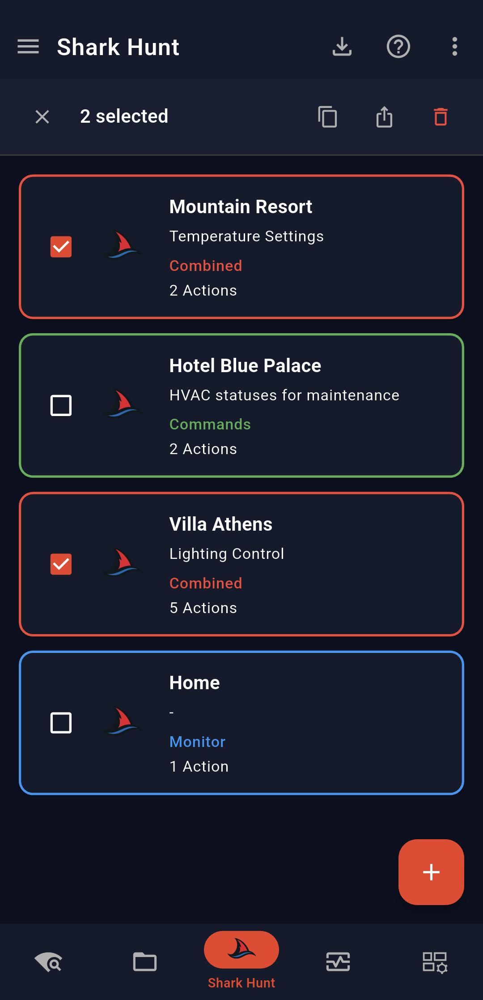
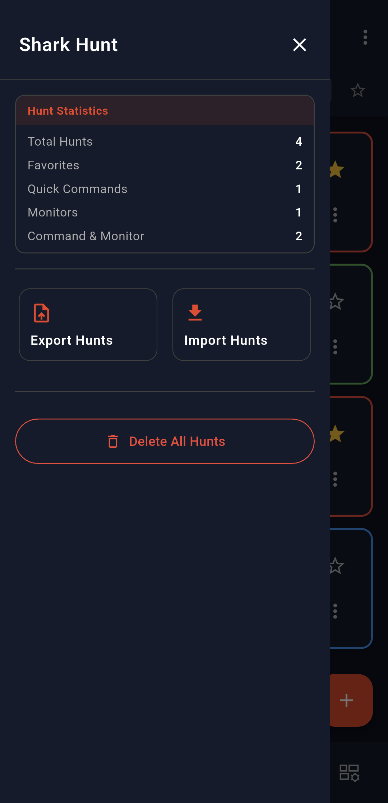
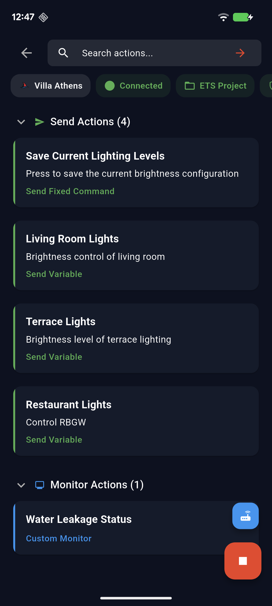
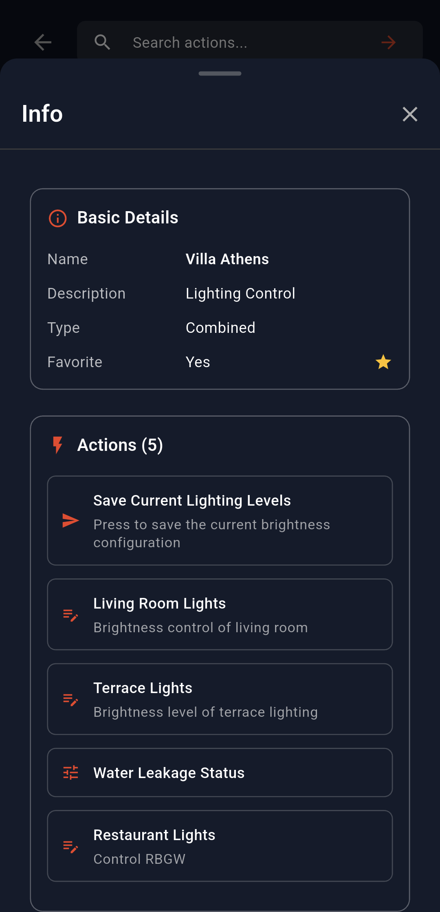
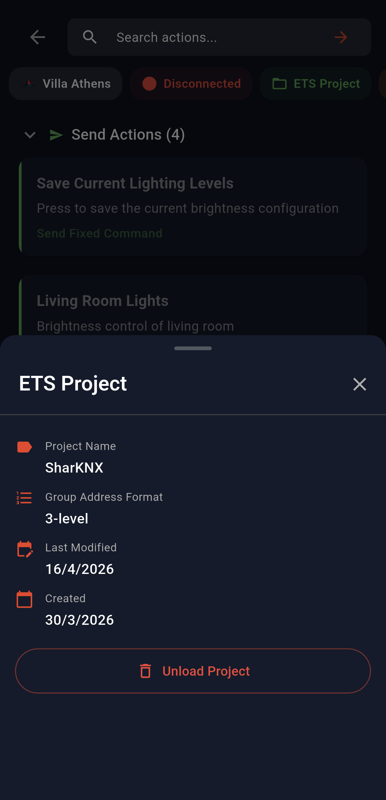
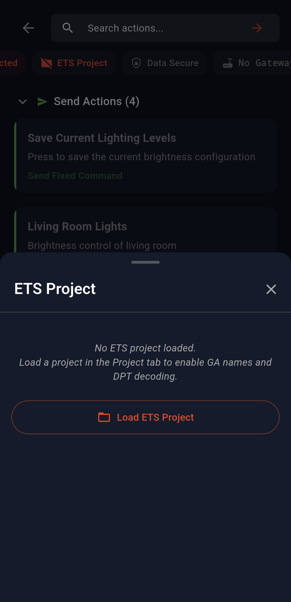
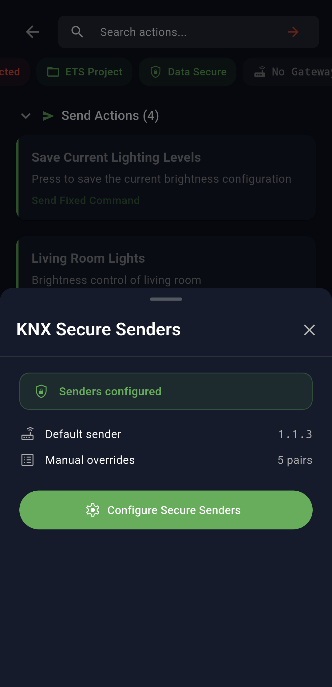
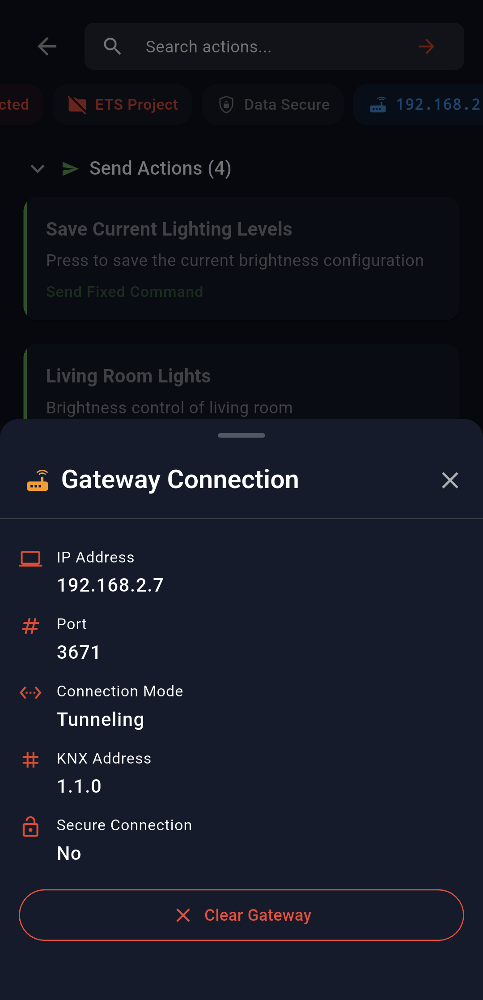

# Shark Hunt

**Shark Hunt** lets you build custom action pages for quick KNX control and diagnostics. Each hunt is a collection of actions - send commands and bus monitors - that can be executed with a single tap. Hunts can be created directly in the app, exported as files, and shared with colleagues or clients, so they can import and run them independently for remote troubleshooting or handover scenarios.

A hunt can contain two types of actions:
- **Send Actions** - send fixed commands, sequences of commands, or variable commands to the KNX bus
- **Monitor Actions** - monitor the bus with custom filters, scoped to a specific space or a specific device

This guide covers all pages and options available in Shark Hunt in detail.

> [!NOTE]
> Shark Hunts are stored as `.json` files with a defined structure. If you want to create or edit hunts manually outside the app, see the [Shark Hunt Advanced Topics](advanced-topics.md) guide.

---

## Contents

- [Shark Hunts Page](#shark-hunts-page)
  - [Top Bar](#top-bar)
  - [Filter Bar](#filter-bar)
  - [Hunt Cards](#hunt-cards)
  - [Multi-Select](#multi-select)
  - [Menu Panel](#menu-panel)
- [Hunt Page](#hunt-page)
  - [Top Bar](#top-bar-1)
  - [Badges](#badges)
    - [Hunt Info Badge](#hunt-info-badge)
    - [Connection Badge](#connection-badge)
    - [ETS Project Badge](#ets-project-badge)
    - [Data Secure Badge](#data-secure-badge)
    - [Gateway Badge](#gateway-badge)
  - [Connecting to the Bus](#connecting-to-the-bus)
  - [Action Cards](#action-cards)
- [Hunt Monitor Page](#hunt-monitor-page)

---

## Shark Hunts Page

The **Shark Hunts Page** is the main entry point for Shark Hunt. It lists all your created hunts as cards and provides options to search, import, and manage them.

  | Shark Hunts Page |
  |------------------|
  |  |

### Top Bar

The top bar contains two buttons on the right side:

| Button | Description |
|--------|-------------|
| **Import** | Import a `.json` hunt file from your device. You can import a file containing a single hunt or multiple hunts at once. If an imported hunt has the same name as an existing one, it is added as a copy with the same name |
| **Help (?)** | Opens the help page with additional information about Shark Hunt |

  | Shark Hunt Help Page |
  |----------------------|
  |  |

### Filter Bar

Below the top bar, a filter row allows you to search through your hunts by name or description. A **star icon button** next to the search input lets you quickly toggle a view showing only your favorited hunts.

### Hunt Cards

Each hunt is displayed as a card. The card **border color** indicates the hunt type at a glance:

| Color | Hunt Type |
|-------|-----------|
| 🟢 Green | Commands only |
| 🔵 Blue | Monitor only |
| 🔴 Red | Combined (send + monitor) |

Each card shows:
- **Name** and **Description** of the hunt
- **Type** label (Commands, Monitor, or Combined)
- **Number of actions** (e.g. *2 actions*)
- **Star icon** — tap to mark/unmark the hunt as a favorite
- **3-dot menu** — opens a menu with the following options:

| Option | Description |
|--------|-------------|
| **Edit** | Open the hunt editor to modify it |
| **Export** | Export this hunt as a `.json` file |
| **Share** | Share the hunt file via your device's share sheet |
| **Delete** | Delete this hunt |
| **Info** | Opens a bottom sheet with full hunt details: basic info, full list of actions, creation date and last modified date |

Tapping the card itself navigates to the [Hunt Page](#hunt-page) for that hunt.

> [!NOTE]
> You can have a maximum of **25 hunts** in the app.

---

### Multi-Select

Long-pressing a hunt card enters **multi-select mode**. You can then tap additional cards to add them to the selection. While in multi-select mode, the top bar shows three action buttons:

| Button | Description |
|--------|-------------|
| **Copy** | Creates a copy of each selected hunt |
| **Export** | Exports the selected hunts together into a single `.json` file |
| **Delete** | Deletes all selected hunts |

  | Shark Hunt Multi-Select |
  |-------------------------|
  |  |

---

### Menu Panel

The **hamburger icon** (top-left) opens a side panel with a summary of all your hunts and bulk management options.

  | Shark Hunt Menu Panel |
  |-----------------------|
  |  |

The summary card shows:

| Stat | Description |
|------|-------------|
| **Total Hunts** | Total number of hunts in the app |
| **Favorites** | Number of hunts marked as favorite |
| **Commands** | Hunts that contain only send actions |
| **Monitor** | Hunts that contain only monitor actions |
| **Combined** | Hunts that contain both send and monitor actions |

Below the summary, two action buttons are available:

| Button | Description |
|--------|-------------|
| **Import** | Import a `.json` file — same as the top bar import button |
| **Export All** | Exports all your hunts together into a single `.json` file |

> [!WARNING]
> The **Delete All** button at the bottom of the panel permanently removes all hunts from the app. This action cannot be undone.

---

## Hunt Page

Tapping a hunt card on the [Shark Hunts Page](#shark-hunts-page) opens the **Hunt Page** for that hunt. This is where you execute actions - send commands to the KNX bus or launch a bus monitor - with a single tap.

  | Hunt Page |
  |-----------|
  |  |

### Top Bar

The top bar contains a **back button** on the left to return to the Shark Hunts Page, and a **filter input** on the right to search through the actions in the current hunt by name.

---

### Badges

Below the top bar, a row of floating badges provides quick access to context and controls for the current hunt session.

---

#### Hunt Info Badge

Displays the **name of the current hunt**. Tapping it opens a bottom sheet with the hunt's full details — the same information shown in the **Info** option on the Shark Hunts Page.

  | Hunt Info Badge |
  |-----------------|
  |  |

---

#### Connection Badge

Displays the current **connection status** - either connected or disconnected. Tapping it triggers a connect or disconnect to the selected gateway.

> [!NOTE]
> See [Connecting to the Bus](#connecting-to-the-bus) for details on how gateway selection works.

---

#### ETS Project Badge

Indicates whether an **ETS project** is currently loaded. The badge is **green** when a project is loaded and **red** when none is loaded.

Tapping it opens a bottom sheet:

- **If a project is loaded** — shows the project details and an **Unload Project** button
- **If no project is loaded** — shows a **Load Project** button, which triggers the same project load flow described in the [ETS Project Explorer](../03-ets-project-explorer.md) guide

  | ETS Project Badge - Loaded | ETS Project Badge - No Project |
  |:--------------------------:|:------------------------------:|
  |  |  |

---

#### Data Secure Badge

Indicates whether **KNX Data Secure senders** are configured for this session.

- **Gray** - no Data Secure senders configured
- **Green** - Data Secure senders are configured

Tapping it opens a bottom sheet:

- **If no project is loaded** - shows an informational message only
- **If a project is loaded and senders are configured** - shows the configured sender details and a **Configure Senders** button, which navigates to the same secure sender configuration page described in the [ETS Project Explorer](../03-ets-project-explorer.md) guide

  | Data Secure Badge - Configured |
  |--------------------------------|
  |  |

---

#### Gateway Badge

Displays the **IP address of the selected gateway**, or *"No Gateway Selected"* if none has been chosen yet.

- **If a gateway is selected** - tapping opens a bottom sheet with the gateway details and a **Clear Gateway** button to deselect it
- **If no gateway is selected** - the badge is not tappable

  | Gateway Badge |
  |---------------|
  |  |

---

### Connecting to the Bus

The Hunt Page has two FAB buttons on the bottom right for managing the KNX bus connection:

| FAB | Description |
|-----|-------------|
| **Connect FAB** (large, green, link icon) | Connects to the selected gateway. While connected, it turns red with a stop icon - tapping it disconnects |
| **Select Gateway FAB** (small, blue, gateway icon) | Opens the gateway selection dialog directly |

If no gateway is selected when you press the **Connect FAB**, the same gateway selection dialog opens automatically before connecting.

The **gateway selection dialog** lists all available options:

- **Discovered gateways** - gateways found during the last network scan
- **Hunt's configured gateway** - a gateway saved specifically in this hunt's configuration during creation
- **General configured gateways** - gateways saved in the [Connection Manager](../02-connection-and-discovery.md)

  | Gateway Selection Dialog |
  |--------------------------|
  |  |

---

## Hunt Monitor Page

Tapping a **monitor action card** on the Hunt Page opens the **Hunt Monitor Page**. This is where you start and stop bus monitoring for that specific filter you created and inspect the received telegrams.

  | Hunt Monitor Page |
  |-------------------|
  |  |

### Top Bar

The top bar shows:
- **Back button** (left) - returns to the Hunt Page
- **Hunt name** (left, next to back button) - the name of the parent hunt
- **Monitor action name** (below the hunt name) - the name of the specific monitor filter currently active
- **Export button** (right) - exports the current telegram list as a CSV file. See the [Monitor & Send](../05-monitor-and-send/monitor-and-send.md) guide for full details on the export format.

### FABs

Two FAB buttons are available on the bottom right:

| FAB | Description |
|-----|-------------|
| **Start Monitor FAB** (large, green, play icon) | Starts monitoring the KNX bus with the active filter. While running, it turns red with a stop icon - tapping it stops the monitor |
| **Change Filter FAB** (small, blue, tune icon) | Opens a bottom sheet listing all monitor actions available in this hunt. Tap any action to switch to its filter. The currently active filter is highlighted with a green indicator |

  | Change Filter Bottom Sheet |
  |----------------------------|
  |  |

### Badges

A row of floating badges sits below the top bar, above the telegram list.

---

#### Send Command Badge

Allows you to send commands directly from the monitor page. See the [Monitor & Send](../05-monitor-and-send/monitor-and-send.md) guide for full details on sending commands.

---

#### Filter Details Badge

Opens a bottom sheet showing the details of the currently active monitor filter - the group addresses, sources, and any other conditions applied.

  | Filter Details Badge |
  |----------------------|
  |  |

---

#### Clear All Badge

Clears the current telegram list view.

---

#### Data Secure Badge

Same behavior as the [Data Secure Badge](#data-secure-badge) on the Hunt Page.

---

#### View Badge

Opens a bottom sheet with two display options for the telegram list:

- **Sort order** - choose between *Newest first* (new incoming telegrams appear at the top) or *Oldest first* (new incoming telegrams appear at the bottom)
- **Address format** - toggle the group address display format between **3-level** (e.g. *1/2/3*) and **2-level** (e.g. *1/512*)

  | View Badge |
  |------------|
  |  |

---

#### Telegram Statistics Badge

Opens a bottom sheet with a summary of the current telegram list:

| Stat | Description |
|------|-------------|
| **Total Telegrams** | Total number of telegrams received |
| **Duration** | Length of the monitoring session |
| **Rate** | Telegrams received per second |
| **Group Addresses** | Percentage breakdown by group address (e.g. *5/5/5 - 20%*) |
| **Sources** | Percentage breakdown by individual/source address |
| **Types** | Percentage breakdown by telegram type (e.g. *Group Value Write*, *Group Value Read*) |

> [!NOTE]
> Statistics are calculated at the moment you open the bottom sheet. They are not updated in real time while the sheet is open.

  | Telegram Statistics Badge |
  |---------------------------|
  |  |

---

#### Gateway Badge

Displays details of the currently selected gateway. Unlike the [Gateway Badge](#gateway-badge) on the Hunt Page, this badge is **read-only** - it shows information only and does not allow clearing or changing the gateway.

---

### Telegram List

The telegram list view is identical to the one in the **Monitor & Send** page. See the [Monitor & Send](../05-monitor-and-send/monitor-and-send.md) guide for a full description of the list, its columns, and how to interact with individual telegrams.
