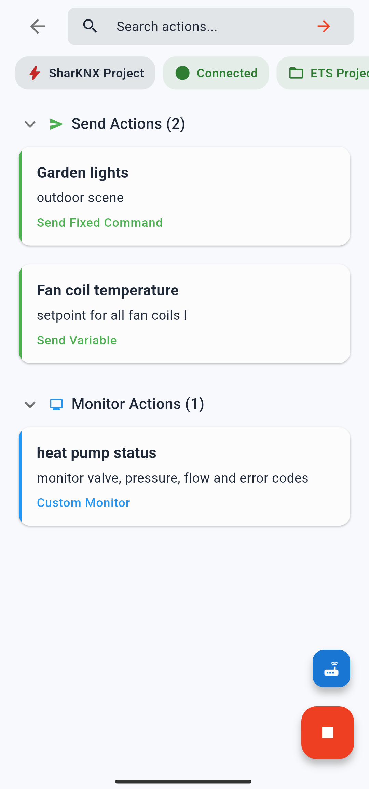

# Shark Hunts

A Shark Hunt is a reusable, self-contained set of actions for testing and diagnosing a KNX installation. Instead of navigating to a group address, selecting a datapoint, and composing a command every time you need to run a test, you build a hunt once and execute it in one tap — from anywhere, on any visit to the same installation.

---

## The Core Idea

Each Shark Hunt is stored as a JSON file that describes a collection of **send actions** (commands to the bus) and **monitor actions** (filtered monitor sessions). A hunt can contain either type, or both. When you open a hunt, all its actions are presented as a single page of tappable cards, ready to run.

This makes Shark Hunts useful in several scenarios:

- **Repeated testing.** Commissioning often requires sending the same commands dozens of times across multiple site visits. A hunt captures those commands so you never have to reconstruct them.
- **Delegating diagnostics.** A hunt can include all the connection details for a specific installation. You can export it and share it with a colleague or client who then runs it on their own device without needing to know how to configure a gateway or find a group address.
- **Structured test sequences.** A multiple/sequence action can send a series of commands with configurable delays between them, covering a full lighting scene test or a shutter cycle in one tap.
- **Advanced bus filtering.** Monitor actions can apply complex filter logic — combining group address ranges, device filters, telegram type filters, and time windows — that the standard monitor filter bar does not support.

---

## Send Actions

Three types of send actions are available:

**Send Fixed** runs a single write or read command to a specific group address with a fixed value every time. Useful for quick device triggers — turning a light on, saving a scene, checking a sensor value.

**Send Multiple / Sequence** runs a series of fixed commands in order. Each command in the sequence can have a configurable delay before the next one fires (up to 10 seconds per step). Use this to test scene saves, shutter travel sequences, or any multi-step automation logic.

**Send Variable** sends a value you choose at the moment of execution to one or more group addresses sharing the same datapoint type. When you tap the action card, a value input sheet opens with the appropriate DPT controls (sliders, colour pickers, numeric fields, etc.). Useful when you want flexibility to test different values without editing the hunt.

---

## Monitor Actions

Three types of monitor actions are available:

**Custom Monitor** applies a multi-condition filter to the bus monitor. Conditions can filter by group address (including wildcards like `1/*/0`), by sender individual address (including wildcards like `1.*.*`), by telegram type (read, write, response), by name or description text, and by time window. Conditions are connected with AND/OR logic, enabling filters that are not expressible through the standard monitor search bar. Address and device entries can also be set to exclude rather than include, so you can monitor everything except a specific range.

**Monitor Space** uses your ETS project's building structure to set the filter target. You select a room or space from the building hierarchy and the monitor shows only the group addresses or devices belonging to that space. No manual address entry needed.

**Monitor Device** targets one or more specific devices from your ETS project and monitors all group addresses connected to them. Effective for isolating the communication of a single actuator or sensor during testing.

When you open a monitor action in a hunt, the filters are applied immediately. A badge in the monitor view shows the active filter details, and a quick-switch sheet lets you swap between all monitor actions in the hunt without leaving the monitor page.

---

## Sharing and Portability

Shark Hunts are designed to be shared. Each hunt can optionally include a **preconfigured gateway** — the IP address, port, and connection settings for the installation it was built for. When someone opens a shared hunt, that gateway appears as a connection option so they can connect and run the hunt without needing to discover or configure anything themselves.

You can export a single hunt or all your hunts at once as a JSON file, then share it via any file transfer method — messaging apps, email, cloud drives. Importing a JSON file adds the hunts it contains to your list without overwriting existing ones.

Hunt cards are colour-coded so you can see at a glance what a hunt does:

| Border colour | Content |
|---|---|
| Green | Send actions only |
| Blue | Monitor actions only |
| Red | Both send and monitor actions |

---

## Persistence

Hunts are saved on-device and persist across app restarts. The creation and last-modified timestamps for each hunt are stored and visible in the hunt info sheet.

---

## Further Reading

- [Create a Shark Hunt](../how-to/create-shark-hunt.md) — step-by-step guide to building your first hunt
