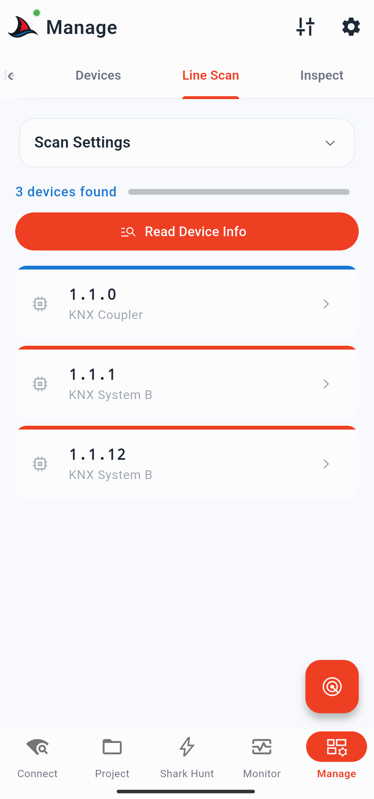
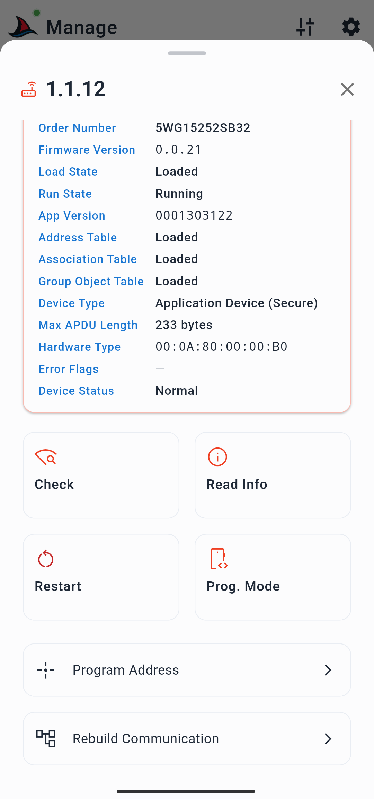
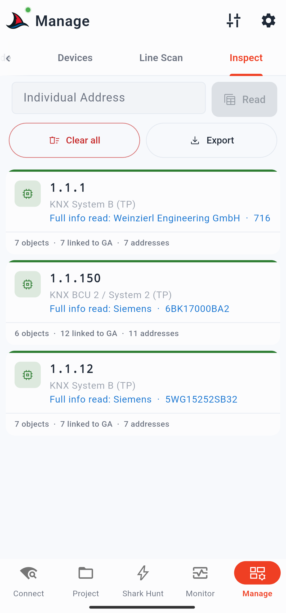
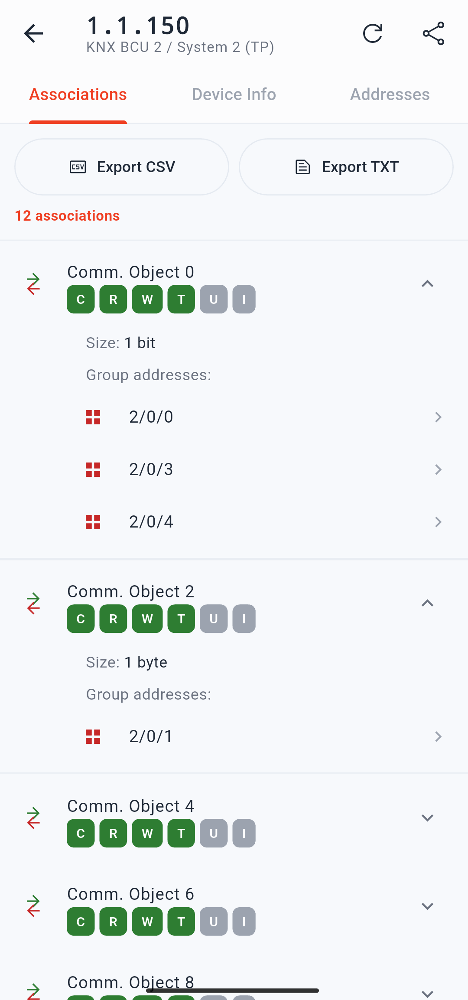

# Management Page

The Management page is focused on KNX device and installation diagnostics. It has four tabs: **Prog. Mode**, **Devices**, **Line Scan**, and **Inspect**.

---

## Prog. Mode Tab

This tab lets you scan the bus for devices that currently have their programming mode active.

Tap the **radar FAB** to start the scan. The app listens for devices in programming mode and lists them as cards. The scan duration and ping interval are configurable in **Scan Settings** (gear icon → Scan settings).

Each discovered device card has two buttons:

- **Check Info** — navigates to the Devices tab with the discovered device's individual address prefilled, ready for a device info read.
- **Comm. Info** — navigates to the Inspect tab with the address prefilled, ready to read the device's communication tables.

This makes it easy to scan first, then immediately jump to deeper diagnostics on any device found in programming mode.

---

## Devices Tab

The Devices tab lets you perform diagnostic actions on any individual device address — whether discovered through scanning or looked up directly.

### Data Secure Badge

At the top of the tab, a badge indicates whether KNX Data Secure device keys are loaded (from a `.knxkeys` file in the Security tab of the Discovery page). If no keys are loaded, the badge is amber. If keys are loaded, the badge is blue and shows the count of secure devices. Tapping the badge opens a sheet with details and a shortcut to load a `.knxkeys` file.

### Address Input

Enter a KNX individual address in the input field. Tap the **search icon** to browse devices from your loaded ETS project and select one directly.

### Actions

Once an address is entered, four actions are available:

| Action | Description |
|---|---|
| **Check** | Verifies whether the device is present and responsive on the bus |
| **Read Info** | Reads detailed device information directly from the device |
| **Toggle Programming Mode** | Remotely turns the device's programming mode on or off |
| **Restart** | Sends a restart command to the device |

**Read Info** retrieves the following fields from the device:
- Device descriptor (e.g. System B)
- Programming mode status
- Manufacturer and order number
- Firmware version
- Load state and run state
- Application version
- Address and association table status
- Max APDU length
- Hardware type
- Error flags and device status

---

## Line Scan Tab

The Line Scan tab scans a KNX bus line for all devices present on it, regardless of what your ETS project contains. This is useful for verifying an installation, detecting unexpected devices, or working with an unknown project.

### Scan Settings Card

Configure the scan before starting:

| Setting | Description |
|---|---|
| Area and line | The KNX area.line to scan (e.g. `1.1`). Use **Choose from project** to select a line from your loaded ETS project — this also auto-selects the correct medium type. |
| Medium type | TP, IP, or IoT. Required for the app to know which device address range to probe. |
| Range | Start and end address within the line (0–255). Narrow the range to speed up the scan or check a specific segment. |

Tap the **scan FAB** to start. The scan can be stopped at any time before it completes.

### Scan Results

Discovered devices appear as cards. The card border colour indicates the device type:

| Colour | Device type |
|---|---|
| Blue | KNX coupler |
| Red | Standard application device |
| Green | KNX Secure device |

A **Read Device Info** button appears above the card list after a scan completes. Tapping it reads device info (manufacturer, serial number, and other details) for all discovered devices in sequence — useful for quickly building a picture of an installation you did not commission yourself.

### Device Card Detail Sheet

Tap any discovered device card to open its detail sheet. It contains:

- A device info card (populated if Read Device Info was run)
- The same four diagnostic actions as the Devices tab: **Check**, **Read Info**, **Toggle Programming Mode**, **Restart**
- **Program Address** — opens a sub-page where you can enter a new individual address (or search your project for one) and program it to the device using one of two methods:
  - **Via programming button** — waits up to 20 seconds for a device to enter programming mode, then writes the address. Also checks for address conflicts against the real installation.
  - **Via serial number** — if you already read the device info and have its serial number, programs the address without requiring physical access to the programming button.
- **Rebuild Communication** — navigates to the Inspect tab with this device's address prefilled.

---

## Inspect Tab

The Inspect tab reads a device's communication tables directly from its memory. This reconstructs which communication objects exist, what flags they have, and which group addresses are connected to them — without needing an ETS project. It is the most effective way to understand an unknown device or verify a device in a project you did not create.

### Reading a Device

Enter a device's individual address in the input field and tap **Read**. A progress bar shows which operation is in progress. After completion, a session card appears for the device.

The card's border colour indicates success or failure. Each card shows:
- Device individual address
- Device descriptor (e.g. System B, KNX coupler)
- Whether full device info has been read (shows manufacturer and order number if it has)

A **Read Full Info** button on each card triggers a separate device info read if you want the complete details without slowing down the initial table reconstruction.

Session cards are **persistent** — they survive app restarts. Use the **Clear** button above the card list to remove all sessions when you are done.

### Session Details Page

Tap any session card to open its full details page. The top bar shows the device address and descriptor, a **reload** button to re-run the reconstruction, and a **share** button to export and share a PDF report for this session.

The details page has three tabs:

#### Associations

Lists all communication objects read from device memory that have connected group addresses:

| Column | Description |
|---|---|
| Number | Communication object index |
| Flags | R (Read), W (Write), C (Communication), T (Transmit), U (Update), I (Read-on-Init) |
| Size | Object size (1 bit, 1 byte, 2 bytes, etc.) |
| Group addresses | Addresses connected to this object |

Each group address is tappable. Because the datapoint type is not known from memory alone, a raw hex or decimal value input is presented for sending test commands.

**Export CSV** and **Export TXT** buttons export the associations list for this device only.

#### Device Info

Shows the full device info card (same fields as the Devices tab Read Info action). Includes a **Read Info** button if not yet read, and a **Copy All** button that copies all fields to the clipboard for sharing with colleagues.

#### Addresses

A table of all group addresses read from the device's address table in memory, with columns for index, 3-level format, 2-level format, and hex value. Each row is individually copyable. **Copy All** and **Export CSV** buttons are available above the table.

---

## Tune Menu

The tune icon in the top bar provides two export actions for the most recent line scan result:

- **Export as text** — exports a TXT report with scan timestamp, gateway used, area/line scanned, medium, and a list of discovered devices with their info
- **Export as PDF** — same content in PDF format
