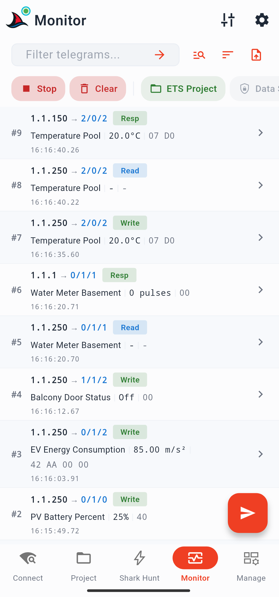
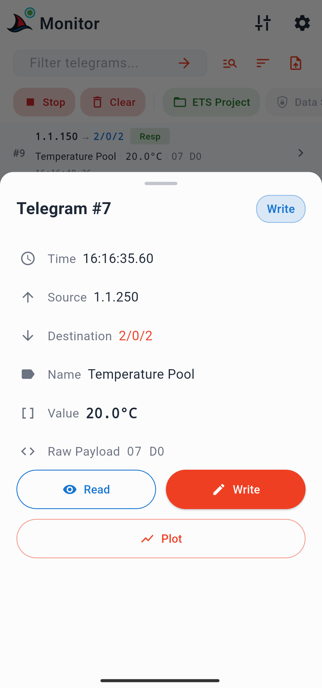
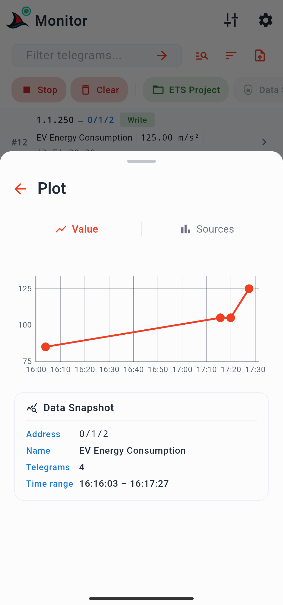
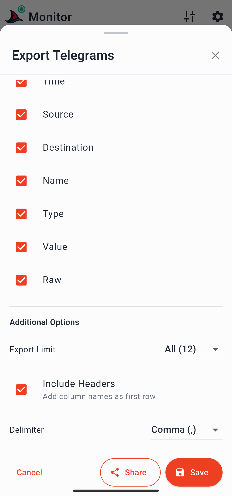

# Monitor Page

The Monitor page provides a live KNX bus monitor session. Incoming telegrams are captured in real time and displayed as a scrollable list. You can filter, inspect, plot, and export telegrams, and send commands to the bus without leaving the page.

---

## Starting and Stopping

Tap the green **start FAB** to begin a monitor session.

- If no gateway is selected, a picker appears with your discovered and saved gateways. Select one to proceed.
- The app connects to the gateway and begins capturing telegrams immediately.
- The FAB changes to a red **send FAB** while the monitor is running (see [Sending Commands](#sending-commands)).

Tap the **Start/Stop badge** in the badge row (see below) to stop the monitor. The telegram list remains visible after stopping — it is not cleared until you explicitly clear it.

---

## Filter Bar Row

The filter bar row is pinned above the telegram list and always visible.

**Text filter bar** — type any text to filter the visible telegram list. Matches against group address names, values, and individual addresses. The underlying list is not modified; clear the filter to see all captured telegrams again.

**Search filter icon** — opens a bottom sheet with two tabs: one listing all group addresses from your loaded ETS project, one listing all devices. Tap any entry to apply it as the active filter immediately. Useful for quickly isolating a specific group address or device without typing.

**Always-on-top button** — when enabled (the default), the list scrolls to the newest telegram each time one arrives. The view automatically detects when you are manually scrolling and pauses auto-scroll until you return to the top. Tapping the button while it is disabled jumps the view to the top immediately.

**Export button** — opens the export bottom sheet. See [Exporting Telegrams](#exporting-telegrams).

---

## Badge Row

A scrollable row of badges is pinned below the filter bar. Each badge is tappable.

### Start / Stop
Starts or stops the monitor session. Same function as the start FAB before the monitor is running.

### Clear
Clears all telegrams from the list. The monitor session continues running if active.

### ETS Project
Shows whether an ETS project is loaded. Tapping it opens a sheet with project details (name, group address format, created and modified dates) and a button to unload the project. If no project is loaded, the sheet has a **Load Project** button that opens the same file picker as the Project page.

### Data Secure
Reflects the state of KNX Data Secure for the current session:

| Badge state | Meaning |
|---|---|
| Gray | No data secure group addresses in the loaded project |
| Amber | Data secure addresses present, but senders not configured |
| Green | Data secure addresses present and senders configured |

Tapping an amber badge opens a sheet with a button to navigate to the Data Secure Senders configuration page. See [KNX Data Secure](../concepts/knx-data-secure.md).

### Telegrams
Shows the current telegram count. Tapping it opens a sheet with:
- **Clear filter** — removes any active text or search filter (only shown when a filter is active)
- **Clear telegrams** — clears all captured telegrams
- **Statistics** — opens a statistics view showing:
  - Total telegram count
  - Telegrams/second rate (calculated from first to last telegram timestamp)
  - Top group addresses by percentage of total
  - Top sender individual addresses by percentage
  - Top telegram types (write, read, response, etc.) by percentage

### View
Opens view options for the telegram list:
- **Sort order** — newest first (default) or oldest first
- **Address level format** — how group addresses are displayed (3-level, 2-level, or free). Defaults to the format of the loaded ETS project. Changes affect only new incoming telegrams, not already-visible ones.
- **View Group** — navigates to a second sheet page where you can filter the visible list by group address, physical address, telegram type, or priority. Selecting an entry shows only matching telegrams.

### Gateway
Shows the selected gateway's IP address. Color indicates connection state:

| Colour | State |
|---|---|
| Gray | No gateway selected |
| Blue | Gateway selected, not connected |
| Green | Selected and connected |

Tapping it opens a sheet with gateway details and a **Clear selection** button (available only when the monitor is stopped).

---

## Telegram List

Each row in the list shows:
- **Sender individual address → destination group address**
- **Group address name** *(requires ETS project)* | **decoded value** *(requires ETS project)* | **raw hex payload*
- **Timestamp** in `HH:MM:SS.ms` format

### Telegram Detail Sheet

Tap any row to open the detail sheet for that telegram. It shows:

- Timestamp
- Source individual address
- Destination group address
- Group address name *(if ETS project loaded)*
- Decoded value *(if ETS project loaded)*
- Raw hex payload

Two action buttons are available:
- **Read** — sends a read command to the telegram's group address immediately
- **Write** — opens the command composer with the group address and datapoint type prefilled; enter a value and send

### Plot

A **Plot** button in the detail sheet opens a two-tab chart view for the selected group address:

- **Value tab** — time series chart of all captured values for this address. Pinch to zoom, pan horizontally, tap a point to see its exact value and timestamp.
- **Sources tab** — bar chart of sender individual addresses that have transmitted this group address, useful for identifying unexpected senders or diagnosing "noise" on the bus.

An info card shows the time range covered by the chart data.

---

## Sending Commands

While the monitor is running, the FAB becomes a red **send FAB**. Tapping it opens a bottom sheet with:

- **New Command** — opens the command composer. Enter a group address (or search from the loaded ETS project), select write or read, choose the datapoint type and subtype, enter a value, and tap **Send**. The sent command appears in the telegram list immediately.
- **Quick command chips** — chips for recently sent commands appear below the new command button. Tap a chip to resend the same command instantly. Long-press a chip to reopen the composer with that command's fields prefilled, so you can adjust the value before sending.

---

## Exporting Telegrams

The export bottom sheet (opened from the export button in the filter bar row, or from the tune menu) lets you save or share the current telegram list as a CSV file.

Options available:

| Option | Description |
|---|---|
| Filename | Editable, prefilled with a timestamp |
| Columns | Tick boxes for id, time, source, destination, name, type, value, raw |
| Telegram count | Choose how many telegrams to export (e.g. last 100 of 5000) |
| Include headers | Toggle column header row in the CSV |
| Delimiter | Comma (default), tab, or semicolon |

**Save** writes the file to your device storage. **Share** opens the system share sheet to send it directly to a messaging app, cloud drive, or email.

See [Export Formats](../reference/export-format.md) for the full CSV file structure.

---

## Tune Menu

The tune icon in the top bar opens additional actions for the Monitor page:

**Import SharKNX CSV** — loads a CSV file previously exported from SharKNX into the telegram list. The imported telegrams replace the current list. The file must match the SharKNX export format.

**Export telegrams** — same as the export button in the filter bar row.

**Import from ETS XML** — loads a telegram export file from the ETS software tool. Useful for viewing and analysing a recording made in ETS on your mobile device or sharing it with colleagues. Replaces the current telegram list.

**Apply project data** — after loading or updating an ETS project, this retroactively applies the project's group address names and datapoint types to all telegrams currently in the list. The monitor must be stopped before running this. Use it when you load a project after you have already captured telegrams, or when you reload an updated project and want the new names to reflect in existing captured data.
