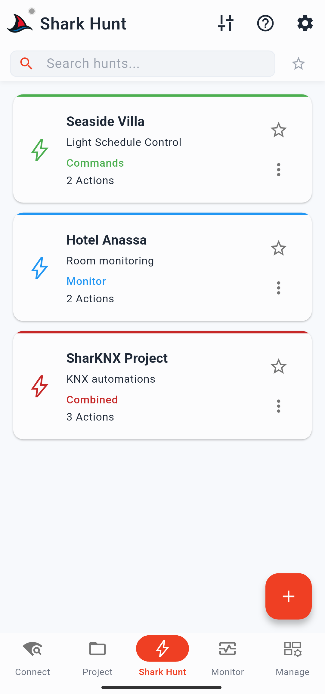

# Shark Hunts Page

The Shark Hunts page is where you create, manage, and run **shark hunts** — reusable sets of KNX send actions and monitor filters saved as portable JSON files. A hunt gives you a dedicated page with one-tap actions, pre-configured filters, and an optional embedded gateway, ready to share with colleagues or clients.

For the underlying concept, see [Shark Hunts](../concepts/shark-hunts.md).

---

## Main Page Layout

Under the top bar there is a text filter row. Type to filter hunt cards by name. The **star icon** on the right of the row filters immediately to show only hunts you have marked as favourite.

The top bar contains:

- **Help button** — opens an in-app reference page covering the Shark Hunt concept, action types, and examples
- **Tune icon** — two actions:
  - **Export Hunts** — exports all existing hunts as a single JSON file
  - **Import Hunts** — imports a JSON file containing one or more hunts

### Creating a Hunt

Tap the **+ FAB** to open the five-step creation wizard. See [Create a Shark Hunt](../how-to/create-shark-hunt.md) for a full walkthrough.

### Hunt Cards

Each created hunt appears as a card. The card's top border colour indicates its type:

| Border colour | Hunt type |
|---|---|
| Green | Send actions only |
| Blue | Monitor actions only |
| Red | Both send and monitor actions |

Each card shows the hunt name, description (if any), and type label. It also has:

- **Star icon** — mark or unmark as favourite
- **Three-dot menu** — Edit, Export (single JSON), Share, Delete, and Info
  - **Info** opens a sheet with name, type, favourite status, action count and names, and creation/modified timestamps

Long-pressing any card enters multi-select mode, allowing you to copy, export, or delete multiple hunts at once.

Hunt cards are persistent and survive app restarts.

  

---

## Hunt Detail Page

Tapping a hunt card opens its dedicated page. The top bar shows a back button and a filter input to search within action cards on this page.

### Badge Row

| Badge | Description |
|---|---|
| **Hunt name** | Tapping opens the hunt info sheet (name, type, favourite, action count, timestamps) |
| **Connection status** | Red = disconnected, Green = connected. Tapping connects or disconnects from the gateway |
| **ETS Project** | Shows whether an ETS project is loaded. Tapping opens a sheet with project details (name, GA format, dates) and a button to load or unload the project |
| **Data Secure** | Shows KNX Data Secure sender status. Grey = no Data Secure GAs loaded; amber = GAs present but no senders configured (tap to configure); green = senders configured (tap to review) |
| **Gateway** | Shows the selected gateway IP address. Blue = selected, grey = none selected, green = selected and connected. Tapping opens a sheet with gateway details and a clear-selection button (when not monitoring) |

### Connecting

Tap the **green connect FAB** to connect to the configured gateway. If no gateway is selected, a pop-up lists available options — including any gateway embedded in the hunt during creation, plus other discovered and manually configured gateways. Once connected, the FAB turns red with a stop icon to disconnect.

All action cards are faint and non-interactive until connected.

---

## Send Actions Section

Send action cards are grouped in the upper section of the hunt page. Tapping a card runs it immediately:

- **Fixed action** — sends the pre-configured value without any prompt
- **Multiple / Sequence action** — sends all commands in sequence, with any configured delays between them
- **Variable action** — opens a bottom sheet with a DPT-appropriate input UI (e.g. colour sliders for RGB, a percentage slider for DPT 5.001). Confirm with the send button.

  

---

## Monitor Actions Section

Monitor action cards are grouped below the send actions. Tapping a card opens the **Shark Hunt Monitor** for that action — a monitor session with the action's filters applied immediately.

### Shark Hunt Monitor

The Shark Hunt Monitor page is similar to the main [Monitor page](monitor.md) but scoped to the active action's filter. The top bar shows the hunt name as title and the monitor action name as subtitle, plus a **save/export** button (active when telegrams are present).

#### Badge Row

| Badge | Description |
|---|---|
| **Send** | Opens a bottom sheet to compose and send a command. Also shows quick-send chips for recent commands; long-press a chip to reopen the composer with fields pre-filled |
| **Filter details** | Shows the conditions of the currently active filter |
| **Clear** | Clears all telegrams from the list |
| **Data Secure** | Same as the hunt detail page Data Secure badge |
| **View** | Sort order (newest first / oldest first) and group address format. Affects new incoming telegrams |
| **Statistics** | Total telegrams, telegrams/sec rate, top group addresses, top source devices, and top telegram types |
| **Gateway** | Same as hunt detail page gateway badge |

The **monitor FABs** work as follows:
- Large FAB — green/start to begin monitoring, red/stop to end
- Small FAB above it — opens a sheet listing all monitor actions in this hunt, so you can switch filters without leaving the page. The currently active action is shown with a green dot

#### Telegram List

Each telegram row shows:
- Sender individual address → destination group address
- Group address name | value | raw hex value (name and value require a loaded ETS project)
- Timestamp in HH:MM:SS.ms format

Tapping a row opens the telegram detail sheet with full fields (time, source, destination, name, value, raw payload) and two action buttons — **Read** (sends a read command to the group address) and **Write** (opens the command composer pre-filled with the address and DPT). A third button, **Plot**, opens a chart view with two tabs: a time-series chart of the group address value and a bar chart of source individual addresses.

#### Export

The export sheet lets you name the file (pre-filled with a timestamp), choose which columns to include (ID, time, source, destination, name, type, value, raw), set how many telegrams to export, toggle column headers, and choose a delimiter (comma, tab, or semicolon).
