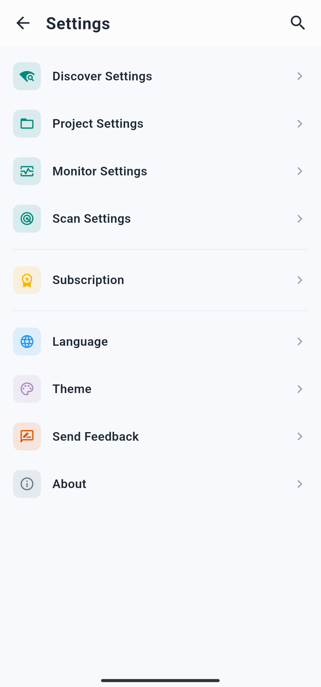
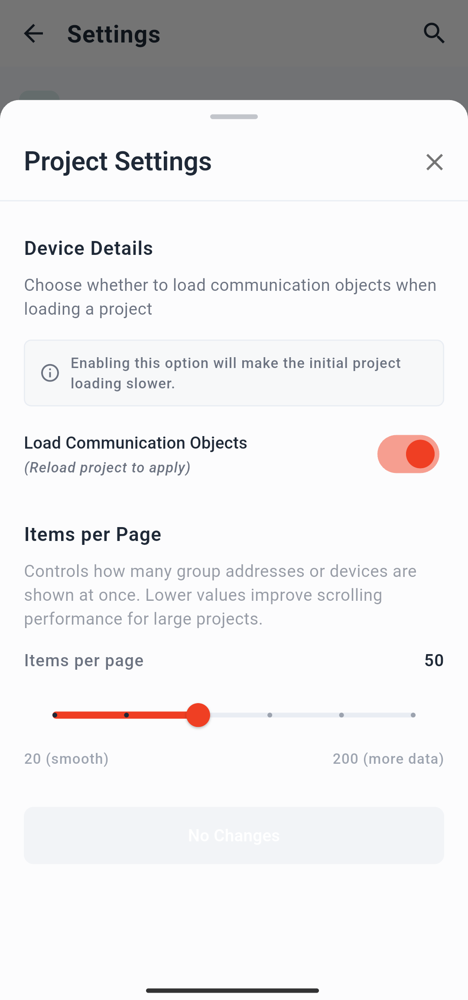
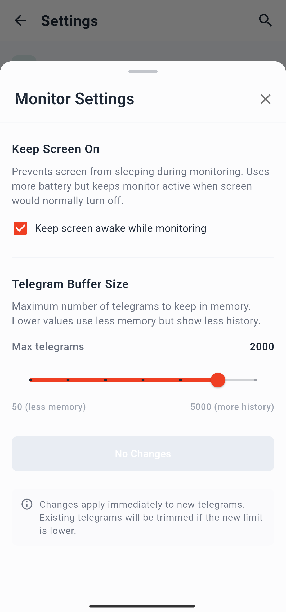
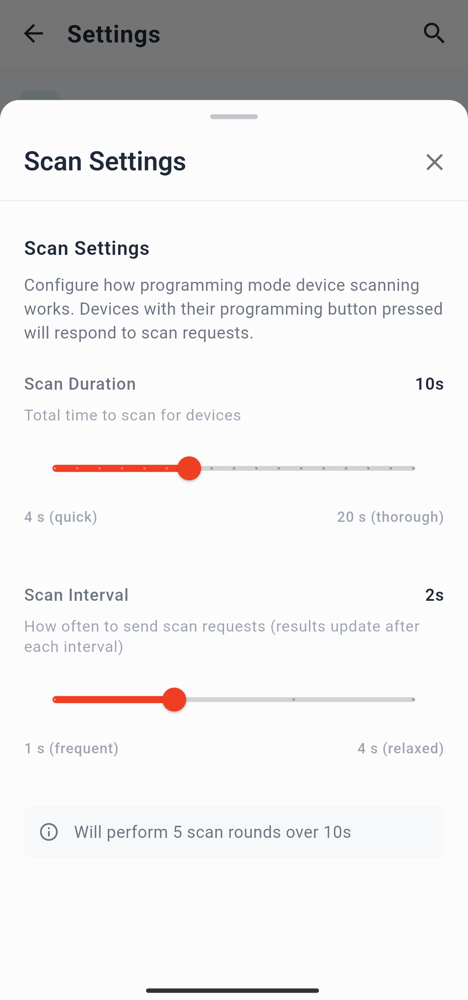
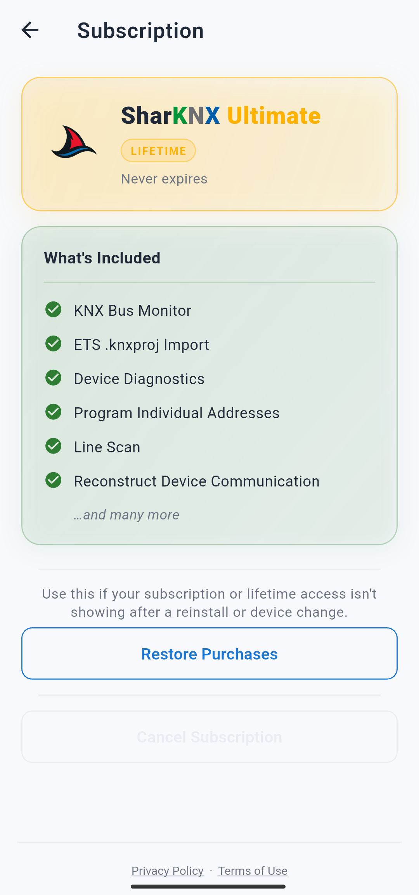

# Settings Reference

The Settings page is accessible from any screen by tapping the **gear icon** (⚙️) in the top-right corner of the app bar.

The page groups all configurable options into sections. A **search icon** (🔍) in the top bar lets you jump directly to a section by name.

---

## Discover Settings

Controls how the app searches for and connects to KNX IP gateways on the network.

### Multicast

| Setting | Default | Description |
|---|---|---|
| Multicast address | `224.0.23.12` | The IP multicast group address used for KNX IP discovery and routing. Only change this if your network uses a non-standard multicast group. |
| Multicast port | `3671` | The UDP port used for multicast discovery and routing communication. |

### Discovery behaviour

| Setting | Default | Description |
|---|---|---|
| Always show multicast options | Off | When enabled, multicast connection options are always visible on the Discover tab. When disabled, they only appear if a KNX IP Router with routing capabilities is found during a scan. |
| Force unicast subnet scan | Off | When enabled, after sending multicast discovery requests the app also sends individual unicast search requests to every IP address in the current subnet. Useful on Wi-Fi networks where routers may drop multicast packets. If no gateway is found via multicast, a unicast scan always runs automatically as a fallback, regardless of this setting. |

### Timeouts

| Setting | Default | Min | Max | Description |
|---|---|---|---|---|
| Discovery timeout | 3 s | 1 s | 10 s | How long the app waits for gateway responses after sending discovery requests. Increase this on slow or congested networks. |
| Connection timeout | 3 s | 1 s | 10 s | How long the app waits when attempting to establish a tunnel connection to a gateway before treating it as unreachable. |

---

## Project Settings

Controls how ETS project files are parsed and displayed.

| Setting | Default | Description |
|---|---|---|
| Load communication objects | On | When enabled, the app parses and stores communication objects for every device in the project that has at least one group address connected to it. Disabling this reduces memory usage on large projects but removes the Communication Objects view from the Project page. |
| Items per page | 50 | Min: 20 · Max: 200 — The number of items shown at once when expanding a list in the project tree view (e.g. group addresses inside a middle group). Once the limit is reached, a **Load more** button appears. Lower values improve rendering speed on large projects. |

---

## Monitor Settings

Controls the behaviour of the bus monitor.

| Setting | Default | Description |
|---|---|---|
| Keep screen on | On | Prevents the device screen from turning off while a monitor session is active. Recommended because most mobile operating systems will close the IP connection when the screen turns off. Disable to conserve battery, but be aware that monitoring will stop if the screen turns off. Note: the monitor always stops when the app moves to the background, regardless of this setting. |
| Telegram buffer size | 2000 | Min: 50 · Max: 5000 — The maximum number of telegrams kept in the monitor list at any time. When the limit is reached, the oldest telegrams are overwritten by incoming ones. Increase this value if you need a longer history; decrease it to reduce memory usage on low-end devices. |

---

## Scan Settings

Controls the programming mode scan in the **Management** page → **Prog. Mode** tab.

| Setting | Default | Min | Max | Description |
|---|---|---|---|---|
| Scan duration | 10 s | 4 s | 20 s | Total duration of a programming mode scan. The app listens for devices that are in programming mode for this length of time. |
| Scan interval | 2 s | 1 s | 4 s | How frequently the app sends scan signals during a scan session. A shorter interval increases the chance of detecting a device that briefly enters programming mode, at the cost of higher network traffic. |

---

## Subscription

Shows the status of your current subscription and provides plan management options.

| Item | Description |
|---|---|
| Current plan | Displays your active plan: **Free** (trial), **Monthly**, **Yearly**, or **Lifetime**. |
| Restore purchases | Re-applies a previously purchased subscription to the current device. Use this after reinstalling the app or switching devices. |
| Cancel subscription | Opens the subscription management page in the App Store (iOS/macOS) or Google Play (Android), where you can cancel an active recurring subscription. Not applicable to Lifetime plans. |
| Privacy Policy | Link to the app's [Privacy Policy](../../privacy/privacy-en.md). |
| Terms of Service | Link to the app's [Terms of Service](../../terms/terms-en.md). |

---

## Language

Opens a list of the app's supported interface languages. Selecting a language takes effect immediately without restarting the app.

Available languages:

- 🇬🇧 English
- 🇩🇪 German
- 🇫🇷 French
- 🇪🇸 Spanish
- 🇮🇹 Italian

---

## Theme

Sets the visual appearance of the app.

| Option | Description |
|---|---|
| Light | Always uses the light colour scheme. |
| Dark | Always uses the dark colour scheme. |
| Match system | Follows the device's system-wide light/dark mode setting. |

---

## Send Feedback

| Option | Description |
|---|---|
| Leave a review | Opens the app's store listing so you can leave a rating or review. |
| Report a bug | Opens a pre-addressed email to `info@owl-automata.com` to report an issue. |
| Write to us | Opens a blank email to `info@owl-automata.com` for general enquiries. |

> For structured bug reports, see also the [How to Report an Issue](../../../support/how-to-report-an-issue.md) guide.

---

## About

Displays the current app version number and copyright information.
