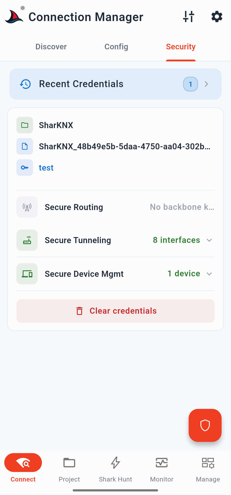

# KNX IP Secure

KNX IP Secure es la extensión de seguridad de la capa de transporte para el protocolo KNXnet/IP. Encripta la comunicación entre un dispositivo KNX IP (pasarela o router) y un cliente como SharKNX, evitando las escuchas pasivas y el control no autorizado a través de la red IP.

> Esta página explica qué es KNX IP Secure y cómo lo gestiona SharKNX. Para ver el procedimiento de configuración paso a paso, consulta [Set Up KNX IP Secure](../how-to/setup-knx-ip-secure.md).

---

## Qué protege KNX IP Secure

En una instalación KNXnet/IP estándar, el tráfico de túnel (tunneling) entre un cliente y una pasarela viaja en forma de paquetes UDP no encriptados. Cualquiera con acceso a la red puede capturar telegramas o inyectar comandos arbitrarios. KNX IP Secure soluciona esto cambiando el transporte de túnel a **TCP** y aplicando encriptación AES-128 CCM a la sesión, garantizando que:

- Solo los clientes con las credenciales correctas pueden establecer una conexión.
- El tráfico no puede ser leído ni reproducido por terceros en la red.
- La pasarela puede rechazar intentos de conexión de fuentes desconocidas.

KNX IP Secure opera en la capa de transporte IP. No altera el contenido del telegrama KNX en sí; esa es la función de [KNX Data Secure](knx-data-secure.md).

---

## Dos modos de KNX IP Secure

### Secure Tunneling (Túnel seguro)

Secure tunneling establece una conexión **TCP** encriptada entre SharKNX y una interfaz compatible con KNX IP Secure (normalmente una pasarela KNX IP o la interfaz de túnel de un router KNX IP), reemplazando el transporte UDP utilizado por el tunneling KNXnet/IP estándar. Cada conexión de túnel tiene su propia dirección individual de interfaz y su correspondiente conjunto de credenciales en el llavero (keyring).

**Restricción de la dirección de remitente:** Cuando se conecta a través de un túnel KNX IP Secure, la dirección individual utilizada en los telegramas salientes está fijada a la dirección de la interfaz de túnel asignada por la pasarela. SharKNX no puede invalidar esto. Esto es importante cuando se trabaja con direcciones de grupo KNX Data Secure, las cuales validan la dirección individual del remitente; consulta [KNX Data Secure](knx-data-secure.md) para más detalles.

### Secure Multicast (IP Routing Secure)

Los routers KNX IP que soportan IP Routing Secure utilizan una clave simétrica compartida —la **clave de línea troncal (backbone key)**— para encriptar el tráfico multicast en el grupo multicast `224.0.23.12` a través de **UDP**. Todos los participantes en la línea troncal (backbone) deben utilizar la misma clave.

SharKNX soporta multicast seguro. Cuando se descubre un router KNX IP, la pestaña **Discover** muestra tanto una opción multicast estándar como una opción multicast segura. Seleccionar la opción multicast segura requiere que la clave de línea troncal esté cargada.

---

## Archivos de credenciales

Las credenciales KNX IP Secure se distribuyen a través de ETS como parte del llavero (keyring) del proyecto. SharKNX acepta credenciales en tres formatos:

| Formato | Qué contiene | Notas |
|---|---|---|
| `.knxkeys` | Credenciales de interfaz, clave de línea troncal, claves de herramienta | Encriptado con una contraseña específica del proyecto configurada en ETS |
| `.knxproj` | Proyecto ETS completo, incluyendo el llavero integrado | SharKNX extrae las credenciales automáticamente |
| Manual backbone key | Clave simétrica única, introducida en hexadecimal | Solo para multicast seguro; úsalo cuando solo tengas la clave y no el archivo de llavero completo |

**Exportar `.knxkeys` desde ETS:** Abre tu proyecto en ETS. Desde la vista general del proyecto (fuera del editor del proyecto), ve a **More details → Security** (Más detalles → Seguridad), y elige **Backup keyring** (Copia de seguridad del llavero). Establece una contraseña y guarda el archivo.

> **Validación de contraseña:** SharKNX no puede verificar si una contraseña de `.knxkeys` es correcta en el momento de la importación; esta es una propiedad de la especificación KNX. La contraseña solo se valida durante el intento de conexión real. Si la conexión falla con un error de autenticación, comprueba que la contraseña coincide con la que se configuró durante la exportación del llavero en ETS.

---

## Dónde cargar las credenciales en SharKNX

Las credenciales se pueden cargar en tres lugares:

**Pestaña Security (página Discovery):** La pestaña dedicada para gestionar todas las credenciales seguras. Toca el FAB de escudo para abrir la hoja de importación de credenciales. Tras la carga, la pestaña muestra un resumen de lo importado: cuántas interfaces se encontraron y cuántos dispositivos KNX Data Secure estaban presentes en el archivo. Un botón de historial te permite recargar rápidamente los archivos utilizados recientemente.

  

**Tarjeta de la pasarela (pestaña Discovery):** Si una pasarela descubierta anuncia compatibilidad con KNX IP Secure, su hoja de detalles incluye un botón de **Load Credentials** (Cargar credenciales). Las credenciales cargadas aquí se almacenan de la misma manera que a través de la pestaña Security.

  

**Menú de ajustes de la página Discovery:** El icono de ajustes (tune) en la barra superior de la página Discovery proporciona acceso rápido para cargar credenciales desde un archivo `.knxkeys` o `.knxproj` sin tener que navegar a la pestaña Security.

Las credenciales se almacenan de forma persistente y siguen estando disponibles al reiniciar la app. Cargar un archivo nuevo reemplaza las credenciales almacenadas previamente.

---

## Claves de herramienta (Tool Keys) para KNX Data Secure

Cuando un archivo `.knxkeys` contiene claves de herramienta (tool keys) para dispositivos KNX Data Secure, SharKNX también almacena esas claves automáticamente. Esto permite operaciones de gestión de dispositivos encriptadas —como conmutar el modo de programación, leer la información del dispositivo, reiniciar un dispositivo o leer tablas de comunicación— en dispositivos que requieren autenticación a nivel de herramienta. Estas son independientes de las credenciales de túnel IP Secure y se utilizan para la comunicación a nivel de dispositivo sobre KNX TP (par trenzado).

---

## KNX IP Secure vs. KNX Data Secure

| | KNX IP Secure | KNX Data Secure |
|---|---|---|
| **Alcance** | Capa de transporte IP | Telegrama KNX (capa de aplicación) |
| **Qué encripta** | El túnel UDP/TCP o canal multicast | Telegramas de grupo individuales en el medio KNX |
| **Tipo de credencial** | Credenciales de interfaz, clave de línea troncal (backbone) | Clave de grupo por dirección de grupo |
| **Dónde se configura** | Página de Discovery → pestaña Security | Página de Project (se carga con `.knxproj`) |
| **Requerido para** | Conectarse a una pasarela segura | Enviar/recibir telegramas de grupo seguros |

Ambos mecanismos son independientes. Una instalación puede usar KNX IP Secure para la conexión IP sin usar KNX Data Secure en el bus, o viceversa, o ambos a la vez.

Consulta [KNX Data Secure](knx-data-secure.md) para ver cómo SharKNX gestiona la encriptación a nivel de telegrama.
