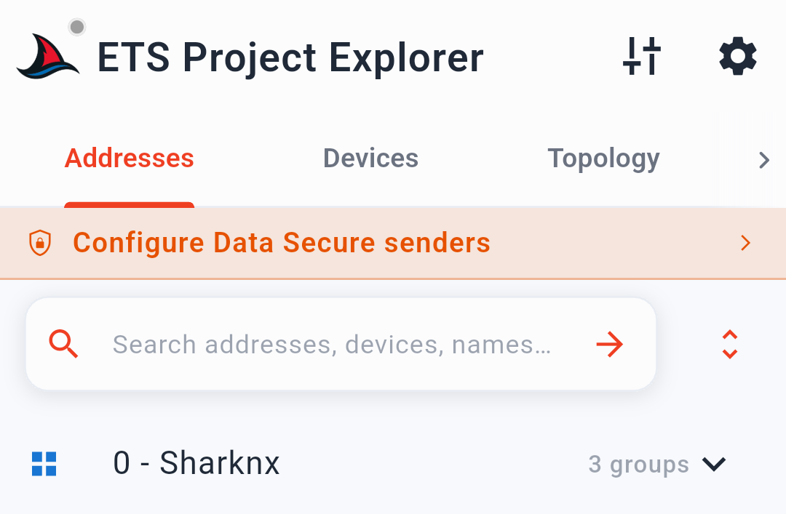
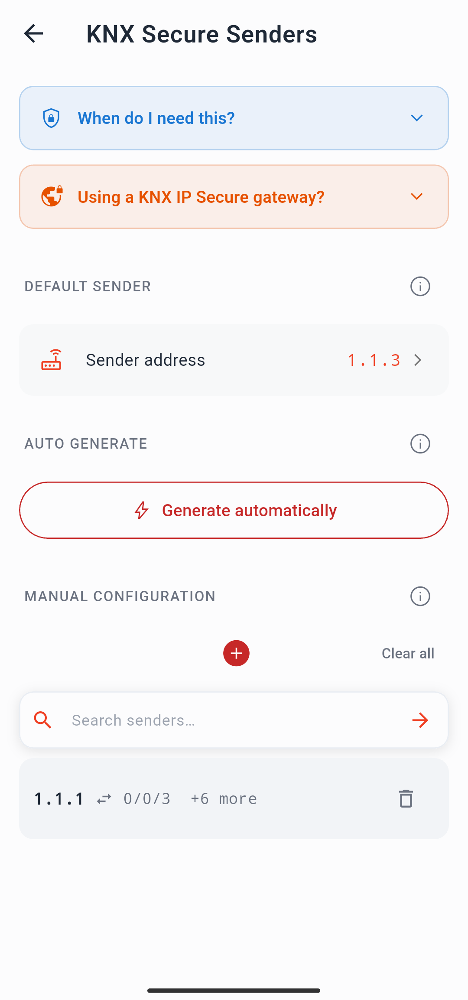

# KNX Data Secure

KNX Data Secure est l'extension de sécurité au niveau de la couche application du standard KNX. Il chiffre et authentifie les télégrammes KNX individuels sur le support de bus (TP ou RF), les protégeant de l'interception et de la manipulation, quelle que soit la manière dont ils sont transportés vers le réseau IP de votre **installation domotique**.

> Cette page explique ce qu'est KNX Data Secure et comment SharKNX le gère. Pour la procédure de configuration étape par étape de votre **domotique KNX**, voir [Set Up KNX Data Secure](../how-to/setup-knx-data-secure.md).

---

## Ce que protège KNX Data Secure

Les télégrammes KNX standard transmis sur paire torsadée (TP) peuvent être lus par n'importe quel participant sur le même segment de bus. KNX Data Secure résout ce problème en chiffrant les données d'application des télégrammes d'adresse de groupe sélectionnés à l'aide de **AES-128 CCM**, le même algorithme utilisé par KNX IP Secure. Chaque télégramme chiffré transporte également un **Message Authentication Code (MAC)** et un **numéro de séquence** incrémentiel, qui ensemble empêchent :

- L'écoute clandestine — la charge utile du télégramme ne peut être lue sans la clé de groupe
- La falsification — toute modification de la charge utile invalide le MAC
- Les attaques par rejeu — un télégramme capturé ne peut pas être rejoué car son numéro de séquence serait hors de l'ordre

KNX Data Secure fonctionne au niveau de la couche application KNX, à l'intérieur même du télégramme. Il est indépendant du chemin de transport pour le **contrôle KNX** — un télégramme Data Secure est tout aussi protégé qu'il transite via TP, RF ou un tunnel KNXnet/IP.

---

## Clés de groupe et liste d'expéditeurs (Sender List)

Chaque adresse de groupe KNX Data Secure possède sa propre **clé de groupe**. La clé est utilisée à la fois pour chiffrer la charge utile et calculer le MAC. Elle est stockée dans le magasin de clés du projet ETS et distribuée à tous les participants connectés à cette adresse de groupe lors de la mise en service de vos **bâtiments intelligents**.

Outre le chiffrement, les participants KNX Data Secure maintiennent une **liste d'expéditeurs de confiance** (trusted sender list) par adresse de groupe : un ensemble d'adresses physiques dont le participant acceptera les télégrammes. Les télégrammes provenant d'une adresse physique ne figurant pas sur cette liste sont rejetés silencieusement, même si le chiffrement est correct. Cela signifie que :

- Pour **recevoir** correctement les télégrammes Data Secure, vous avez besoin de la clé de groupe.
- Pour **envoyer** des commandes Data Secure qu'un participant exécutera, votre adresse physique doit figurer sur la liste des expéditeurs de confiance du participant pour cette adresse de groupe.

---

## Recevoir des télégrammes Data Secure dans SharKNX

SharKNX extrait automatiquement toutes les clés de groupe Data Secure lorsque vous chargez un fichier `.knxproj` pour votre **diagnostic KNX**. Aucune configuration d'identifiant distincte n'est requise pour la surveillance. Une fois un projet chargé :

- Les télégrammes Data Secure entrants dans la page **Monitor** sont décryptés de manière transparente et affichés avec leur valeur décodée, leur nom et leur DPT — exactement comme les télégrammes non sécurisés.
- Si aucun projet n'est chargé, les télégrammes Data Secure apparaissent sous forme de valeurs hexadécimales RAW sans valeur décodée (la charge utile est chiffrée et illisible sans la clé).

Le **Data Secure badge** dans la rangée de badges de la page **Monitor** reflète l'état actuel : grisé si aucune adresse de groupe Data Secure n'est présente dans le projet chargé, orange si des adresses Data Secure sont chargées mais que les expéditeurs n'ont pas été configurés, et vert lorsque les expéditeurs sont configurés et que l'envoi est prêt.

  

---

## Envoyer des télégrammes Data Secure — l'adresse de l'expéditeur

Lorsque SharKNX envoie une commande Data Secure, il doit présenter une adresse physique que le participant cible reconnaît comme un expéditeur de confiance. Si l'adresse ne figure pas sur la liste des expéditeurs du participant, la commande est ignorée.

SharKNX gère cela via la configuration **Data Secure Senders**, accessible depuis la bannière qui apparaît sur la page **Project** lorsqu'un projet avec des adresses de groupe Data Secure est chargé.

Dans la page des expéditeurs, vous pouvez :

- Définir une **global sender address** — utilisée pour toute adresse de groupe Data Secure qui n'a pas d'adresse spécifique configurée.
- Définir des **per-address overrides** — mapper des adresses de groupe individuelles à des adresses physiques d'expéditeur spécifiques.
- **Auto-generate from project data** — SharKNX lit le projet ETS et crée automatiquement les mappages adresses de groupe ↔ adresses physiques en fonction des participants connectés à chaque adresse de groupe sécurisée. C'est le moyen le plus rapide de configurer les expéditeurs lorsque vous disposez d'un projet complet.

  

---

## La contrainte de l'adresse de l'expéditeur avec KNX IP Secure

Lorsque SharKNX est connecté via un tunnel **KNX IP Secure**, l'adresse physique utilisée dans tous les télégrammes sortants est fixée par la passerelle à l'adresse de l'interface de connexion de tunneling. SharKNX ne peut pas remplacer cette adresse — c'est une propriété du protocole KNX IP Secure.

Cela crée une contrainte pratique : pour qu'un participant Data Secure accepte les commandes de SharKNX sur un tunnel KNX IP Secure, l'adresse de l'interface de tunneling doit déjà figurer sur la liste des expéditeurs de confiance du participant dans ETS.

Deux approches fonctionnent bien en pratique pour votre installation domotique :

1. **Utiliser une interface factice dédiée dans ETS.** Créez un participant d'interface sécurisée virtuelle dans votre projet ETS et connectez-y toutes les adresses de groupe Data Secure. Attribuez son adresse physique comme expéditeur dans SharKNX. Cela permet de séparer proprement l'accès de SharKNX des autres clients.

2. **Connecter les adresses de groupe Data Secure à l'interface de tunneling de la passerelle.** Dans ETS, associez les adresses de groupe Data Secure à l'interface de connexion de tunneling de votre passerelle KNX IP Secure. Tout client se connectant via cette interface (y compris SharKNX) sera alors reconnu comme un expéditeur de confiance par les participants sur le terrain.

> Si vous vous connectez sans KNX IP Secure (tunnel non chiffré standard), SharKNX peut utiliser n'importe quelle adresse physique que vous configurez comme expéditeur, et cette contrainte ne s'applique pas.

---

## Clés d'outil (Tool Keys) pour la gestion des participants

KNX Data Secure s'applique également aux opérations de gestion des participants — lire les informations du participant, basculer le mode de programmation, réinitialiser un participant, programmer une adresse physique, ou lire les tables de communication. Les participants qui nécessitent une authentification au niveau de l'outil rejetteront les commandes de gestion provenant de sources inconnues.

Lorsque vous chargez un fichier `.knxkeys` dans l'onglet **Security** de la page **Discovery**, SharKNX extrait automatiquement toutes les **clés d'outil** présentes dans le fichier et les stocke. Ces clés permettent une communication de gestion chiffrée avec les participants Data Secure correspondants — aucune configuration supplémentaire n'est requise une fois les clés chargées.

Les clés d'outil sont distinctes des clés de groupe intégrées dans le fichier `.knxproj`. Si votre installation utilise la gestion des participants Data Secure, vous devez charger le fichier `.knxkeys` (ou le fichier `.knxproj`, qui contient également des clés d'outil) dans l'onglet **Security**, en plus du projet chargé dans la page **Project**.

---

## Lectures complémentaires

Pour une explication technique détaillée du protocole KNX Data Secure, la note d'application ABB "i-bus KNX Data Secure" est une ressource complète couvrant en profondeur les mécanismes cryptographiques, la gestion des numéros de séquence et la configuration ETS.

---

## KNX Data Secure vs. KNX IP Secure

| | KNX Data Secure | KNX IP Secure |
|---|---|---|
| **Portée** | Télégramme KNX (couche application) | Couche de transport IP |
| **Ce qu'il chiffre** | Télégrammes de groupe individuels sur le support KNX | Le tunnel UDP/TCP ou le canal multicast |
| **Type d'identifiant** | Clé de groupe par adresse de groupe ; clés d'outil par participant | Identifiants d'interface ; clé de backbone |
| **Où configuré dans SharKNX** | Page **Project** (clés depuis `.knxproj`) ; Onglet **Security** (clés d'outil) | Page **Discovery** → Onglet **Security** |
| **Requis pour** | Envoyer/recevoir des télégrammes de groupe sécurisés | Se connecter à une passerelle KNX IP Secure |

Les deux mécanismes sont indépendants et peuvent être utilisés séparément ou ensemble. Voir [KNX IP Secure](knx-ip-secure.md) pour l'homologue de la couche transport.
