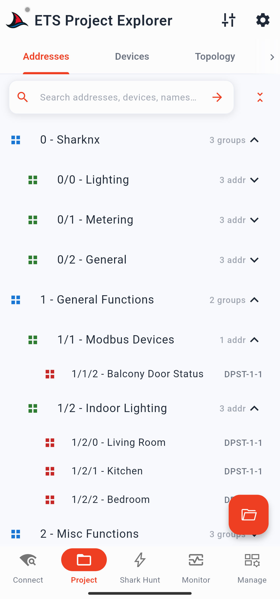
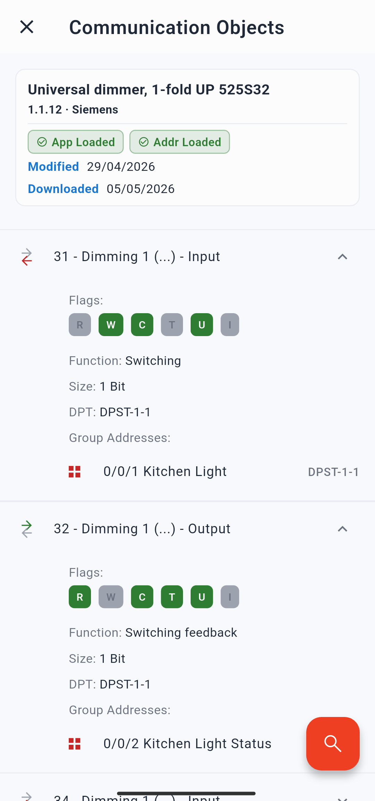

# Progetti ETS in SharKNX

SharKNX consente di caricare un file di progetto ETS standard (`.knxproj`) per arricchire ogni sezione dell'applicazione con i nomi, i tipi di datapoint (DPT) e la struttura che hai già definito all'interno di ETS. Questa pagina spiega cosa significa in pratica: come SharKNX utilizza il file, cosa non fa e gli aspetti importanti da tenere a mente.

---

## Il File di Progetto Non Viene Mai Modificato

Il caricamento di un file `.knxproj` in SharKNX è un'operazione di sola lettura. SharKNX legge il file una sola volta, estrae i dati necessari e li memorizza internamente. **Il file originale sul tuo dispositivo non viene mai sovrascritto o modificato.** Non devi preoccuparti che SharKNX possa danneggiare il tuo progetto, creare conflitti di versione o causare problemi quando riaprirai lo stesso progetto in ETS in un secondo momento.

---

## I Vantaggi del Caricamento del Progetto

SharKNX funziona anche senza un progetto caricato - puoi comunque connetterti a un gateway, monitorare il bus e inviare comandi utilizzando gli indirizzi di gruppo grezzi. Tutte le funzionalità rimangono attive, ma prive di nome. Il caricamento di un progetto trasforma radicalmente l'esperienza d'uso:

**Pagina Project - quattro viste strutturate:**
Le schede Group Addresses (Indirizzi di gruppo), Devices (Dispositivi), Topology (Topologia) e Buildings (Edifici) si popolano con i dati del tuo progetto, rispecchiando esattamente la struttura definita in ETS. Puoi navigare l'intera gerarchia, effettuare ricerche su tutti i nomi e toccare qualsiasi indirizzo di gruppo per inviare direttamente un comando di lettura o scrittura.

  

**Pagina Monitor - telegrammi con nomi e valori decodificati:**
I telegrammi in entrata vengono associati automaticamente al progetto caricato. Ogni riga del monitor mostra il nome dell'indirizzo di gruppo e un valore decodificato in formato leggibile in base al suo tipo di datapoint, invece del solo payload esadecimale grezzo. Inoltre, quando tocchi un indirizzo di gruppo, il compositore di comandi utilizza i dati del progetto per precompilare il nome e il DPT.

**KNX Data Secure - estrazione automatica delle chiavi:**
Se il tuo progetto contiene indirizzi di gruppo protetti da KNX Data Secure, le relative chiavi di gruppo vengono estratte in modo automatico. SharKNX le utilizza per decrittografare i telegrammi Data Secure in arrivo nel monitor e per crittografare i comandi Data Secure in uscita. Non è richiesto alcun passaggio separato di importazione delle credenziali per la sicurezza a livello di gruppo. Consulta la sezione [KNX Data Secure](knx-data-secure.md) per ulteriori dettagli.

---

## Oggetti di Comunicazione

Quando l'impostazione **Load communication objects** (Carica oggetti di comunicazione) è abilitata (impostazione predefinita), SharKNX analizza e memorizza anche gli oggetti di comunicazione di ogni dispositivo che presenta indirizzi di gruppo collegati. Questo aggiunge un ulteriore livello di dettaglio:

- Nella scheda Devices, puoi aprire una pagina dedicata agli oggetti di comunicazione per singolo dispositivo, che mostra tutti gli oggetti di comunicazione collegati con i relativi flag, dimensioni, funzioni e indirizzi di gruppo associati.
- Questa funzione è particolarmente utile per la diagnostica dei dispositivi: consente di verificare a colpo d'occhio quali oggetti di comunicazione sono mappati su determinati indirizzi di gruppo e di inviare comandi di test direttamente da quella vista.

  

Disattivando questa impostazione si riduce l'utilizzo della memoria, un fattore che può risultare utile su dispositivi con RAM limitata o nel caso di progetti molto grandi. Il resto dei dati del progetto (indirizzi di gruppo, topologia, edifici) verrà comunque caricato normalmente.

---

## Cosa SharKNX NON Fa

SharKNX è uno strumento di diagnostica e supporto sul campo, non un software di messa in servizio (commissioning). Di conseguenza, vi sono operazioni con il progetto ETS che l'app deliberatamente non esegue:

- **Nessuna modifica dei parametri.** SharKNX non può leggere né modificare i parametri dei dispositivi memorizzati nel progetto. Solo ETS è in grado di scrivere i parametri sui dispositivi.
- **Nessun download del programma applicativo.** SharKNX non può programmare o effettuare il flash dei dispositivi con il loro software applicativo. Questa operazione rimane ad esclusivo appannaggio di ETS.
- **Nessuna connessione a un server o licenza ETS.** SharKNX legge direttamente il file `.knxproj` esportato. Non richiede una connessione a ETS, non necessita che ETS sia in esecuzione e non consuma alcuna licenza ETS.

La **programmazione degli indirizzi individuali** (indirizzi fisici) è l'unica operazione di scrittura supportata da SharKNX correlata ai dati di progetto - tuttavia, questa operazione scrive direttamente sul dispositivo fisico presente sul bus tramite la comunicazione di gestione KNX, e non sul file `.knxproj`. Il file di progetto rimane del tutto invariato.

---

## Mantenere Aggiornati i Dati di Progetto

SharKNX legge il file di progetto nel momento esatto in cui lo carichi. Se successivamente apporti modifiche in ETS ed esporti un nuovo file `.knxproj`, SharKNX non rileverà tali modifiche automaticamente: sarà necessario ricaricare il file aggiornato.

La funzione **Apply project data** (Applica dati di progetto) presente nel menu di ottimizzazione (tune menu) della pagina Monitor viene in aiuto in questi casi: dopo aver caricato un progetto aggiornato, puoi applicare i nuovi nomi e tipi di datapoint ai telegrammi che sono già stati catturati nella lista del monitor, senza dover registrare nuovamente la sessione da capo.

---

## Formati Supportati

| Formato | Supportato |
|---|---|
| `.knxproj` (ETS5) | ✅ |
| `.knxproj` (ETS6) | ✅ |
| Progetti protetti da password | ✅ (la password viene richiesta all'importazione) |
| `.knxpkg` o altri formati ETS | - |

È possibile caricare un solo progetto alla volta. Il caricamento di un nuovo progetto sostituisce quello corrente. I progetti caricati in precedenza vengono conservati in un elenco cronologico per consentire un ricaricamento rapido senza dover navigare nuovamente all'interno del file system del dispositivo.
