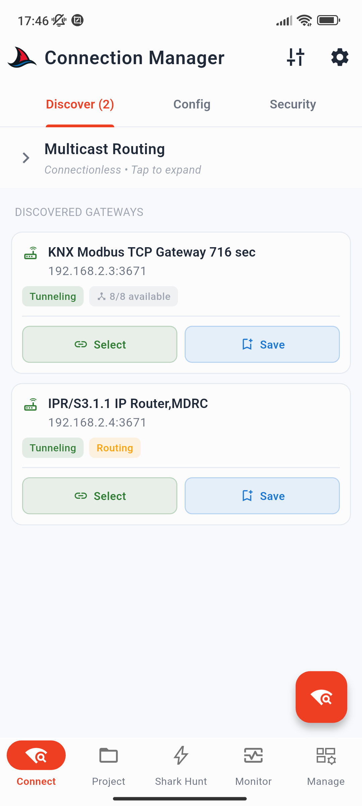
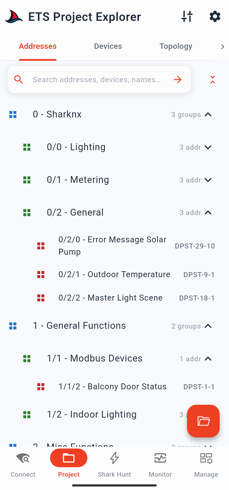
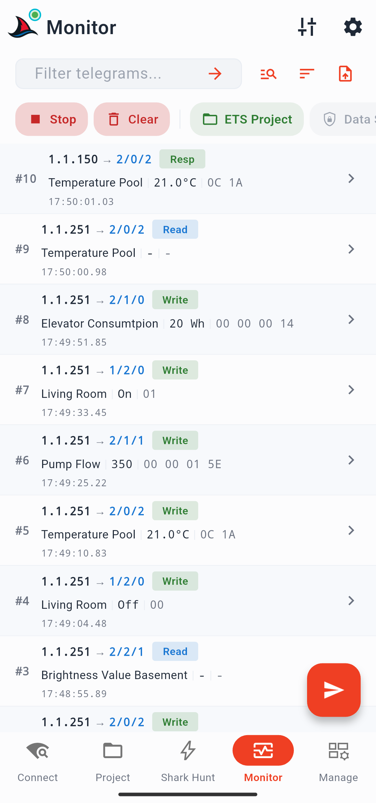
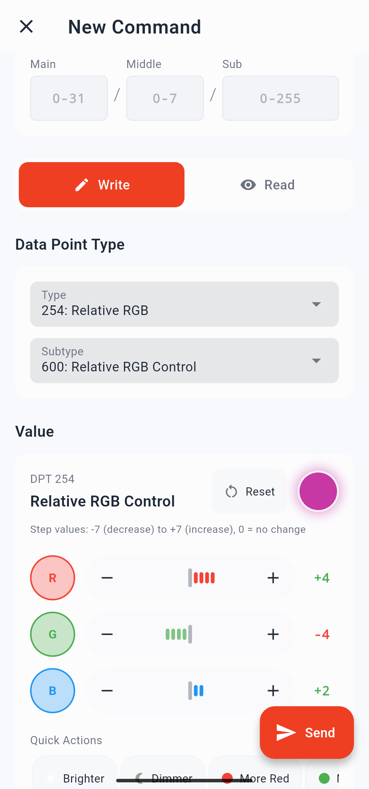

# Guida Introduttiva a SharKNX

SharKNX è un compagno di campo professionale per KNX, disponibile per dispositivi mobili e desktop. Questa guida ti accompagnerà passo dopo passo nel flusso di lavoro principale: connessione a un gateway KNX IP, caricamento di un progetto ETS e avvio di una sessione di monitoraggio del bus in tempo reale.

## Prerequisiti

- Un dispositivo con Android, iOS, Windows o macOS 13+
- Un gateway KNX IP raggiungibile sulla stessa rete IP del tuo dispositivo
- (Consigliato) Un file di progetto ETS (`.knxproj`) della tua installazione

> **Abbonamento:** SharKNX richiede un abbonamento attivo. Senza un abbonamento o un periodo di prova attivo, potrai caricare un solo progetto ETS e non potrai connetterti ai gateway o in multicast. I piani mensili e annuali includono una prova gratuita di 14 giorni. È disponibile anche un piano a vita come acquisto singolo. Consulta [Subscription Plans](reference/subscription-plans.md) per ulteriori dettagli.

---

## Passo 1 - Rilevamento del Gateway

La pagina **Discovery** (Rilevamento) si apre automaticamente all'avvio dell'applicazione. È la prima pagina a sinistra nella barra di navigazione inferiore.

1. Tocca il **FAB di scansione** (pulsante fluttuante) in fondo alla pagina.  
   L'applicazione invierà richieste di ricerca KNX IP sulla tua rete locale. Tutti i gateway KNX IP che rispondono appariranno come schede nella lista.

2. Tocca **Select** (Seleziona) sulla scheda del gateway che desideri utilizzare.  
   Il gateway verrà spostato nella sezione **Last Selected Gateway** (Ultimo gateway selezionato) in cima della pagina e verrà memorizzato per i successivi riavvii - non sarà necessario eseguire una nuova scansione alla sessione successiva.

  

> **Nessun gateway trovato?** Verifica che il tuo dispositivo sia sullo stesso segmento di rete del gateway. Se utilizzi il Wi-Fi con una VLAN cablata, i pacchetti multicast potrebbero essere bloccati dal router. Usa la scheda **Config** per aggiungere il gateway manualmente tramite indirizzo IP e porta, oppure abilita l'opzione **Force unicast subnet scan** nelle impostazioni di rilevamento (Discover Settings).

> **KNX IP Secure?** Se il tuo gateway richiede le credenziali KNX IP Secure, tocca la scheda del gateway e usa il pulsante **Load Credentials** (Carica credenziali). Consulta la guida [Configurare KNX IP Secure](how-to/setup-knx-ip-secure.md) per la procedura completa.

> **Salva per dopo:** Tocca **Save** (Salva) sulla scheda di un gateway per memorizzarlo permanentemente nella scheda **Config**. I gateway salvati saranno subito disponibili senza dover ripetere la scansione, il che è ideale quando si torna a lavorare sulla stessa installazione.

---

## Passo 2 - Caricamento del Progetto ETS

Un progetto ETS fornisce a SharKNX i nomi degli indirizzi di gruppo, i tipi di datapoint (DPT) e i metadati dei dispositivi della tua installazione. Senza di esso, i telegrammi appariranno come valori esadecimali grezzi, privi di nomi o di valori decodificati.

1. Tocca la pagina **Project** (Progetto - seconda scheda nella barra di navigazione inferiore).
2. Tocca il **FAB a forma di cartella** per aprire il selettore di file. Naviga fino al tuo file `.knxproj` e selezionalo.  
   Se hai già caricato dei progetti in passato, apparirà prima una schermata con la cronologia - seleziona un elemento recente o tocca **Browse** (Sfoglia) per scegliere un nuovo file.
3. Attendi il completamento del caricamento del progetto. Le quattro schede (Group Addresses, Devices, Topology, Buildings) si popoleranno con i dati del tuo progetto.

  

> **Trasferire il file sul dispositivo:** Esporta il tuo progetto ETS dal PC (`File → Esporta progetto` o clic destro sul progetto all'interno di ETS). Successivamente, trasferisci il file `.knxproj` sul tuo smartphone o tablet usando il metodo che preferisci: inviatelo tramite un'app di messaggistica (ad esempio salvandolo nella tua chat personale su Viber, WhatsApp o Telegram), allegalo a un'e-mail, caricalo su un servizio cloud (Google Drive, iCloud, OneDrive) e aprilo dal telefono, oppure copialo tramite cavo USB.

> **I progetti protetti da password** sono pienamente supportati. L'applicazione richiederà la password del progetto durante la fase di importazione.

> **Saltare questo passo:** È possibile monitorare il bus anche senza un progetto caricato. In questo caso, i telegrammi mostreranno solo gli indirizzi fisici di sorgente e destinazione con i relativi payload esadecimali grezzi.

---

## Passo 3 - Avvio del Monitor di Bus

1. Tocca la pagina **Monitor** (quarta scheda nella barra di navigazione inferiore).
2. Tocca il **FAB verde di avvio**.
   - Se non hai ancora selezionato alcun gateway, apparirà una schermata di scelta con l'elenco dei gateway rilevati e salvati - selezionane uno per procedere.
   - L'applicazione si connetterà al gateway e inizierà a ricevere i telegrammi in tempo reale.
3. I telegrammi in entrata appariranno come righe all'interno della lista. Ogni riga mostra:
   - Indirizzo individuale del mittente → indirizzo di gruppo di destinazione
   - Nome dell'indirizzo di gruppo e valore decodificato *(richiede un progetto ETS)*
   - Payload esadecimale grezzo (hex)
   - Timestamp nel formato `HH:MM:SS.ms`

  

> Tocca una riga qualsiasi per aprire i dettagli del telegramma, inclusi sorgente, destinazione, valore decodificato e i pulsanti per inviare un comando immediato di **Read** (Lettura) o **Write** (Scrittura) a quel determinato indirizzo.

> **Mantieni schermo attivo:** Su dispositivi mobili, il monitoraggio si interrompe se lo schermo si blocca. La modalità "schermo sempre attivo" è abilitata di default nelle impostazioni del Monitor (Monitor Settings) per prevenire questo comportamento.

---

## Passo 4 - Invio di un Comando

Mentre il monitor è in esecuzione, puoi inviare comandi di test senza dover uscire dalla schermata di monitoraggio.

1. Tocca il **FAB rosso di invio** (sostituisce il FAB di avvio quando il monitor è attivo).
2. Tocca **New Command** (Nuovo comando) nel menu a comparsa inferiore.
3. All'interno del compositore di comandi:
   - Inserisci un indirizzo di gruppo, oppure tocca l'**icona di ricerca** per sfogliare gli indirizzi di gruppo del tuo progetto caricato.
   - Scegli tra **Write** (Scrittura) o **Read** (Lettura).
   - Seleziona il tipo e il sottotipo di datapoint (DPT).
   - In caso di scrittura, inserisci il valore che desideri inviare.
4. Tocca **Send** (Invia). Il comando verrà trasmesso sul bus e apparirà immediatamente nella lista dei telegrammi.

  

> **Rinvio rapido:** Dopo aver inviato un comando, un piccolo chip contenente il relativo indirizzo e valore apparirà accanto al FAB di invio. Tocca il chip per inviarlo nuovamente all'istante, oppure tienilo premuto per riaprire il compositore con i campi già precompilati.

---

## Passi Successivi

Ora hai una sessione di monitoraggio attiva, un progetto ETS associato e sai come inviare comandi di test. Da qui puoi approfondire:

| Obiettivo | Guida |
|---|---|
| Sfogliare gli indirizzi di gruppo e inviare comandi dall'albero di progetto | [Pagina Progetto](pages/project.md) |
| Creare set di comandi e filtri riutilizzabili | [Shark Hunts](concepts/shark-hunts.md) |
| Configurare la decrittazione degli indirizzi di gruppo KNX Data Secure | [Configurare KNX Data Secure](how-to/setup-knx-data-secure.md) |
| Scansionare una linea bus e verificare la presenza dei dispositivi | [Scansione Linea Bus](how-to/scan-bus-line.md) |
| Esportare la sessione del monitor in formato CSV o PDF | [Formati di Esportazione](reference/export-format.md) |
| Leggere i dati firmware del dispositivo o attivare la modalità di programmazione | [Ispezione Dispositivo](how-to/inspect-device.md) |
