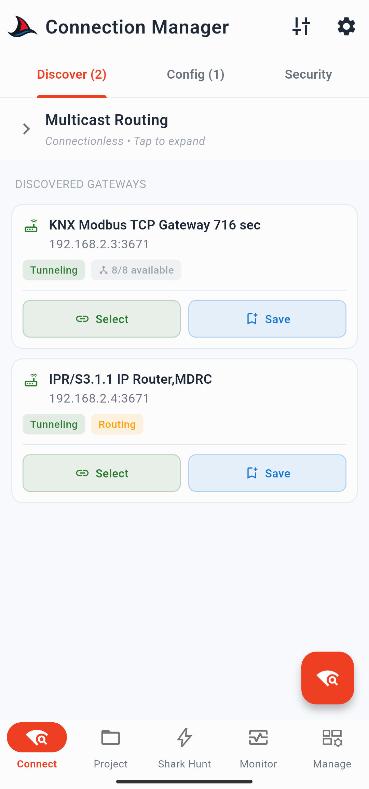
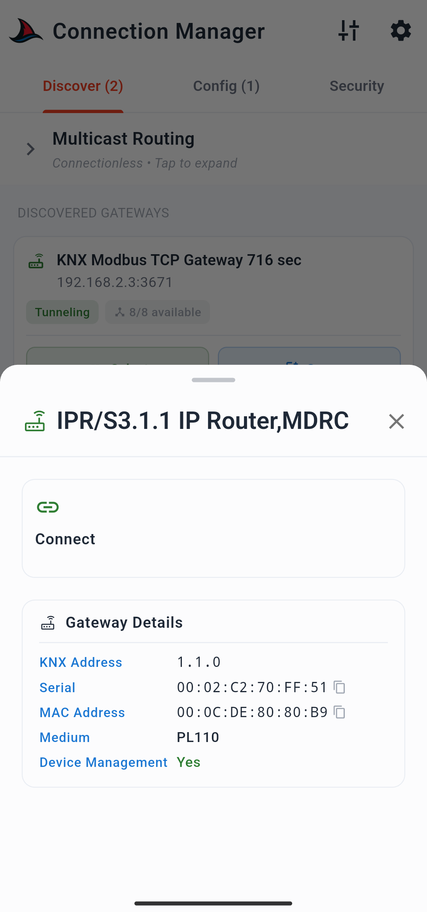
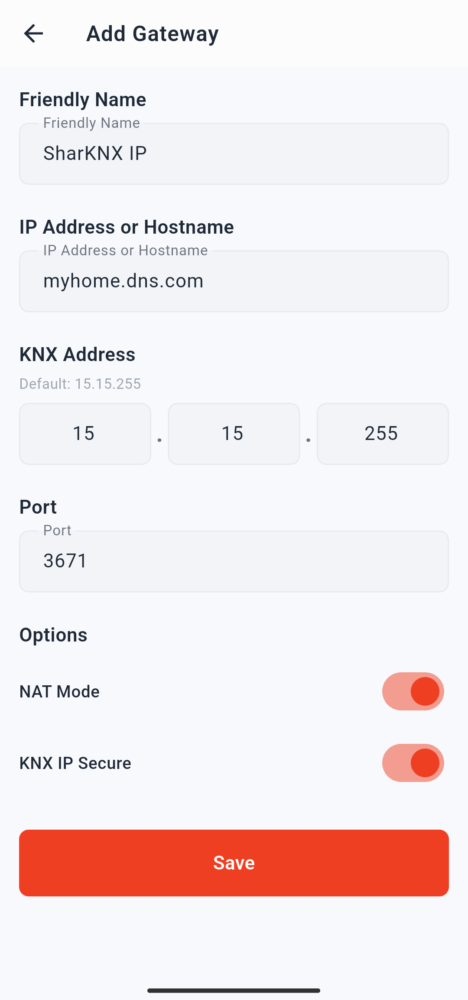
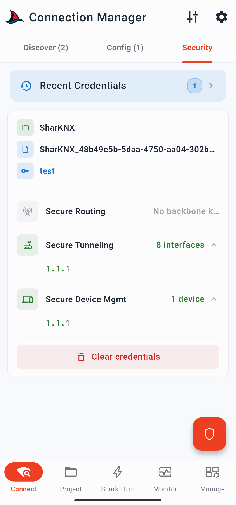

# Pagina Discovery (Rilevamento)

La pagina Discovery è la prima schermata presente nella barra di navigazione inferiore e si apre per impostazione predefinita all'avvio dell'applicazione. In questa sezione è possibile trovare, configurare e gestire i gateway KNX IP ai quali connettersi. La pagina è suddivisa in tre schede: **Discover**, **Config** e **Security**.

---

## Scheda Discover

Tocca il **FAB di scansione** (pulsante d'azione fluttuante) per avviare la ricerca dei dispositivi KNX IP all'interno della rete locale. L'applicazione invia richieste di ricerca KNX IP e mostra i dispositivi che rispondono sotto forma di schede (card).

### Schede dei Gateway

Ogni scheda relativa a un gateway rilevato mostra:
- Nome del gateway (così come pubblicizzato dal dispositivo stesso)
- Indirizzo IP e porta di tunneling

Su ciascuna scheda sono presenti due pulsanti:

**Select (Seleziona)** - contrassegna questo gateway come target di connessione attivo. Il gateway viene spostato nella sezione **Last Selected Gateway** (Ultimo gateway selezionato) in cima alla pagina e memorizzato per i successivi riavvii dell'app. La selezione di un gateway non avvia immediatamente la connessione; l'applicazione si connetterà automaticamente non appena eseguirai un'azione (avvio del monitor, invio di un comando, ecc.).

**Save (Salva)** - salva il gateway all'interno della scheda **Config**, consentendo di riutilizzarlo in futuro senza dover eseguire nuovamente una scansione. Molto utile se visiti regolarmente la medesima installazione.

Toccando la scheda stessa (e non uno dei pulsanti) si apre la **schermata dei dettagli del gateway**:
- Indirizzo individuale KNX
- Numero di serie
- Indirizzo MAC
- Tipo di mezzo (Medium type)
- Funzionalità di gestione del dispositivo (se supportate)
- Pulsante **Connect (Connetti)** - avvia immediatamente la connessione; utile per testare la raggiungibilità del dispositivo, sebbene non sia richiesto per le normali operazioni
- Pulsante **Load Credentials (Carica credenziali)** *(solo per gateway KNX IP Secure)* - consente di caricare le credenziali tramite file `.knxkeys` o `.knxproj` per questo specifico gateway. Vedi [KNX IP Secure](../concepts/knx-ip-secure.md).

  <table>
    <tr>
      <td></td>
      <td></td>
    </tr>
  </table>

### Last Selected Gateway (Ultimo gateway selezionato)

Se un gateway è stato selezionato in precedenza, apparirà in una sezione bloccata nella parte superiore della scheda Discover. Verrà selezionato automaticamente al riavvio dell'applicazione per consentirti di iniziare a lavorare senza dover effettuare nuovamente una scansione.

### Sezione Multicast

Se viene rilevato un router KNX IP dotato di funzionalità di routing, al di sotto dell'elenco delle schede apparirà la sezione **Multicast**. Espandendola verranno mostrate due opzioni:
- **Multicast** - comunicazione multicast KNX IP standard sull'indirizzo `224.0.23.12:3671`
- **Secure Multicast** - multicast crittografato che richiede una chiave di dorsale o "backbone key" (vedi [KNX IP Secure](../concepts/knx-ip-secure.md))

Seleziona una delle due opzioni per utilizzarla come tipo di connessione al posto di un tunnel unicast.

---

## Scheda Config

La scheda Config memorizza i gateway che hai inserito manualmente o salvato tramite il pulsante **Save** nella scheda Discover. I gateway memorizzati in questa sezione sono disponibili in qualsiasi momento senza la necessità di effettuare una scansione di rete.

### Aggiungere un Gateway Manualmente

Tocca il **FAB "+"** per aprire la pagina di configurazione manuale del gateway. Compila i seguenti campi:

| Campo | Descrizione |
|---|---|
| Nome identificativo (Friendly name) | Un'etichetta visualizzata sulla scheda per identificare il gateway |
| Indirizzo IP / Hostname | L'indirizzo IP del gateway o un hostname DNS (ad esempio un dominio DynDNS) |
| Indirizzo individuale KNX | L'indirizzo KNX del gateway; il valore predefinito è `15.15.255`. Deve coincidere con quello del dispositivo per le connessioni KNX IP Secure. |
| Porta | Porta di tunneling; il valore predefinito è `3671` |
| Usa NAT | Da abilitare per scenari VPN in cui il client e il gateway si trovano su sottoreti diverse |
| KNX IP Secure | Contrassegna questa connessione come connessione protetta KNX IP Secure |

Tocca **Save** per creare la voce. Il gateway apparirà sotto forma di scheda all'interno della scheda Config.

  

### Schede dei Gateway in Config

Le schede all'interno della scheda Config funzionano in modo identico a quelle della scheda Discover (Seleziona, Salva, schermata dei dettagli) con un'unica aggiunta: il pulsante **Edit (Modifica)**, che riapre la pagina di configurazione per correggere o aggiornare qualsiasi campo senza dover eliminare e ricreare la voce da zero.

La scheda Config può ospitare un numero massimo di 50 gateway salvati.

---

## Scheda Security

La scheda Security è la sezione in cui è possibile caricare le credenziali KNX IP Secure e KNX Data Secure valide per l'intera applicazione.

Tocca il **FAB dello scudo** per aprire la schermata di importazione delle credenziali. Sono disponibili tre metodi di inserimento:

| Metodo | Caso d'uso |
|---|---|
| File `.knxkeys` | Esportato da ETS. Contiene le credenziali delle interfacce, la chiave di dorsale (backbone key) e le chiavi degli strumenti (tool keys). Richiede la password del portachiavi (keyring password) impostata durante l'esportazione. |
| File `.knxproj` | Esportazione completa del progetto ETS. SharKNX estrae automaticamente tutte le credenziali di sicurezza contenute. |
| Chiave di dorsale manuale | Consente di inserire direttamente in formato esadecimale una chiave di dorsale multicast (backbone key). Valido solo per il secure multicast. |

Dopo il caricamento, la scheda mostrerà un riepilogo:
- Il numero di interfacce KNX IP trovate nel file
- Il numero di dispositivi KNX Data Secure presenti (identificati per indirizzo individuale)

Il pulsante **History (Cronologia)** situato in alto consente di ricaricare rapidamente i file di credenziali utilizzati di recente senza dover navigare nuovamente all'interno del file system del dispositivo.

  

> **Tool keys (Chiavi dello strumento):** Un file `.knxkeys` può contenere anche le chiavi dello strumento per i dispositivi KNX Data Secure. Se presenti, SharKNX le memorizza automaticamente per abilitare le operazioni di gestione crittografata dei dispositivi (attivazione della modalità di programmazione, lettura delle informazioni del dispositivo, ecc.). Vedi [KNX Data Secure](../concepts/knx-data-secure.md).

---

## Menu di Ottimizzazione (Tune Menu)

L'icona delle regolazioni nella barra superiore apre una schermata inferiore che offre un accesso rapido al caricamento delle credenziali senza dover navigare fino alla scheda Security:

- **Load credentials from .knxkeys** - apre il selettore di file per selezionare un file `.knxkeys`
- **Load credentials from .knxproj** - apre il selettore di file per selezionare un file `.knxproj`
