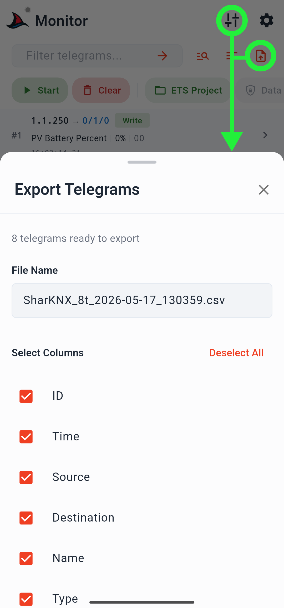
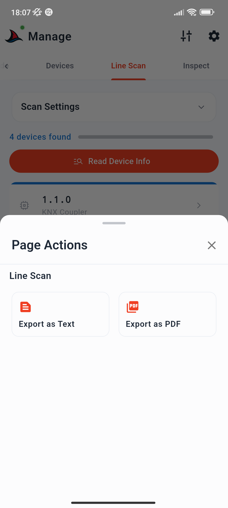
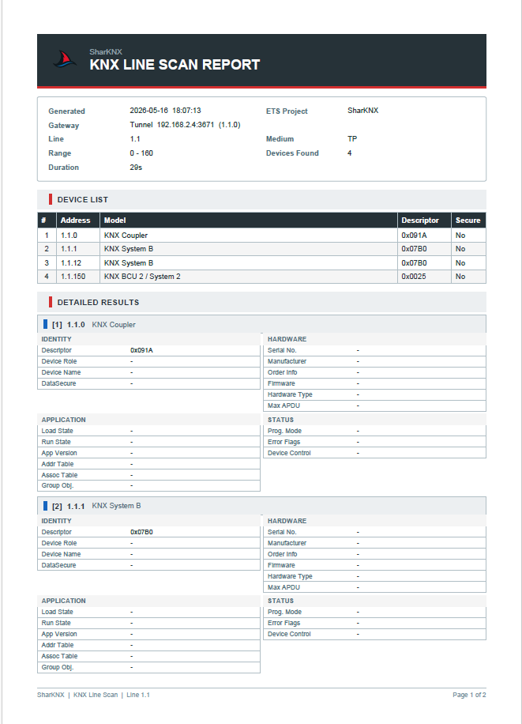
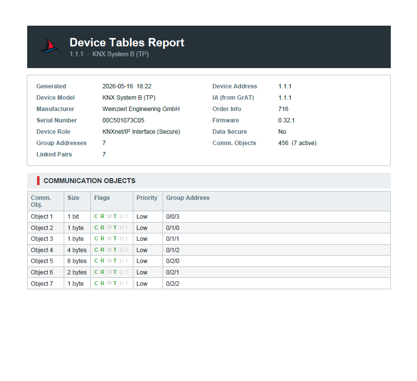

# Formati di Esportazione

SharKNX può esportare dati in cinque formati differenti a seconda della sorgente:

| Formato | Sorgente | Estensione |
|--------|--------|-----------|
| [Telegram CSV](#telegram-csv) | Monitor, Monitor delle Shark Hunt | `.csv` |
| [Line Scan Text (Testo Scansione Linea)](#line-scan-text) | Pagina Scan → risultati Scansione Linea | `.txt` |
| [Line Scan PDF (PDF Scansione Linea)](#line-scan-pdf) | Pagina Scan → risultati Scansione Linea | `.pdf` |
| [Device Tables PDF (PDF Tabelle Dispositivo)](#device-tables-pdf) | Pagina Inspect → tabelle dispositivo | `.pdf` |
| [Shark Hunt JSON](#shark-hunt-json) | Pagina Shark Hunts | `.json` |

Sui dispositivi mobili, il file esportato viene gestito tramite la schermata di condivisione nativa del sistema operativo (share sheet). Su desktop (Windows, macOS), si apre una finestra di dialogo nativa per il salvataggio del file o della cartella.

---

## Telegram CSV

Esportato dalla pagina Monitor e da qualsiasi pagina di monitoraggio delle Shark Hunt utilizzando il pulsante di esportazione/salvataggio o il menu di ottimizzazione (tune menu).

<div align="center">
  
</div>

### Nome del file

```
SharKNX_[Context]_YYYY-MM-DD_HHMMSS.csv
```

`[Context]` è rappresentato da `Monitor` oppure dal nome della Shark Hunt (normalizzato, max 30 caratteri). Esempio: `SharKNX_Monitor_2026-05-16_143022.csv`.

### Struttura del file

La prima riga è sempre un commento di identificazione:

```
# SharKNX Export v1
```

Questa è seguita da una riga di intestazione opzionale e poi da una riga di dati per ogni telegramma.

### Colonne selezionabili dall'utente

Queste colonne possono essere attivate o disattivate singolarmente nel menu a comparsa inferiore di esportazione prima del salvataggio:

| Colonna | Intestazione | Descrizione |
|--------|--------|-------------|
| ID | `ID` | Posizione sequenziale del telegramma nella lista |
| Time | `Time` | Timestamp nel formato `HH:MM:SS.mm` |
| Source | `Source` | Indirizzo individuale del dispositivo mittente |
| Destination | `Destination` | Indirizzo di gruppo del telegramma |
| Name | `Name` | Nome dell'indirizzo di gruppo dal progetto ETS (vuoto se non è caricato alcun progetto) |
| Type | `Type` | Tipo di APCI: `Write`, `Read`, `Response`, ecc. |
| Value | `Value` | Valore decodificato dal progetto ETS (vuoto se non è caricato alcun progetto) |
| Raw | `Raw` | Payload grezzo come stringa esadecimale; sempre presente nei dati del bus |

### Colonne di metadati

Cinque colonne strutturali vengono **sempre aggiunte alla fine**, indipendentemente dalla selezione dell'utente. Vengono utilizzate per consentire la successiva re-importazione in SharKNX:

| Colonna | Tipo | Descrizione |
|--------|------|-------------|
| `_timestampMs` | intero | Timestamp Unix in millisecondi |
| `_isGroupAddress` | booleano | Indica se la destinazione è un indirizzo di gruppo |
| `_priority` | stringa | Campo relativo alla priorità KNX |
| `_hopCount` | intero | Conteggio dei salti (Hop count) dal frame del telegramma |
| `_numericValue` | float | Rappresentazione numerica del valore decodificato (se disponibile) |

### Opzioni

| Opzione | Predefinito | Descrizione |
|--------|---------|-------------|
| Separatore (Delimiter) | Virgola | Separatore di campo: `,`, `;`, o tabulazione |
| Includi intestazioni | Attivo | Scrive i nomi delle colonne come prima riga di dati |
| Max telegrammi | Tutti | Consente di limitare opzionalmente l'esportazione alle prime N righe |

### Importazione

Un file CSV di SharKNX può essere re-importato nel Monitor tramite il menu di ottimizzazione → **Import SharKNX CSV**. Il file deve obbligatoriamente contenere la riga di intestazione `# SharKNX Export v1`. L'importazione sovrascrive la lista dei telegrammi corrente.

**File di esempio:** [sample-telegrams.csv](../../../../assets/examples/exports/sample-telegrams.csv)

---

## Line Scan Text (Testo Scansione Linea)

Esportato dalla pagina Scan al termine di una scansione di linea, tramite il menu delle utilità → **Export as Text**.

<div align="center">
  
</div>

### Nome del file

```
line_scan_{area.line}_{YYYY-MM-DD}.txt
```

Esempio: `line_scan_1.1_2026-05-16.txt`.

### Struttura del file

Il report è suddiviso in tre sezioni separate da linee tratteggiate.

**Blocco di intestazione (Header block)**

```
Generated     : 2026-05-16 14:30:22
ETS Project   : My Building
Gateway       : Secure Tunnel  192.168.2.7:3671  (1.1.0)
Line          : 1.1
Medium        : TP
Range         : 0 - 255
Devices Found : 12
Duration      : 38s
```

**Lista dei dispositivi** - tabella numerata compatta:

```
  [1]   1.1.1    MDT SCN-00.02        (0x0900)
  [2]   1.1.5    Siemens 5WG1...      (0xFFFF)  [DataSecure]
  ...
```

Ogni riga mostra: indice, indirizzo individuale, stringa del modello, codice esadecimale del descrittore (descriptor) e il flag `[DataSecure]` se il descrittore è `0xFFFF`.

**Risultati dettagliati** - un blocco per ciascun dispositivo, strutturato in quattro sottosezioni:

| Sottosezione | Campi |
|------------|--------|
| Identity | Descrittore, Ruolo Dispositivo, Nome Dispositivo, DataSecure |
| Hardware | Num. Serie, Produttore, Info Ordine, Versione Firmware, Tipo Hardware, Lunghezza massima APDU |
| Application | Stato Caricamento, Stato Esecuzione, Versione App, Stato caricamento Tabella Indirizzi, Stato caricamento Tabella di Associazione, Stato caricamento Tabella Oggetti di Gruppo |
| Status | Modalità Programmazione, Flag di Errore, Controllo Dispositivo |

I campi che non sono stati letti (ad esempio se non è stata avviata l'azione **Read Info** per un dispositivo) vengono indicati con il simbolo `–`.

**File di esempio:** [sample-line-scan.txt](../../../../assets/examples/exports/sample-line-scan.txt)

---

## Line Scan PDF (PDF Scansione Linea)

Esportato dalla pagina Scan al termine di una scansione di linea, tramite il menu delle utilità → **Export as PDF**.

### Nome del file

```
line_scan_{area.line}_{YYYY-MM-DD}.pdf
```

Esempio: `line_scan_1.1_2026-05-16.pdf`.

### Contenuto

Il file PDF contiene le medesime informazioni del report [Line Scan Text](#line-scan-text), formattate all'interno di un documento A4 provvisto di logo SharKNX, intestazioni di sezione cromatiche e righe a ombreggiatura alternata. I numeri di pagina e il timestamp di generazione sono inclusi nel piè di pagina.

<div align="center">
  
</div>

**File di esempio:** [sample-line-scan.pdf](../../../../assets/examples/exports/sample-line-scan.pdf)

---

## Device Tables PDF (PDF Tabelle Dispositivo)

Esportato dalla pagina Inspect una volta completata la lettura delle tabelle del dispositivo, tramite il pulsante di esportazione presente nella barra superiore. È inoltre disponibile l'esportazione massiva (bulk export) per generare un file PDF per ciascun dispositivo analizzato nella sessione corrente di ispezione.

### Nome del file

Singolo dispositivo:
```
device_tables_{individual_address}_{YYYY-MM-DD}.pdf
```

L'esportazione massiva genera molteplici file che seguono la stessa struttura logica, salvati in una cartella scelta dall'utente (su desktop) o condivisi come archivio cumulativo (su dispositivi mobili).

Esempio: `device_tables_1.1.5_2026-05-16.pdf`.

### Sezioni

| Sezione | Contenuto |
|---------|---------|
| **Header + Info** | Indirizzo del dispositivo, timestamp di esportazione, nome del progetto ETS (se caricato) |
| **Communication Objects** | Tabella delle associazioni espansa con sotto-righe relative agli indirizzi di gruppo - mostra il numero di ciascun oggetto di comunicazione, il nome (se disponibile da ETS), i flag e gli indirizzi di gruppo collegati |
| **Group Address Table** | Voci grezze della tabella degli indirizzi di gruppo (GrAT): indice dello slot, valore dell'indirizzo di gruppo |
| **Device Info** | Campi relativi a Identità, Hardware, Applicazione e Stato (i medesimi campi del report Line Scan Text) - presenti solo se è stata eseguita l'azione **Read Info** prima dell'esportazione |

Ogni sezione inizia su una nuova pagina in modo da garantire un'impaginazione pulita nei report multi-sezione.

<div align="center">
  
</div>

**File di esempio:** [sample-device-tables.pdf](../../../../assets/examples/exports/sample-device-tables.pdf)

---

## Shark Hunt JSON

Esportato dalla pagina Shark Hunts (tutte le Hunt) o dal menu delle azioni di una singola Hunt (esportazione singola). Il formato utilizzato è identico in entrambi i casi - un array di oggetti Hunt.

### Nome del file

L'applicazione propone un nome per il file al momento dell'esportazione. L'estensione del file è sempre `.json`.

### Struttura del file

Il file JSON è strutturato come un array. Ogni elemento rappresenta la definizione completa di una singola Shark Hunt, includendo il relativo nome, le azioni di monitoraggio e tutti i filtri configurati. Schema di esempio:

```json
[
  {
    "name": "HVAC Diagnostics",
    "monitor_actions": [
      {
        "name": "All writes to zone 1",
        "filters": { ... }
      }
    ]
  }
]
```

L'esportazione di una singola Hunt racchiude quella specifica struttura all'interno del medesimo array di livello principale, in modo che il formato di importazione risulti identico a prescindere dal numero di Hunt contenute nel file.

**File di esempio**: [sample-shark-hunt.json](../../../../assets/examples/exports/sample-shark-hunt.json)

### Importazione

Nella pagina Shark Hunts, selezionando il menu di ottimizzazione → **Import Hunts** è possibile caricare un file `.json` contenente uno o più oggetti Hunt. Le Hunt importate vengono aggiunte in coda alla lista esistente - non sovrascrivono in alcun modo le Hunt già presenti.
