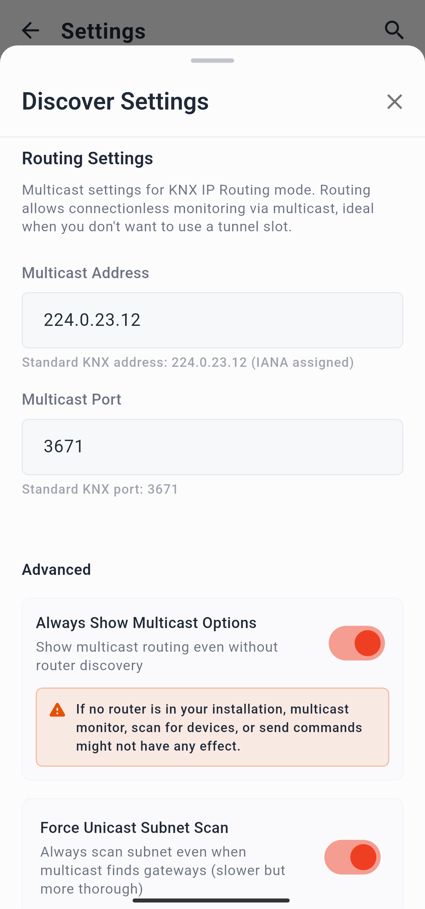
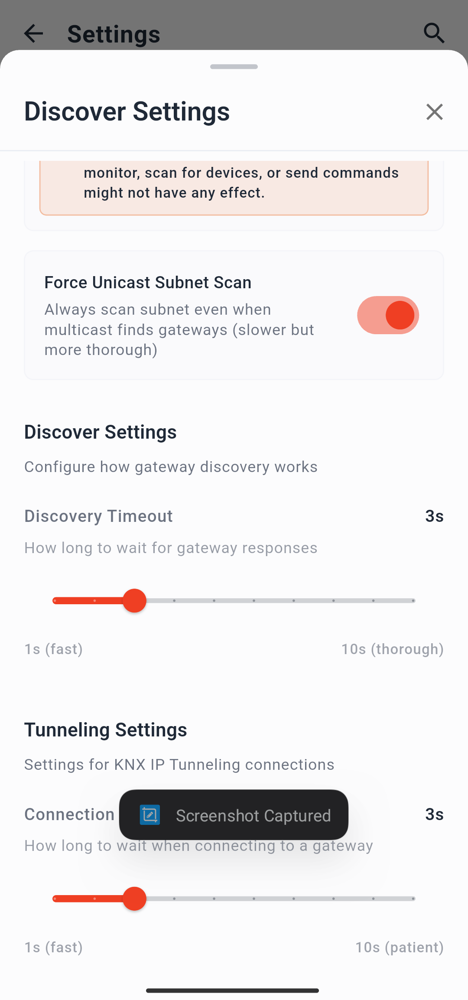

# Guida alle Impostazioni

La pagina delle Impostazioni (Settings) è accessibile da qualsiasi schermata toccando l'**icona dell'ingranaggio** (⚙️) nell'angolo in alto a destra della barra dell'applicazione.

La pagina raggruppa tutte le opzioni configurabili in sezioni distinte. Un'**icona di ricerca** (🔍) nella barra superiore consente di saltare direttamente a una sezione cercandola per nome.

  

---

## Discover Settings (Impostazioni Rilevamento)

Controlla il modo in cui l'applicazione cerca i gateway KNX IP sulla rete e si connette ad essi.

  <table>
    <tr>
      <td></td>
      <td></td>
    </tr>
  </table>

### Multicast

| Impostazione | Predefinito | Descrizione |
|---|---|---|
| Indirizzo multicast | `224.0.23.12` | L'indirizzo del gruppo multicast IP utilizzato per il rilevamento (discovery) e il routing KNX IP. Modifica questo valore solo se la tua rete utilizza un gruppo multicast non standard. |
| Porta multicast | `3671` | La porta UDP utilizzata per la comunicazione di rilevamento multicast e routing. |

### Comportamento di rilevamento (Discovery behaviour)

| Impostazione | Predefinito | Descrizione |
|---|---|---|
| Mostra sempre opzioni multicast | Disattivato | Quando abilitata, le opzioni di connessione multicast sono sempre visibili nella scheda Discover. Quando disabilitata, appaiono solo se un router KNX IP con funzionalità di routing viene effettivamente rilevato durante una scansione. |
| Forza scansione subnet unicast | Disattivato | Se abilitata, dopo aver inviato le richieste di rilevamento multicast l'app invia anche singole richieste di ricerca unicast a ogni indirizzo IP della sottorete corrente. Molto utile su reti Wi-Fi in cui i router potrebbero bloccare i pacchetti multicast. Se non viene trovato alcun gateway tramite multicast, una scansione unicast viene comunque avviata automaticamente come fallback, indipendentemente da questa impostazione. |

### Timeout

| Impostazione | Predefinito | Min | Max | Descrizione |
|---|---|---|---|---|
| Timeout rilevamento | 3 s | 1 s | 10 s | Il tempo di attesa dell'app per le risposte dei gateway dopo l'invio delle richieste di rilevamento. Aumenta questo valore su reti lente o congestionate. |
| Timeout connessione | 3 s | 1 s | 10 s | Il tempo di attesa dell'app durante il tentativo di stabilire una connessione di tunneling con un gateway prima di considerarlo irraggiungibile. |

---

## Project Settings (Impostazioni Progetto)

Controlla il modo in cui i file di progetto ETS vengono analizzati e visualizzati.

  

| Impostazione | Predefinito | Descrizione |
|---|---|---|
| Carica oggetti di comunicazione | Attivo | Se abilitata, l'app analizza e memorizza gli oggetti di comunicazione per ogni dispositivo del progetto che ha almeno un indirizzo di gruppo collegato. Disattivare questa opzione riduce l'utilizzo della memoria sui progetti di grandi dimensioni, ma rimuove la vista degli Oggetti di Comunicazione dalla pagina Project. |
| Elementi per pagina | 50 | Min: 20 · Max: 200 - Il numero di elementi mostrati contemporaneamente quando si espande un elenco nella vista ad albero del progetto (ad esempio, gli indirizzi di gruppo all'interno di un gruppo intermedio). Al raggiungimento del limite, appare il pulsante **Load more** (Carica altri). Valori inferiori migliorano la velocità di rendering sui progetti molto grandi. |

---

## Monitor Settings (Impostazioni Monitor)

Controlla il comportamento del monitor di bus.

  

| Impostazione | Predefinito | Descrizione |
|---|---|---|
| Mantieni schermo attivo | Attivo | Impedisce allo schermo del dispositivo di spegnersi mentre è attiva una sessione del monitor. Opzione consigliata in quanto la maggior parte dei sistemi operativi mobili interrompe la connessione IP quando lo schermo si spegne. Disabilita per risparmiare batteria, ma tieni presente che il monitoraggio si interromperà allo spegnimento dello schermo. Nota: il monitor si interrompe sempre quando l'app passa in background, indipendentemente da questa impostazione. |
| Dimensione buffer telegrammi | 2000 | Min: 50 · Max: 5000 - Il numero massimo di telegrammi mantenuti nella lista del monitor in qualsiasi momento. Al raggiungimento del limite, i telegrammi più vecchi vengono sovrascritti da quelli nuovi in arrivo. Aumenta questo valore se hai bisogno di uno storico più lungo; riducilo per diminuire l'utilizzo della memoria su dispositivi meno performanti. |

---

## Scan Settings (Impostazioni Scansione)

Controlla la scansione della modalità di programmazione nella scheda **Management** (Gestione) → **Prog. Mode**.

  

| Impostazione | Predefinito | Min | Max | Descrizione |
|---|---|---|---|---|
| Durata scansione | 10 s | 4 s | 20 s | Durata totale di una scansione in modalità di programmazione. L'app rimane in ascolto dei dispositivi in modalità di programmazione per questo intervallo di tempo. |
| Intervallo scansione | 2 s | 1 s | 4 s | La frequenza con cui l'app invia i segnali di scansione durante una sessione. Un intervallo più breve aumenta la probabilità di rilevare un dispositivo che entra brevemente in modalità di programmazione, al costo di un traffico di rete maggiore. |

---

## Subscription (Abbonamento)

Mostra lo stato del tuo abbonamento corrente e fornisce le opzioni per la gestione dei piani.

  

| Voce | Descrizione |
|---|---|
| Piano attuale | Mostra il tuo piano attivo: **Free** (prova), **Monthly** (Mensile), **Yearly** (Annuale), o **Lifetime** (A vita). |
| Ripristina acquisti | Applica nuovamente un abbonamento precedentemente acquistato sul dispositivo corrente. Utilizza questa voce dopo aver reinstallato l'app o dopo aver cambiato dispositivo. |
| Annulla abbonamento | Apre la pagina di gestione degli abbonamenti nell'App Store (iOS/macOS) o su Google Play (Android), dove è possibile annullare un abbonamento ricorrente attivo. Non applicabile ai piani Lifetime. |
| Informativa sulla Privacy | Link alla [Privacy Policy](../../privacy/privacy-en.md) dell'applicazione. |
| Termini di Servizio | Link ai [Terms of Service](../../terms/terms-en.md) dell'applicazione. |

---

## Language (Lingua)

Apre l'elenco delle lingue supportate per l'interfaccia dell'applicazione. La selezione di una lingua ha effetto immediato senza dover riavviare l'app.

Lingue disponibili:

- 🇬🇧 English (Inglese)
- 🇩🇪 German (Tedesco)
- 🇫🇷 French (Francese)
- 🇪🇸 Spanish (Spagnolo)
- 🇮🇹 Italian (Italiano)

---

## Theme (Tema)

Imposta l'aspetto visivo dell'applicazione.

| Opzione | Descrizione |
|---|---|
| Chiaro | Utilizza sempre la combinazione di colori chiari. |
| Scuro | Utilizza sempre la combinazione di colori scuri. |
| Come il sistema | Segue l'impostazione della modalità chiara/scura definita a livello globale sul dispositivo. |

---

## Send Feedback (Invia Feedback)

| Opzione | Descrizione |
|---|---|
| Lascia una recensione | Apre la scheda dell'applicazione sullo store per consentirti di lasciare una valutazione o una recensione. |
| Segnala un bug | Apre un'e-mail precompilata indirizzata a `info@owl-automata.com` per segnalare un problema tecnico. |
| Scrivici | Apre una mail vuota indirizzata a `info@owl-automata.com` per richieste di carattere generale. |

> Per segnalazioni di bug strutturate, consulta anche la guida [Come segnalare un problema](../../../support/how-to-report-an-issue.md).

---

## About (Informazioni)

Mostra il numero di versione corrente dell'applicazione e le informazioni sul copyright.
